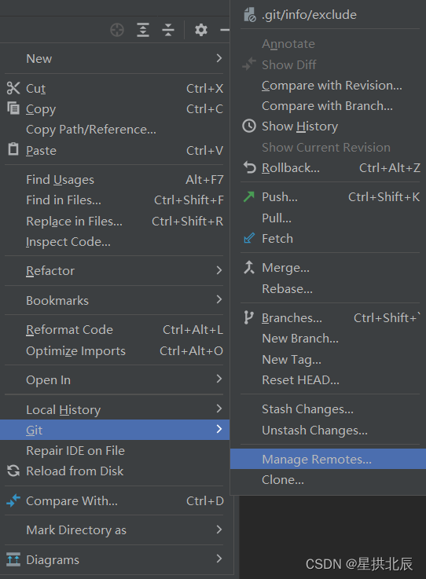
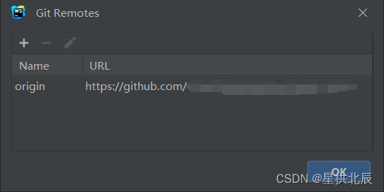

---
title: Git项目修改remote信息
date: 2022-08-01 12:21:42
summary: 本文分享Git项目修改remote信息的方法。
tags:
- Git
- GitHub
categories:
- 开发技术
---

现代智能化IDE为开发者操作Git提供了丰富的图形化界面支持，极大地简化了开发过程。

以JetBrains的系列IDE为例，右键`Git项目目录 → Git → Manage Remotes`，可选择`+`、`-`、`Edit`。





那么，Git命令行是如何实现这些功能的呢？

答案是`git origin`。

查询当前origin：
```shell
git remote -v
```

删除当前origin：
```shell
git remote remove origin
```

添加origin：
```shell
git remote add origin https://github.com/username/reponame.git
```

修改当前origin：
```shell
git remote set-url origin https://github.com/username/reponame.git
```
