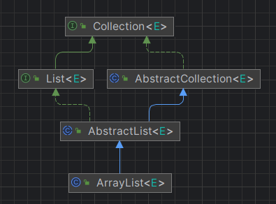

---
title: Array、List的类型转换
date: 2022-03-13 04:00:15
summary: 本文分享Array、List的类型转换，主要剖析Arrays.asList()与List.toArray()。
tags:
- Java
categories:
- 开发技术
---

# Arrays.asList()

java.util.Arrays.asList()方法返回一个由指定数组支持的固定大小的列表。对数组的更改将反映在返回的列表中，对列表的更改也将反映在数组中。返回的列表实现了java.io.Serializable接口并实现了java.util.RandomAccess接口。

返回的列表实现了可选的java.util.Collection方法，除了那些会改变返回列表大小的方法。这些方法会保持列表不变并抛出java.lang.UnsupportedOperationException异常。

asList()方法在数组和基于集合的API之间提供了桥梁，可以结合java.lang.Collection.toArray()方法使用。

java.util.Arrays.asList()方法的实现代码如下所示：

```java
@SafeVarargs
@SuppressWarnings("varargs")
public static <T> List<T> asList(T... a) {
    return new ArrayList<>(a);
}
```

对于获取到的java.util.List对象，如果执行add()或remove()会抛出java.lang.UnsupportedOperationException异常。

```java
import java.util.Arrays;
import java.util.List;

public class ArrayToListDemo {
    public static void main(String[] args) {
        Integer[] array = new Integer[] {1, 2, 3, 4, 5};
        List<Integer> list = Arrays.asList(array);
        list.add(6);
    }
}
```

以上面的代码为例，运行时会抛出java.lang.UnsupportedOperationException：

```java
Exception in thread "main" java.lang.UnsupportedOperationException
    at java.util.AbstractList.add(AbstractList.java:148)
    at java.util.AbstractList.add(AbstractList.java:108)
    at com.blankspace.csdn.basic.ArrayToListDemo.main(ArrayToListDemo.java:10)
```

出现此问题的原因是：java.util.Arrays.asList()方法返回的ArrayList实例不是java.util.ArrayList实例，而是java.util.Arrays的内部类ArrayList。

下面来看java.util.Arrays.ArrayList的实现：

```java
private static class ArrayList<E> extends AbstractList<E> implements RandomAccess, java.io.Serializable {
    @java.io.Serial
    private static final long serialVersionUID = -2764017481108945198L;
    @SuppressWarnings("serial") // Conditionally serializable
    private final E[] a;

    ArrayList(E[] array) {
        a = Objects.requireNonNull(array);
    }

    @Override
    public int size() {
        return a.length;
    }

    @Override
    public Object[] toArray() {
        return Arrays.copyOf(a, a.length, Object[].class);
    }

    @Override
    @SuppressWarnings("unchecked")
    public <T> T[] toArray(T[] a) {
        int size = size();
        if (a.length < size)
            return Arrays.copyOf(this.a, size, (Class<? extends T[]>) a.getClass());
        System.arraycopy(this.a, 0, a, 0, size);
        if (a.length > size)
            a[size] = null;
        return a;
    }

    @Override
    public E get(int index) {
        return a[index];
    }

    @Override
    public E set(int index, E element) {
        E oldValue = a[index];
        a[index] = element;
        return oldValue;
    }

    @Override
    public int indexOf(Object o) {
        E[] a = this.a;
        if (o == null) {
            for (int i = 0; i < a.length; i++)
                if (a[i] == null)
                    return i;
        } else {
            for (int i = 0; i < a.length; i++)
                if (o.equals(a[i]))
                    return i;
        }
        return -1;
    }

    @Override
    public boolean contains(Object o) {
        return indexOf(o) >= 0;
    }

    @Override
    public Spliterator<E> spliterator() {
        return Spliterators.spliterator(a, Spliterator.ORDERED);
    }

    @Override
    public void forEach(Consumer<? super E> action) {
    Objects.requireNonNull(action);
        for (E e : a) {
            action.accept(e);
        }
    }

    @Override
    public void replaceAll(UnaryOperator<E> operator) {
        Objects.requireNonNull(operator);
        E[] a = this.a;
        for (int i = 0; i < a.length; i++) {
            a[i] = operator.apply(a[i]);
        }
    }

    @Override
    public void sort(Comparator<? super E> c) {
        Arrays.sort(a, c);
    }

    @Override
    public Iterator<E> iterator() {
        return new ArrayItr<>(a);
    }
}
```

再看java.util.Arrays.ArrayList的基类java.util.AbstractList的实现：

```java
public abstract E get(int index);

public E set(int index, E element) {
    throw new UnsupportedOperationException();
}

public void add(int index, E element) {
    throw new UnsupportedOperationException();
}

public E remove(int index) {
    throw new UnsupportedOperationException();
}
```

get()方法是java.util.AbstractList的派生类必须实现的抽象方法，set()、add()、remove()方法都被默认实现为抛出java.lang.UnsupportedOperationException异常的“空方法”。虽然java.util.AbstractList的派生类不是必须重写set()、add()、remove()方法，但如果不重写调用时就会抛出异常。

反观java.util.Arrays.ArrayList，该类实现了get()方法，重写了set()方法，却没重写add()、remove()方法，因此调用add()、remove()方法会抛出java.lang.UnsupportedOperationException。

既然有这个问题，那如何解决呢？

一个简单的方法是利用java.util.ArrayList的构造方法`ArrayList(Collection<? extends E> c)`将java.util.Arrays.ArrayList实例转化为java.util.ArrayList实例。

```java
public ArrayList(Collection<? extends E> c) {
    Object[] a = c.toArray();
    if ((size = a.length) != 0) {
        if (c.getClass() == ArrayList.class) {
            elementData = a;
        } else {
            elementData = Arrays.copyOf(a, size, Object[].class);
        }
    } else {
        elementData = EMPTY_ELEMENTDATA;
    }
}
```

根据类的继承关系，我们可以知道java.util.ArrayList和java.util.Arrays.ArrayList都是实现了Collection接口的，因此可以转化。



# List.toArray()

同理，List也可以转化为Array，通过`public Object[] toArray()`和`public <T> T[] toArray(T[] a)`两个方法即可实现List到Array的转化。

```java
import java.util.ArrayList;
import java.util.List;

public class ListToArrayDemo {
    public static void main(String[] args) {
        List<String> fruits = new ArrayList<>();
        fruits.add("Apple");
        fruits.add("Banana");
        fruits.add("Orange");
        // 将列表转换为数组
        String[] fruitsArray = fruits.toArray(new String[fruits.size()]);
        // 打印数组元素
        for (String fruit : fruitsArray) {
            System.out.println(fruit);
        }
    }
}
```
