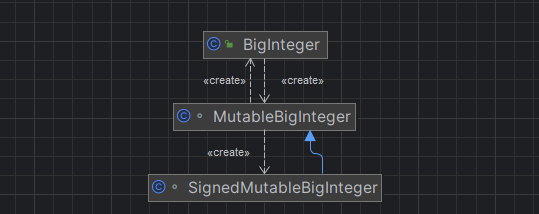

---
title: BigInteger与MutableBigInteger
date: 2021-02-18 22:18:01
summary: 本文分享java.math.BigInteger与java.math.MutableBigInteger的相关内容，还涉及java.math.SignedMutableBigInteger。
tags:
- Java
categories:
- Java
---

# java.math.BigInteger

java.math.BigInteger是Java中提供的一个用于表示任意精度整数的类。其内部实现机制是基于数组的，即使用数组来存储这个任意精度整数。这种实现机制使得java.math.BigInteger能够表示任意长度的整数，而不受固定数据类型长度的限制。

# java.math.MutableBigInteger

java.math.MutableBigInteger采用默认访问修饰符，不可被外部访问，只能java.math包内访问。java.math.MutableBigInteger相当于java.math.BigInteger的内部类，它在java.math.BigInteger的实现中扮演着重要的角色。java.math.MutableBigInteger提供了一种可变的、高效的方式来执行大整数计算，这些计算可以直接修改内部的数据。

java.math.MutableBigInteger类为java.math.BigInteger类提供了一些核心的计算方法。当执行这些计算时，java.math.MutableBigInteger的方法会直接修改内部的数据，从而提高了计算的效率。

例如：

```java
public BigInteger divide(BigInteger val) {
    if (val.mag.length < BURNIKEL_ZIEGLER_THRESHOLD || mag.length - val.mag.length < BURNIKEL_ZIEGLER_OFFSET) {
        return divideKnuth(val);
    } else {
        return divideBurnikelZiegler(val);
    }
}

private BigInteger divideKnuth(BigInteger val) {
    MutableBigInteger q = new MutableBigInteger(),
                      a = new MutableBigInteger(this.mag),
                      b = new MutableBigInteger(val.mag);

    a.divideKnuth(b, q, false);
    return q.toBigInteger(this.signum * val.signum);
}
```

java.math.MutableBigInteger的存在使得java.math.BigInteger在进行大整数计算时能够避免频繁地创建新的对象，从而减少了内存开销和垃圾回收的压力。它允许java.math.BigInteger对象在进行一系列计算时可以重复使用内部的数据结构，而不需要每次都创建新的对象。

除了在内部计算中的使用，java.math.MutableBigInteger还可以辅助其他功能，例如与java.math.BigInteger的数据转换。java.math.MutableBigInteger支持将不可变的java.math.BigInteger对象转换为可变的java.math.MutableBigInteger对象，并且还支持将可变的java.math.MutableBigInteger对象转换回不可变的java.math.BigInteger对象。

在java.math.BigInteger的实现中，java.math.MutableBigInteger和java.math.BigInteger之间的相互转换和协作是无缝的，它们共同构成了java.math.BigInteger类强大的大整数计算功能的基础。通过使用java.math.MutableBigInteger来处理底层的大整数运算，java.math.BigInteger类能够提供高效、准确的计算结果，并且能够处理各种数值范围内的大整数操作。

java.math.MutableBigInteger存在一个派生类java.math.SignedMutableBigInteger。java.math.BigInteger、java.math.MutableBigInteger、java.math.SignedMutableBigInteger的关系如下所示：



# BigInteger与MutableBigInteger的区别

java.math.BigInteger和java.math.MutableBigInteger是Java中两个不同的类，用于处理大整数的计算和操作。它们之间有以下区别：
- 不可变性：java.math.BigInteger是不可变类，意味着一旦创建了一个java.math.BigInteger对象，它的值就不能被修改。每个操作都会返回一个新的java.math.BigInteger对象，而原始对象保持不变。相比之下，java.math.MutableBigInteger是可变类，可以直接修改其内部的数据。这意味着在大量操作和修改大整数时，java.math.MutableBigInteger可能会更高效，因为它避免了不断创建新对象的开销。
- 线程安全性：由于java.math.BigInteger是不可变类，它是线程安全的。多个线程可以同时访问和使用java.math.BigInteger对象，而无需额外的同步机制。相反，java.math.MutableBigInteger是可变类，不具备线程安全性。在多线程环境下使用java.math.MutableBigInteger时，需要采取适当的同步措施来保证线程安全性。
- 使用方式：由于java.math.BigInteger是不可变的，它更适合用于那些需要对大整数进行频繁计算和操作的场景。每次操作都会返回一个新的java.math.BigInteger对象，可以方便地进行链式调用。而java.math.MutableBigInteger则更适合在需要大量修改和更新大整数的场景中使用，例如在底层实现大整数算法时。
- 外部调用：java.math.BigInteger采用public访问修饰符，可被外部访问。java.math.MutableBigInteger采用默认访问修饰符，不可被外部访问，只能包内访问。

# BigInteger与MutableBigInteger的转化

可以使用java.math.MutableBigInteger的toBigInteger()方法实现从java.math.MutableBigInteger到java.math.BigInteger的转化，它会创建一个新的不可变的java.math.BigInteger对象，其中包含了java.math.MutableBigInteger的当前值。

可以使用java.math.MutableBigInteger的构造方法MutableBigInteger(BigInteger)实现从java.math.BigInteger到java.math.MutableBigInteger的转化，它会创建一个新的可变的java.math.MutableBigInteger对象，其中包含了java.math.BigInteger的当前值。
