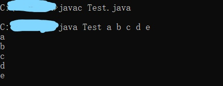
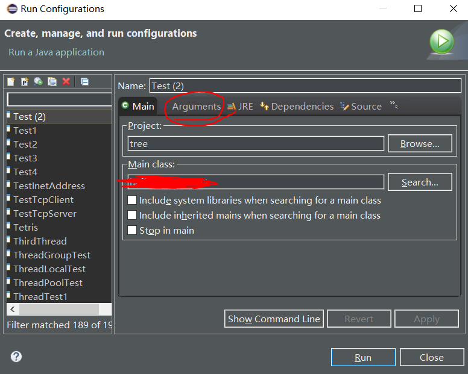
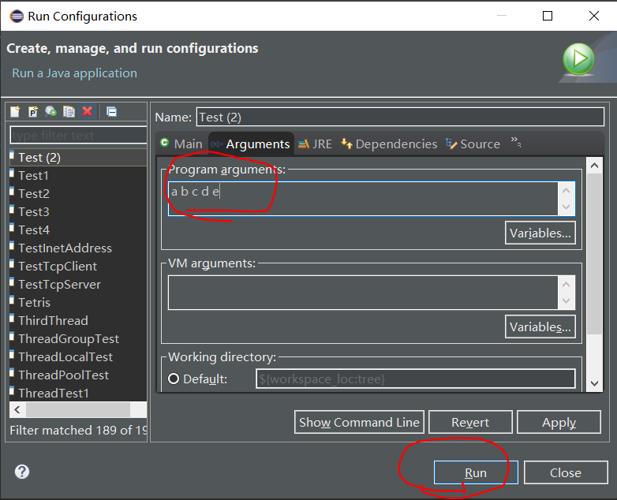

---
title: Eclipse用法总结
date: 2019-10-01 15:53:17
summary: 本文总结使用Eclipse的经验。
tags:
- Java
- Eclipse
categories:
- 开发技术
---

# Eclipse

Eclipse是一个开放源代码的、基于Java的可扩展开发平台。就其本身而言，它只是一个框架和一组服务，用于通过插件组件构建开发环境。Eclipse还附带了一个标准的插件集，包括JDK。

[Eclipse官方网站](https://www.eclipse.org)


# 输入命令行参数

首先需要说明的是`String[] args`是一个Java命令行参数的数组，这些参数一般是在命令行输入，可以被main方法直接使用。

请看下面这个类：
```java
public class Test {
    public static void main(String[] args) {
        for (String s : args) {
            System.out.println(s);
        }
    }
}
```

在命令行里编译：
```shell
javac Test.java
```

然后执行：
```shell
java Test a b c d e
```

输出结果：
```
a
b
c
d
e
```


我们在Eclipse里run，输出为空。

这其实是因为Eclipse默认帮我们输入空参数（未输入参数）。

操作流程如下：

1. 先点击Run栏

2. 找到Run Configurations
3. 找到Arguments

4. 添加参数，空格分隔，点击Run


最终得到结果：
```
a
b
c
d
e
```

# 常见快捷键

## 基本操作

 - Ctrl + C：复制。
 - Ctrl + V：粘贴。
 - Ctrl + S：保存。
 - Ctrl + Z：撤销，返回上一步。

## 打开资源

 - Ctrl + Shift + R：打开所有类型文件，不包括JAR包。
 - Ctrl + Shift + T：打开Java类型文件，包括JAR包。

## 查找资源

 - Ctrl + F：查找当前编辑器内容。
 - Ctrl + H：查找所有文件内容。
 - Ctrl + Shift + G：快速查找所有引用的地方。

## 代码整理

 - Ctrl + Shift + F：格式化代码。
 - Ctrl + Shift + O：删除没有用到的引用。
 - Ctrl + Shift + M：导入所需要的类引用。

## 重命名

 - Alt + Shift + R：重命名。
 - Ctrl + Shift + X：转换大写。
 - Ctrl + Shift + Y：转换小写。

## 切换编辑器

 - Ctrl + E：显示所有打开的编辑器列表。
 - Ctrl +Shift + E：显示更详细的所有打开的编辑器列表。
 - Alt + ←：回到上一次编辑所在的代码。
 - Alt + →：回到下一次编辑所在的代码。

## 快速处理行

 - Ctrl + D：删除当前行。
 - Ctrl + Alt + ↑：向上复制当前行。
 - Ctrl + Alt + ↓：向下复制当前行。
 - Alt + ↑：向上替换行。
 - Alt + ↓：向下替换行。

## 类继承关系

 - Ctrl +T：显示当前类继承关系列表。
 - F4：打开当前打开当前继承关系对话块。
 - Ctrl + Shift + H：打开指定的类型继承关系对话块。

## 快速修复

 - Ctrl + 1：快速修复问题。

## 重构

 - Alt +Shift + L：提取出局部变量。
 - Alt +Shift + M：提取出方法。
 - Alt +Shift + C：修改当前方法构造。

## 添加注释

 - Ctrl + /：用单行注释注释掉当前行或者所选择的行。
 - Ctrl + Shift + C：用单行注释注释掉当前行或者所选择的行。
 - Ctrl + Shift + /：用多行注释（块）注释所选择的行。
