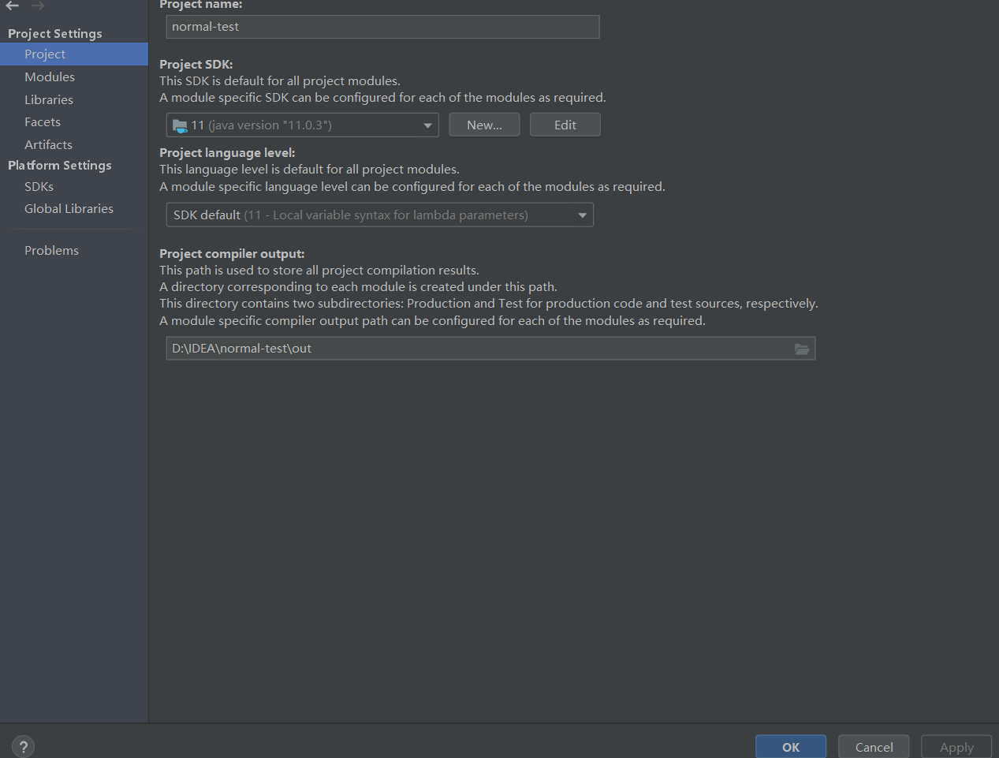
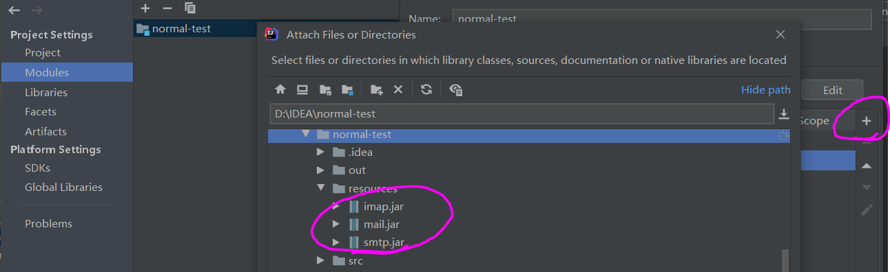
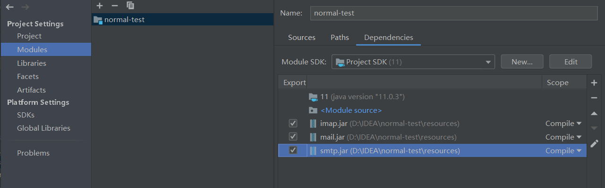
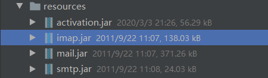
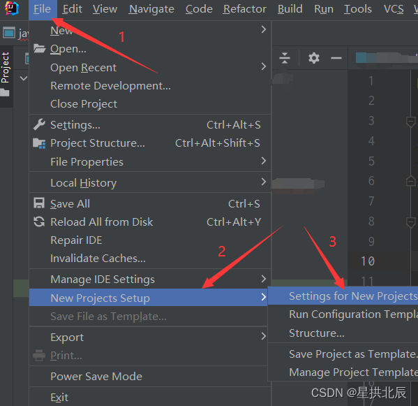
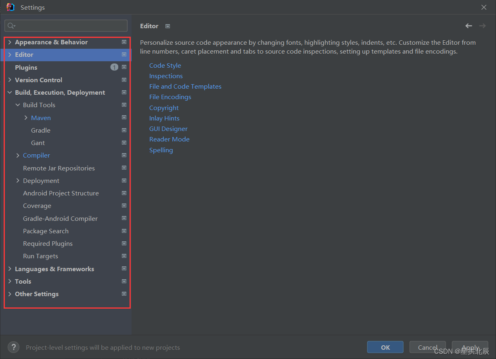
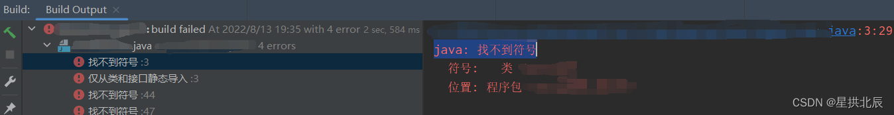
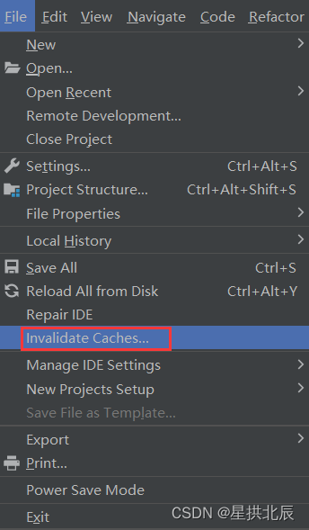
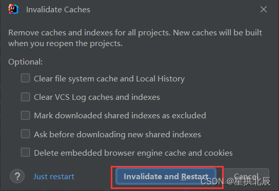
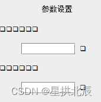

---
title: IntelliJ_IDEA用法总结
date: 2020-03-03 22:57:58
summary: 本文总结使用IntelliJ_IDEA的经验。
tags:
- Java
- IntelliJ_IDEA
categories:
- 开发技术
---

# 导入JAR包

## 方法一

点击左上角的File：

选择菜单栏第七项：Project Structure ... ，打开：

左边栏选择Modules，点击最右侧的“+”，在路径中找到待导入的包：

选中并添加，就导入成功了：

证实导入成功：

## 方法二

直接在工程目录中选中指定JAR包。

注意如果没导入的包是没有右箭头的，根本看不到里面的内容。

右键菜单栏，选择 Add as Library ... ，其中 Level 选 Project Library 。

## 方法三

Ant、Maven、Gradle都是构建Java的工具，可以通过项目配置文件引入依赖。

以Maven为例，查询对应的依赖项可以通过[Maven中心仓库](https://mvnrepository.com)。

[ClassNotFound](https://classnotfound.com.cn)：解决ClassNotFoundException和NoClassDefFoundError异常问题，findjar by 类名或jar名，定时从maven central同步jar信息，支持artifact_id，group_id和name搜索。

# 修改新建工程默认设置

IntelliJ IDEA是一款强大的Java开发工具，其设置也是纷繁复杂。其中，如果依照默认设置，Maven、Java Compiler等设置往往需要创建工程后手动修改，Maven尤其麻烦。本文将会介绍如何修改默认IDEA的默认设置。

本文基于的IDEA版本是`2022.2.3`，但方法应该可以兼容多数版本，如实在不能兼容，恕博主不熟悉各个版本。

`File` → `New Projects Setup` → `Settings for New Projects`：

低版本可能还有`Other Settings`选项，可以从那里进入设置。

打开设置界面，和平常的配置一样，我们就可以去配置我们需要的设置了。

如何设置，本文不赘述，感谢您的阅读。

# 关联Git和GitHub

我们可能会想要把在做的项目提交到GitHub上，但苦于必须每次把项目导出，commit并push到Git远程服务器上，这很麻烦，那我们能不能直接利用IDEA与Git关联起来，进而便捷地提交呢？

推荐阅读：[idea中将已有项目转变为git项目，并提交到git服务器上](https://www.cnblogs.com/grey-wolf/p/11796387.html)

注意在遇到`Push rejected: Push to origin/master was rejected`错误的时候，打开 git bash，输入`git pull`和`git pull origin master`，等待完成后重新在idea中push一下。

我在pull之后，项目中出现了重复的部分，这可能需要自己调整一下。

补充说明，想知道是不是绑定成功，可以先打开项目文件夹，打开隐藏的文件，看看有没有隐藏的`.git`文件夹，有就OK！

# 错误解决方案

## java: 找不到符号

IDEA编译Java项目报错`java: 找不到符号`，情况如下所示：

解决方法：

先删除`out`文件夹，然后选择`File → Invalidate Caches → Invalidate and Restart`

说明：`out`文件夹应该删除...

## 开发GUI应用程序出现汉字变方框问题

IDEA开发GUI应用程序出现汉字变方框的问题：

错误原因：
IDEA中使用`java.awt.Label`、`java.awt.Button`等传统AWT控件，会出现这样的问题。

解决方法：
改换Swing的`javax.swing.JLabel`、`javax.swing.JButton`等Swing控件，即可解决问题。
