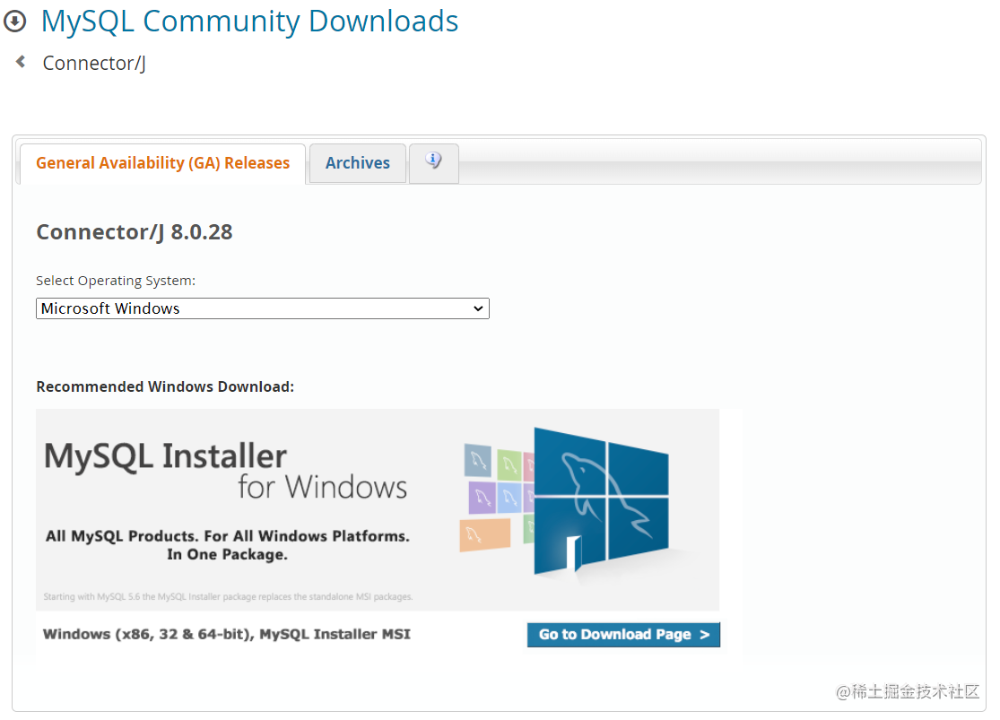
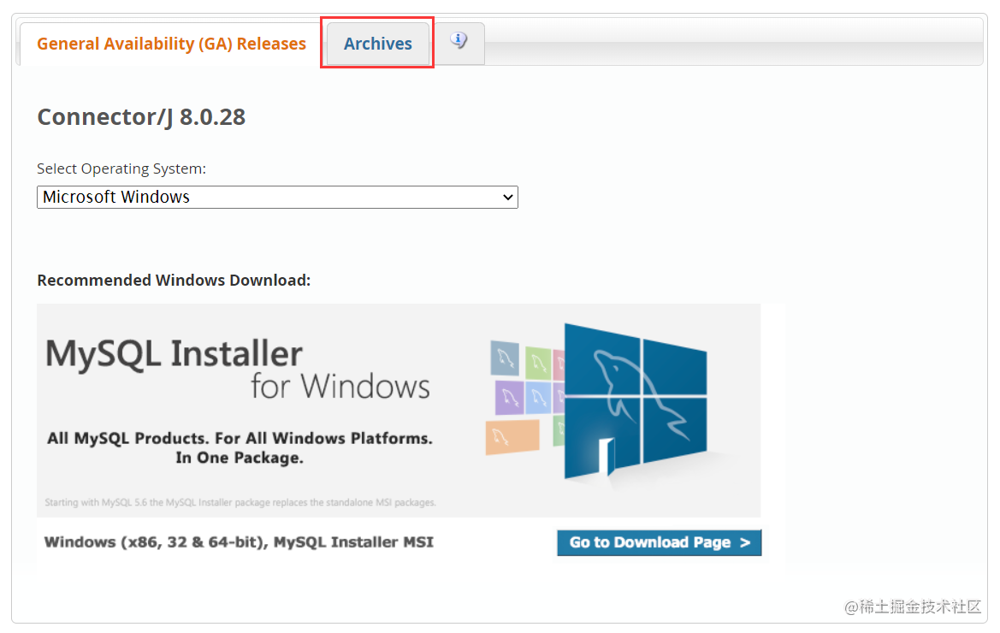
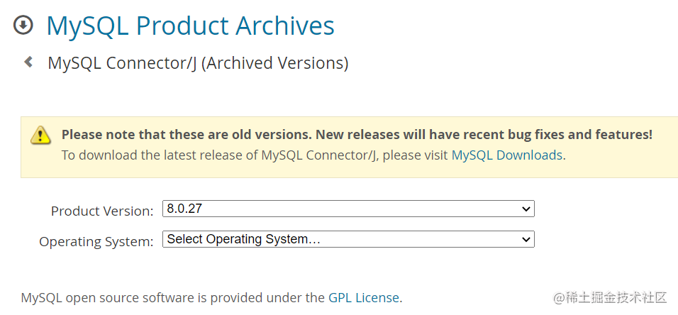

---
title: JDBC连接MySQL驱动
date: 2020-03-06 22:41:24
summary: 本文分享以JDBC连接MySQL驱动的方法。
tags:
- Java
- MySQL
categories:
- Java
---

# 获取驱动jar包

## 官网下载jar包导入工程

安装Java和安装MySQL这里就不说了，可以通过[官网链接](https://dev.mysql.com/downloads/connector/j/)下载驱动。



注意如果是WindowsOS不要直接下Windows，那个不是JDBC，应该选上面的"Selecting Operating System..."，再选"Plantform Independent"，在这里选那个.zip文件。Unix/Linux的选择上面的.tar.gz文件。

想选择版本的话，选择Archives：





打开.zip就有.jar，自取并导入工程。

jar包导入方法：
- 把.jar导入idea的话，推荐阅读[这篇文章](https://blog.csdn.net/weixin_43896318/article/details/104643857)。
- 把.jar导入eclipse的话，推荐阅读[这篇文章](https://blog.csdn.net/ClearLoveQ/article/details/85781624)。

## Maven引入jar包

访问[Maven中央仓库](https://mvnrepository.com)，搜索`mysql-connector-java`，在[页面](https://mvnrepository.com/artifact/mysql/mysql-connector-java)中寻找对应版本的pom引入配置。

例如，`8.0.28`版本的引入配置是：
```xml
<!-- https://mvnrepository.com/artifact/mysql/mysql-connector-java -->
<dependency>
    <groupId>mysql</groupId>
    <artifactId>mysql-connector-java</artifactId>
    <version>8.0.28</version>
</dependency>
```

随后引入jar包即可。

# 解读URL

URL为`jdbc:mysql://localhost:3306/[database_name]`：
- **jdbc:mysql://**：JDBC连接方式
- **localhost**：本机地址
- **3306**：SQL数据库的端口号（MySQL用这个就行了）
- **[database_name]**：待连接的数据库的名称

一般来说，只需要自己写一下DatabaseName即可，注意这个库应该是存在的，否则会报错。

# 版本问题

笔者使用的jar包是 **mysql-connector-java-8.0.19.jar** ，`mysql-connector-java`版本在8以上时应该使用：`com.mysql.cj.jdbc.Driver`。

# 乱码问题

运行起来可能还会有乱码问题，我遇到过的一个乱码问题的异常栈是这样的：

```
java.sql.SQLException: The server time zone value '�й���׼ʱ��' is unrecognized or represents more than one time zone. You must configure either the server or JDBC driver (via the 'serverTimezone' configuration property) to use a more specifc time zone value if you want to utilize time zone support.
    at com.mysql.cj.jdbc.exceptions.SQLError.createSQLException(SQLError.java:129)
    at com.mysql.cj.jdbc.exceptions.SQLError.createSQLException(SQLError.java:97)
    at com.mysql.cj.jdbc.exceptions.SQLError.createSQLException(SQLError.java:89)
    at com.mysql.cj.jdbc.exceptions.SQLError.createSQLException(SQLError.java:63)
    at com.mysql.cj.jdbc.exceptions.SQLError.createSQLException(SQLError.java:73)
    at com.mysql.cj.jdbc.exceptions.SQLExceptionsMapping.translateException(SQLExceptionsMapping.java:76)
    at com.mysql.cj.jdbc.ConnectionImpl.createNewIO(ConnectionImpl.java:836)
    at com.mysql.cj.jdbc.ConnectionImpl.<init>(ConnectionImpl.java:456)
    at com.mysql.cj.jdbc.ConnectionImpl.getInstance(ConnectionImpl.java:246)
    at com.mysql.cj.jdbc.NonRegisteringDriver.connect(NonRegisteringDriver.java:197)
    at java.sql/java.sql.DriverManager.getConnection(DriverManager.java:677)
    at java.sql/java.sql.DriverManager.getConnection(DriverManager.java:228)
    at main.JDBCTest.main(JDBCTest.java:19)
Caused by: com.mysql.cj.exceptions.InvalidConnectionAttributeException: The server time zone value '�й���׼ʱ��' is unrecognized or represents more than one time zone. You must configure either the server or JDBC driver (via the 'serverTimezone' configuration property) to use a more specifc time zone value if you want to utilize time zone support.
  at java.base/jdk.internal.reflect.NativeConstructorAccessorImpl.newInstance0(Native Method)
  at java.base/jdk.internal.reflect.NativeConstructorAccessorImpl.newInstance(NativeConstructorAccessorImpl.java:62)
  at java.base/jdk.internal.reflect.DelegatingConstructorAccessorImpl.newInstance(DelegatingConstructorAccessorImpl.java:45)
  at java.base/java.lang.reflect.Constructor.newInstance(Constructor.java:490)
  at com.mysql.cj.exceptions.ExceptionFactory.createException(ExceptionFactory.java:61)
  at com.mysql.cj.exceptions.ExceptionFactory.createException(ExceptionFactory.java:85)
  at com.mysql.cj.util.TimeUtil.getCanonicalTimezone(TimeUtil.java:132)
  at com.mysql.cj.protocol.a.NativeProtocol.configureTimezone(NativeProtocol.java:2118)
  at com.mysql.cj.protocol.a.NativeProtocol.initServerSession(NativeProtocol.java:2142)
  at com.mysql.cj.jdbc.ConnectionImpl.initializePropsFromServer(ConnectionImpl.java:1310)
  at com.mysql.cj.jdbc.ConnectionImpl.connectOneTryOnly(ConnectionImpl.java:967)
  at com.mysql.cj.jdbc.ConnectionImpl.createNewIO(ConnectionImpl.java:826)
  ... 6 more
```

处理方法是：
将URL改为`jdbc:mysql://localhost:3306/library?useUnicode=true&characterEncoding=utf8&useSSL=false&serverTimezone=Asia/Shanghai`

# Demo

数据库名、用户名、密码 这三个需要自己替换，注意版本是否与笔者大概一致，如果是8-版本就很不一样！

```java
import java.sql.Connection;
import java.sql.DriverManager;
import java.sql.SQLException;

public class JDBCDemo {

    public static void main(String[] args) {
        String driverName="com.mysql.cj.jdbc.Driver";
        String dbURL="jdbc:mysql://localhost:3306/dbName?useUnicode=true&characterEncoding=UTF-8&useSSL=false&serverTimezone=Asia/Shanghai";
        // 你的登录名，自己写，比如root
        String userName="userName";
        // 你的登录密码，自己写
        String userPassword="userPassword";
        try {
            Class.forName(driverName);
            System.out.println("加载MySQL驱动成功");
        } catch (ClassNotFoundException e) {
            System.out.println("加载MySQL驱动失败");
        }
        try (Connection dbConnection = DriverManager.getConnection(dbURL, userName, userPassword)) {
            System.out.println("连接数据库成功");
        } catch(SQLException e) {
            System.out.println("数据库连接失败");
        }
    }

}
```

运行结果：

```java
加载MySQL驱动成功
连接数据库成功
```
