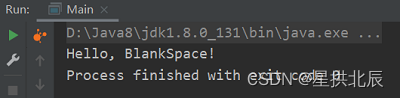

---
title: JNI的开发方法
date: 2022-05-04 03:35:03
summary: 本文通过一个案例带领读者完成一个简单的JNI应用Demo。
tags:
- Java
categories:
- 开发技术
---

# 前言

本文通过一个案例，教读者一步一步实现一个简单的JNI的Demo。

需要准备的工具是：Java开发工具(IDEA)、C开发IDE(CLion)、……

# 创建含native的Java类并编译

笔者基于IDEA创建Java工程，命名为`java-jni-demo`，在src目录下创建`HelloJNI.java`：

```java
public class HelloJNI {

    /**
     * 定义本地方法，Unsafe类有大量类似方法声明
     *
     * @param name 打招呼的对象
     */
    public native void sayHello(String name);

}
```

笔者使用的Java8可用`javah -jni -o hellojni.h HelloJNI`命令生成.h文件，Java11以后可以使用`javac -h . HelloJNI.java`命令去生成.h文件。

生成的`hellojni.h`文件内容为：

```c
/* DO NOT EDIT THIS FILE - it is machine generated */
#include <jni.h>
/* Header for class HelloJNI */

#ifndef _Included_HelloJNI
#define _Included_HelloJNI
#ifdef __cplusplus
extern "C" {
#endif
/*
 * Class:     HelloJNI
 * Method:    sayHello
 * Signature: (Ljava/lang/String;)V
 */
JNIEXPORT void JNICALL Java_HelloJNI_sayHello
  (JNIEnv *, jobject, jstring);

#ifdef __cplusplus
}
#endif
#endif
```

此时，可以新建CLion的Library工程`hellojni`，修改`CMakeLists.txt`文件：

```c
cmake_minimum_required(VERSION 3.21)
project(hellojni C)

set(CMAKE_C_STANDARD 99)

include_directories(D:\\Java8\\jdk1.8.0_131\\include)
include_directories(D:\\Java8\\jdk1.8.0_131\\include\\win32)
link_directories(D:\\Java8\\jdk1.8.0_131\\lib)

add_library(hellojni SHARED library.c)
```

笔者选择直接加四行代码去引入java提供的dll文件，以得到结果。

`hellojni.h`复制进项目中，完成`library.c`：

```c
#include "hellojni.h"
#include <jni.h>
#include <jni_md.h>

#include <stdio.h>

JNIEXPORT void JNICALL Java_HelloJNI_sayHello(JNIEnv *env, jobject obj, jstring name) {
    const char *str = (*env)->GetStringUTFChars(env, name, 0);
    printf("Hello, %s!", str);
}
```

运行生成`libhellojni.dll`，复制到原Java工程中，创建`Main.java`：

```java
public class Main {

    public static void main(String[] args) {
        System.load("D:\\IDEA\\java-jni-demo\\src\\libhellojni.dll");
        new HelloJNI().sayHello("BlankSpace");
    }

}
```

要注意的是，System.load()中的内容是绝对路径。

运行`Main.java`，得到输出：


