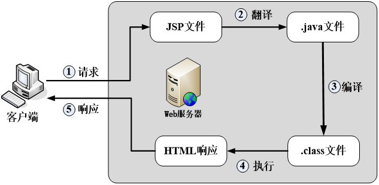
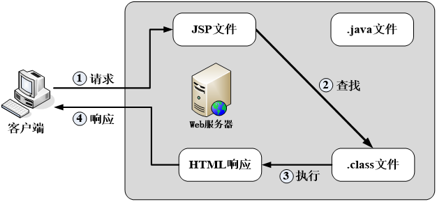
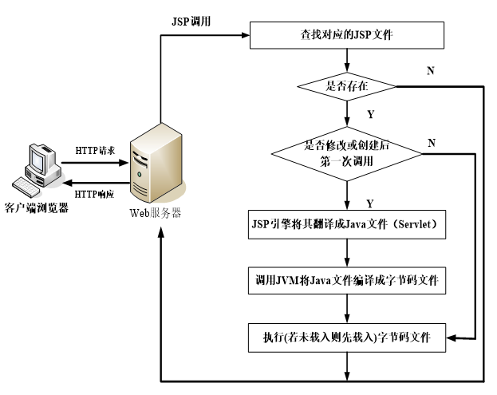

---
title: JSP运行原理
date: 2021-02-16 16:06:44
summary: 本文介绍JSP的运行原理。
tags:
- Java
- JSP
categories:
- Java
---

# 初次访问JSP页面

JSP同Servlet一样，都运行在Servlet容器中。当用户第一次访问JSP页面时，JSP页面的执行过程可分为五个步骤，各步骤含义如下：
1. 客户向服务器发送JSP页面请求（request）。
2. 容器接收到请求后检索对应的JSP页面，如果该JSP页面（或被修改后的JSP页面）是第一次被请求，则容器将此页面中的静态数据（HTML文本）和动态数据（Java脚本）全部转化成Java代码，使JSP文件编译成一个Java文件，即Servlet。
3. 容器将编译后的Servlet源代码编译形成字节码文件（.class），对于Tomcat服务器而言，生成的字节码文件默认存放在`<Tomcat安装目录>\work`目录下。
4. 编译后的字节码文件被加载到容器内存中执行，并根据用户的请求生成HTML格式的响应内容。
5. 容器将响应内容即响应（response）发送回客户端。

# 再次访问JSP页面

当同一个JSP页面再次被请求时，只要该JSP文件没有发生过改动，容器将直接调用已装载的字节码文件，而不会再执行翻译和编译的过程，从而大大提高了服务器的性能。此过程如下：

# JSP运行原理

第一次访问JSP页面时可能会稍慢，但是再次访问变快。

