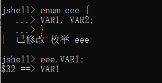
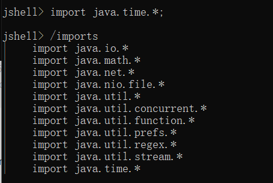

# 前言

很早就装了JDK9，因为有模块化，想尝尝鲜，不想却被JShell吸引过去。
不得不说，至少对于我个人，JShell都是一个非常便捷、高效的工具。

# JShell

JShell提供了一个交互式环境，允许快速、方便地尝试使用Java代码。JShell实现了所谓的“读取-执行-打印”循环（REPL）。使用这个机制，会提示用户输入一段代码。接着读取并执行它。然后JShell显示与代码相关的结果。接下来JShell会提示用户输入下一段代码，继续处理（如循环）。在JShell中，输入的每个代码段都被称为片段。

理解JShell的关键是使用它不需要输入完整的Java程序。每个输入的代码片段都能在输入的同时执行，这是可能的，因为JShell会自动处理与Java程序相关的许多信息，这允许用户只考虑具体功能，而不需要编写完整的程序。因此，JShell在初学Java的时候显得非常有用。

当然，JShell也可以供有经验的程序员使用。因为JShell存储了状态信息，所以可以在JShell中输入多行代码段，并运行它们。因此需要对某个概念建立起原型的时候，JShell是非常有用的，因为它允许以交互方式尝试使用代码，而不需要开发、编译完整的程序。

# Windows环境下JShell启动与退出

打开cmd，按照如下操作：

注意退出不能输入\exit：

# JShell基本使用全攻略

1. 下图可见我们可以做很多基本操作：
    - 输入一个表达式/算式进行运算
    - 直接打印一个临时变量
    - 运行一个Java语句（可以带结尾分号也可以不带）
    - 可以定义变量
    - 可以直接覆盖变量而不担心已定义而导致不能重新定义
    - ……

2. 我们接着看简单的代码块：
    - 没有大括号就等待分号结尾然后执行。
    
    
    - 有大括号就等待右大括号收尾。
    
    
3. 定义方法，基本相当于过程化的函数：

能看出来这里还支持函数重载。
JShell支持函数间的调用：

更厉害的是这里支持函数的向前引用，即支持一个函数调用其他哪怕暂时未被定义的函数。

这是支持的，但不能直接调用：

那我们创建这个未定义的方法：

顺利完成！
4. JShell支持的面向对象：
我们可以定义普通类并实例化：

可以利用类的对象引用属性和方法，甚至null也不会爆空指针，只是显示null。
我们也可以定义枚举：

我们也可以使用接口：

可见，连注解都支持。
5. import、文件IO与异常

可见：上述包是除了lang包以外，JShell自动为我们导入的包。
异常的话，JShell自己会处理，貌似并不需要catch，比如IOException啊，FileNotFoundException啊这些。
其他的包还是需要自己导入的：

那个IO的就不演示了……打住。。。
6. 玩转临时变量

# JShell命令

JShell中的所有命令都是以/开头。

| 命令 | 功能 |
|:----:|:----:|
| `/!` | 运行刚刚输入的代码段 |
| `/n` | 指定要运行的第n个代码段 |
| `/exit` | 退出JShell |
| `/edit` | 编辑一个代码段 |
| `/list` | 列出已输入的代码 |
| `/list count` | 列出已输入的count的声明 |
| `/imports` | 列出已导入的包名 |
| `/save *filename*`  | 保存会话（当前源代码） |
| `/save *filename* -all` | 保存会话（当前源代码），包括输入不正确的 |
| `/save *filename* -history` | 保存会话的历史（例如输入的命令列表） |
| `/open *filename*` | 加载保存过的会话 |
| `/types` | 显示类、接口和枚举 |
| `/methods` | 显示方法 |
| `/vars` | 显示变量 |
| …… | …… |
