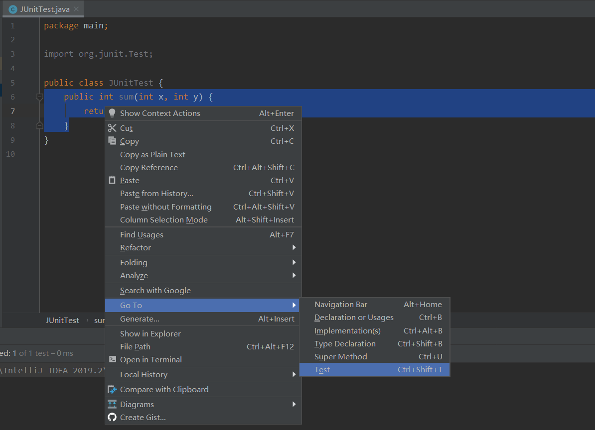

# 程序的测试及JUnit

我们都知道，程序的Bug是不可避免的，遇到Bug后对程序的修改是经常要进行的过程，我们必须保证程序在修改后其结果仍然是正确的。（当然，我们很难验证程序是“对的”，而只能保证其在尽可能大面积覆盖的测试用例中是“对的”。这点可以参考OJ，其实你的程序未必100%对，但过了全部普通或刁钻的测试用例，就算你AC）

在编写代码的同时，还要求编写测试代码来判断这些程序是否正确。甚至先编写测试用例，再进行软件开发，使得程序在逐步通过测试用例的过程中完善起来。这个过程称为“测试驱动”的开发过程（TDD）。

积极地来看，TDD保证了代码质量，减少了后期的差错与调试的时间，所以实际上提高了软件开发的效率。
当然TDD的批评声也是有的，比如针对其单纯为了满足测试而开发等方面的问题，不过这不是我们这里要研究的啦！

# Eclipse与JUnit

Eclipse好像内嵌了JUnit4，我以前也用过，就先不提了。这里讲的是基于IDEA的操作。

# 下载JUnit4

编写下面的代码：

```java
package main;

import org.junit.Test;

public class JUnitTest {
    @Test
    public int sum(int x, int y) {
        return x+y;
    }
}
```

鼠标放到@Test上，自动提示是否安装JUnit4，安装就好啦！

它还自动帮你导入lib中，很方便。

# 创建JUnit测试用例

删去@Test，让代码回到这种状态：


选中待测试方法，右键选择GoTo，再选择Test。（注意如果不去掉@Test就不是这个样子，Test被Test Subject换掉了）


再选择创建新的测试类：


对测试类进行设置：
 - 编写类名
 - 确定包路径
 - 选中测试函数


然后，新的测试类生成：


使用assertEquals()简单地做一下断言测试：


运行，一切OK，毕竟是一个简单的程序嘛。


把 x+y 改成 x-y ，模拟原函数错误的情况：


运行测试类会报错：


然后，在原本的代码上会标红，提示需要修复Bug以通过测试用例：


# 测试代码

```java
import org.junit.Test;

import static org.junit.Assert.*;

public class JUnitTestTest {
    @Test
    public void sum() {
        JUnitTest test = new JUnitTest();
        assertEquals(test.sum(1, 2), 3);
        assertEquals(test.sum(1, 2), test.sum(2, 1));
        assertEquals(test.sum(0, 1000), 1000);
        assertEquals(test.sum(-2, 3), 1);
    }
}
```
