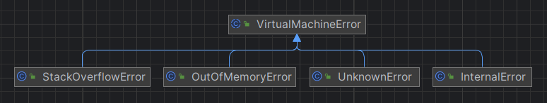

---
title: JVM异常
date: 2023-05-15 00:58:21
summary: 本文分享JVM异常的相关内容，介绍java.lang.VirtualMachineError及其派生类。
tags:
- Java
- JVM
categories:
- Java
---

# JVM异常

Java虚拟机中的异常由类java.lang.Throwable或其派生类之一的实例表示。抛出异常会导致从抛出异常的点立即进行非本地控制转移。

大多数异常是同步发生的，因为它们是由发生异常的线程执行的操作引起的。与之相反，异步异常可能在程序执行的任何时候发生。Java虚拟机抛出异常的原因有以下三种：
- 执行了`athrow`指令。
- Java虚拟机同步检测到异常执行条件。这些异常不是在程序的任意点抛出的，而只是在执行具有以下特点的指令后同步抛出：
    - 指令将异常作为可能结果的一部分，例如：
        - 当指令包含违反Java编程语言语义的操作时，例如超出数组边界的索引操作。
        - 当程序的加载或链接部分出现错误时。
    - 引起某些资源限制超出，例如使用过多的内存。
- 由于Java虚拟机实现中发生了内部错误，导致异步异常发生。

Java虚拟机实现可能允许在抛出异步异常之前进行少量但有限制的执行。这种延迟的存在允许代码在遵守Java的语义的同时，在处理它们的实际点处检测并抛出异常，以提高代码的优化性能。

一个简单的实现可能会在每个控制传输指令处轮询异步异常。由于程序的大小是有限的，这限制了检测异步异常的总延迟。然而，代码生成器具有一定的灵活性，可以在控制传输之间重新排序计算以获得更高的性能。

Java虚拟机抛出的异常是精确的。当控制转移发生时，在抛出异常之前执行的指令的所有效果必须看起来已经发生。在抛出异常的点之后出现的任何指令可能看起来都已被评估。如果优化代码已经推测性地执行了异常发生点之后的一些指令，则此类代码必须准备好将这种推测性执行从程序的用户可见状态中隐藏起来。

每个Java虚拟机中的方法都可能与零个或多个异常处理程序相关联。异常处理程序指定实现异常处理程序处于活动状态的方法的Java虚拟机代码的偏移范围，描述异常处理程序能够处理的异常类型，并指定要处理的代码位置。如果导致异常的指令的偏移量在异常处理程序的偏移量范围内，并且异常类型与异常处理程序处理的异常类是同一类或者是异常类的子类，则异常与异常处理程序相匹配。抛出异常时，Java虚拟机会在当前方法中搜索匹配的异常处理程序。如果找到匹配的异常处理程序，系统将分支到匹配的处理程序指定的异常处理代码。

如果在当前方法中没有找到这样的异常处理程序，则当前方法调用会突然完成。在突然完成时，当前方法调用的操作数栈和局部变量被丢弃，它的帧被弹出，恢复调用方法的帧。然后在调用者框架的上下文中重新抛出异常，以此类推，继续方法调用链。如果在到达方法调用链的顶部之前没有找到合适的异常处理程序，则终止抛出异常的线程的执行。在线程终止之前，未捕获的异常按照以下规则处理：
- 如果线程设置了未捕获的异常处理程序，则执行该处理程序。
- 否则，为线程的父线程组调用uncaughtException方法。如果ThreadGroup及其父ThreadGroup未覆盖uncaught，则调用默认处理程序的 uncaughtException 方法。

在方法的异常处理程序中，搜索匹配项的顺序非常重要。在类文件中，每个方法的异常处理程序都存储在一个表中。当抛出异常时，Java 虚拟机会按照它们在类文件中相应的异常处理程序表中出现的顺序，从该表的开头开始搜索当前方法的异常处理程序。

需要注意的是，Java 虚拟机并不强制对嵌套方法的异常表条目进行排序。为了确保所有 Java 虚拟机实现的行为一致，需要通过与编译器合作来实现 Java 编程语言的异常处理语义。即使是通过其他方式生成类文件，定义的搜索过程也应该保证一致性。

# java.lang.VirtualMachineError

java.lang.VirtualMachineError是JVM在内部发生严重错误时抛出的基类异常。这个异常表示JVM自身在执行操作时发生了内部错误，而不是在应用程序代码中发生的错误。java.lang.InternalError、java.lang.OutOfMemoryError、java.lang.StackOverflowError、java.lang.UnknownError都是java.lang.VirtualMachineError的派生异常类。

java.lang.InternalError是java.lang.VirtualMachineError的一个子类，表示JVM发生了一个内部错误，通常是由于JVM的软件故障、底层主机系统软件故障或硬件故障导致的。 当检测到此错误时，它会异步传送，并且可能在程序中的任何位置发生。

java.lang.OutOfMemoryError是java.lang.VirtualMachineError的一个子类，表示JVM中没有足够的内存（虚拟内存或物理内存）来为对象分配空间。在运行时，当JVM无法分配足够的内存来满足新对象的请求时，它就会抛出java.lang.OutOfMemoryError异常。

java.lang.StackOverflowError是java.lang.VirtualMachineError的一个子类，表示JVM的方法调用堆栈溢出。java.lang.StackOverflowError表示JVM实现已用完线程的堆栈空间，通常是因为执行程序中的错误导致线程正在执行无限数量的递归调用。例如，当调用堆栈深度超过JVM所允许的最大深度时，会抛出java.lang.StackOverflowError异常。

java.lang.UnknownError是java.lang.VirtualMachineError的一个子类，表示JVM发生了一个未知的、无法归类为其他类型的内部错误。通常，这个异常只有在JVM自身发生严重故障时才会被抛出。
