---
title: JavaDoc文档注释
date: 2019-11-22 14:33:42
summary: 本文分享JavaDoc文档注释的相关内容。
tags:
- Java
categories:
- Java
---

# 文档注释

我们知道，Java有三种注释：
 - 单行注释：`//`
 - 多行注释：`/* */`
 - 文档注释：`/** */`

这里，文档注释是我们探讨的主角。

文档注释可以在程序中嵌入关于程序的信息。我们可以利用JDK提供的javadoc实用程序提取这些信息，并放到HTML文件中。

文档注释使得程序的文档化变得简单，是Java的重要内容。
感兴趣的看一下Java11的[API文档](https://docs.oracle.com/en/java/javase/11/docs/api/index.html)吧。

比如java.util.Scanner的网页版官档内容如下：

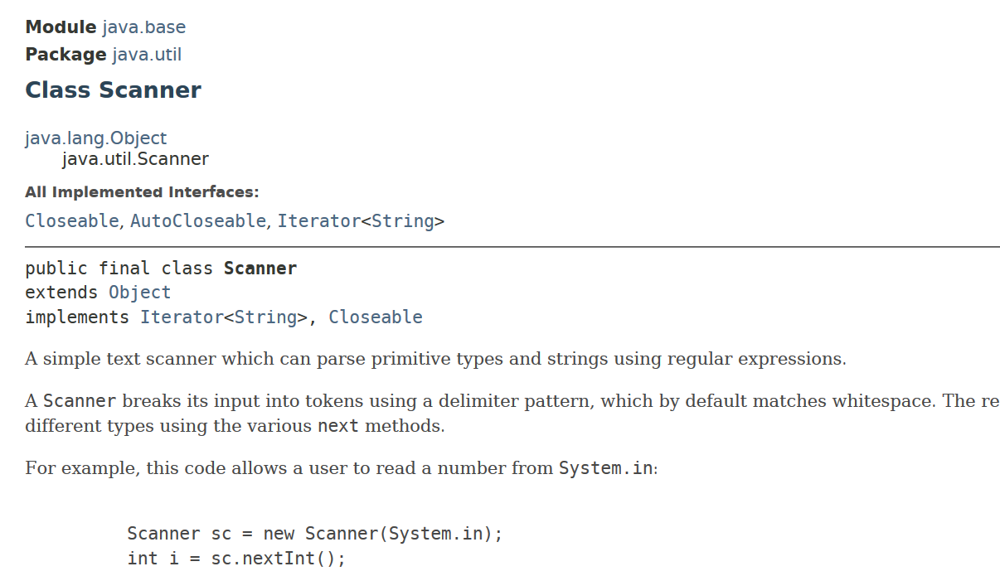

而我们借助Eclipse IDE查看一下JDK源码：

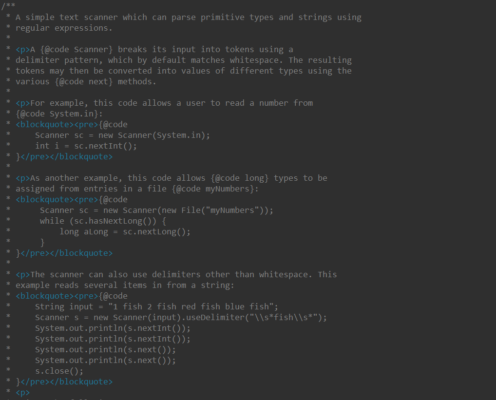

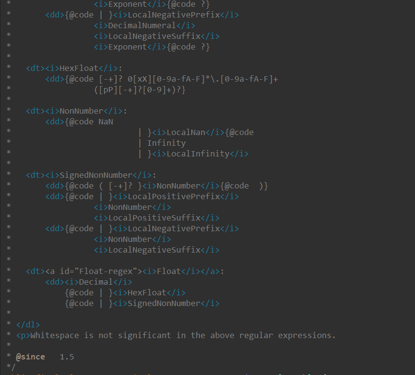

上面的两个图是Scanner类的部分文档注释截图，可见文档注释里不仅仅有大量的英文注释用于解释，更是有许多@（javadoc标记），还有<></>（HTML文档），内容十分丰富。

当然，其他类也是类似的，因为整个Java API库就是通过这种方式文档化的。

另说：JDK9+开始JavaDoc开始支持模块（Java模块的概念从JDK9正式引入Java体系）

# JavaDoc标记

| 标签 | 含义 |
|:----:|:----:|
| @author | 标识作者 |
| {@code} | 以代码字体原样显示信息，但不转换成HTML样式 |
| @deprecated | 指定程序元素已经过时 |
| {@docRoot} | 指定当前文档的根目录路径 |
| @exception | 标识某个方法或者构造函数抛出的异常 |
| @hidden | 禁止某元素显示在文档中 |
| {@index} | 给索引指定术语 |
| {@inheritDoc} | 直接从父类中继承文档注释 |
| {@link} | 插入指向另一个主题的内部链接 |
| {@linkplain} | 插入指向另一个主题的内部链接，但以纯文本字体显示链接 |
| {@literal} | 原样式显示信息，但不转换成HTML样式 |
| @param | 文档化形参 |
| @provides | 文档化模块提供的服务 |
| @return | 文档化方法的返回值 |
| @see | 指定对另一个主题的链接 |
| @serial | 文档化默认的可序列化域 |
| @serialData | 文档化writeObject()或writeExternal()方法写入的数据 |
| @serialField | 文档化ObjectStreamField组件 |
| @since | 声明引入特定更改的版本号 |
| {@summary} | 文档化某项的摘要(JDK10+) |
| @throws | 相当于@exception |
| @uses | 文档化模块所需要的服务(JDK9+) |
| {@value} | 显示一个常量的值，该常量必须是静态域 |
| @version | 指定程序元素的版本 |

# 基于Eclipse的JavaDoc实战

我们用自己写的[顺序表](https://blog.csdn.net/weixin_43896318/article/details/101169551)的Project生成JavaDoc。

右键工程，点击Export：
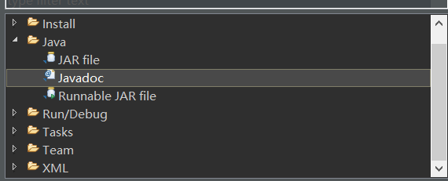

选Javadoc：
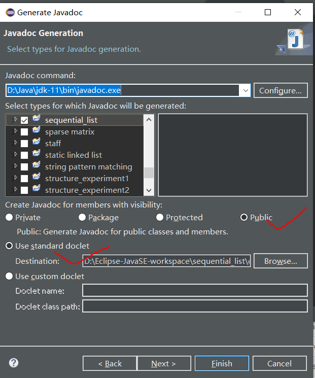

我们目前只需要public的，毕竟这是API文档，一直点击next或者finish：
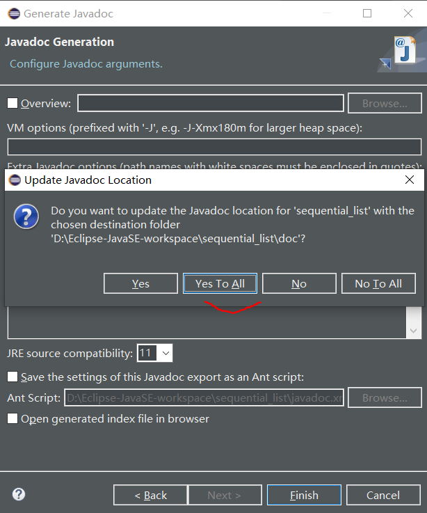

最后一个next有一个JRE的问题，自己处理一下就行，一般不用动。然后点击Yes To All：
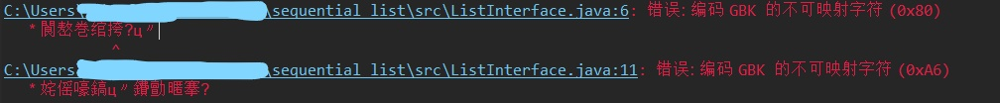

我们看一下，GBK编码？哦，想到我用的是UTF-8编码。那就拷过去，换个work-space呗，我还有一个gbk的work-space，再生成：

原来……直接就乱码了，那就文本复制，最简单了！

我再来：
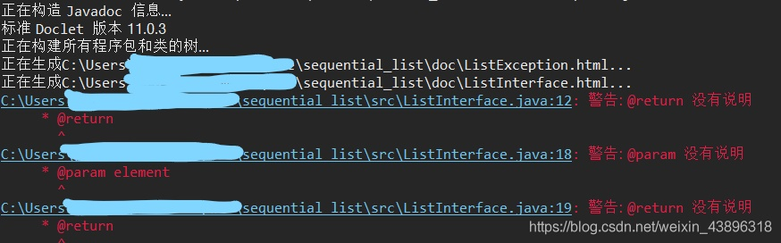

咋还Warning？
原来是我有的@param、@return没有进行说明，以后注意。不过这次就算了，先看看结果：
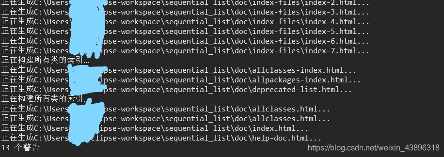

下面是SequentialList类的JavaDoc文档的一部分：
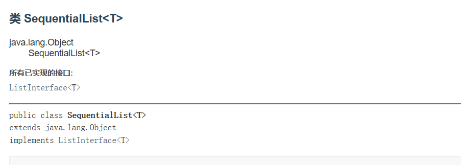

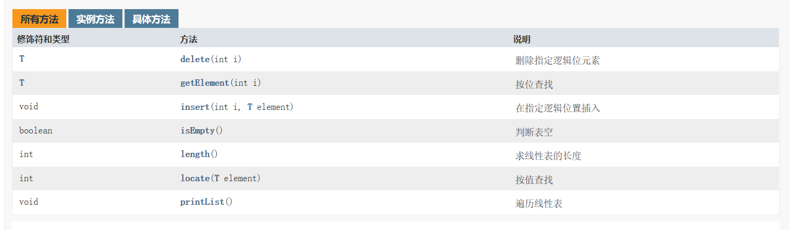

简单的完成了任务！

# 后记

Java文档注释非常方便，也很好用，建议编程人员养成良好的编程习惯，认真写注释。

另外，现在的IDE非常便捷，能够在你输入/**和回车的时候直接生成文档注释结构。比如在写完一个方法以后，这么做IDE会直接生成包含@param、@return、@throws等在内的基本文档注释，把变量名等直接给出了，很是方便。

而且IDE里如果有良好的文档注释，鼠标放在类名等上时，IDE会给出基本解释（Eclipse）。

Eclipse的@param在生成以后就那个样子了，除非重新生成，否则即使改变变量名也不会引起警告或者错误（生成文档时除外），而IDEA则会给不匹配的文档注释警告报错（红字提示），很人性化。

Eclipse里的文档注释是白色的，挺丑；IDEA里是绿色、斜体，蛮好看的。
