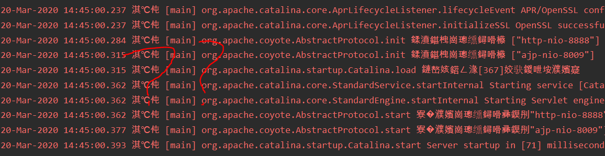
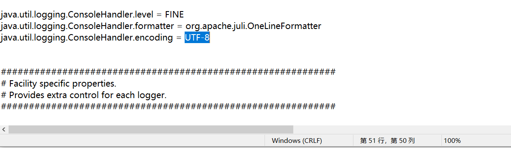
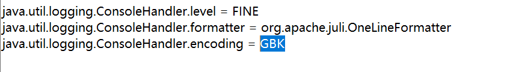
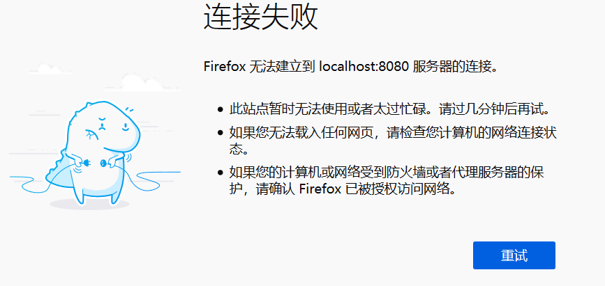
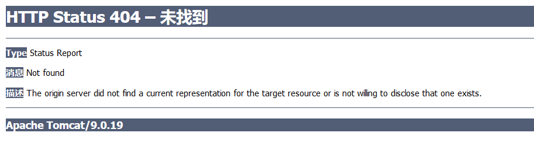
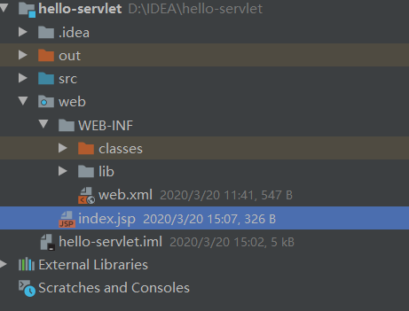
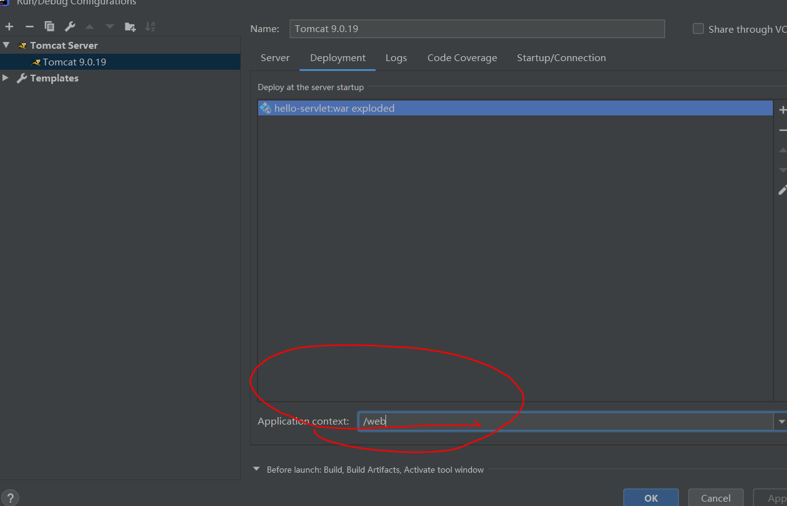
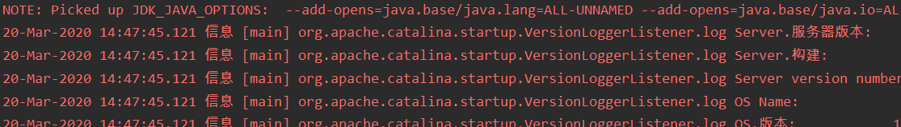

---
title: JavaEE开发Web项目尝试
date: 2020-07-25 19:40:47
summary: 本文尝试JavaEE开发Web项目，基于Servlet+JSP+Tomcat。
tags:
- Java
- Tomcat
- Servlet
- JSP
categories:
- Java
---

# 配置Tomcat

首先要配好Tomcat服务器。

荐读：[《初次配置Tomcat的那些糟心事》](https://blankspace.blog.csdn.net/article/details/104982601)
助你初配Tomcat的时候排坑避雷。

# 操作流程

网上有各种的教程，但我觉得很多都有问题，这里给大家推荐一份优质的[初学者教程](https://www.cnblogs.com/liusong-funtime/p/9144275.html)。

希望大家能认真地动手操作。

# index.jsp

文件就是web文件夹下的index.jsp，后续我们看的也是这个文件：

```html
<%@ page contentType="text/html;charset=UTF-8" language="java" %>
<html>
  <head>
    <title>Servlet & JSP</title>
  </head>
  <body>
    <h1>Hello, Servlet!</h1>
  </body>
</html>
```

# web.xml

WEB-INF下的web.xml也要配一下（加上Servlet的话）。

这里的Test假设是src代码根路径下的类，并且读者要注意最后一个是/Test，莫要填错。

```xml
<?xml version="1.0" encoding="UTF-8"?>
<web-app xmlns="http://xmlns.jcp.org/xml/ns/javaee"
         xmlns:xsi="http://www.w3.org/2001/XMLSchema-instance"
         xsi:schemaLocation="http://xmlns.jcp.org/xml/ns/javaee http://xmlns.jcp.org/xml/ns/javaee/web-app_4_0.xsd"
         version="4.0">
    <servlet>
        <servlet-name>Test</servlet-name>
        <servlet-class>Test</servlet-class>
    </servlet>
    <servlet-mapping>
        <servlet-name>Test</servlet-name>
        <url-pattern>/Test</url-pattern>
    </servlet-mapping>
</web-app>
```

# JavaEE相关包的导入

IDEA可以下载JavaEE6的包，顺便下载一下呗，装在lib文件夹下，成功导入即可。

不导入的话，是没法使用Servlet的。

# 启动遇到“淇℃伅”的乱码问题

这可能是一种较为常见的问题，但也不算什么大事（可乱码看着总不那么舒服嘛）。


大家可以看到这里很多红色的“淇℃伅”，再加上右边的一堆qqgg的符号，可见确实是乱码。
（说明：这是日志，这里的红色并不是说明报错了，不必担心）

乱码的根源还是Windows系统那个GBK中文编码，而这些默认都是UTF-8，要想在Windows的Console里显示出来，就得改UTF-8为GBK。

## 解决方法

找到Tomcat目录下的`conf/logging.properties`配置文件，使用记事本等文本编辑器打开，找到下图的位置，发现UTF-8，改为GBK（这也是没办法的）：




只改这一处就可以，然后重启Tomcat服务器，发现真的不红了：


# 网页无显示

打不开可能是你端口号弄错了，未必是8080，比如我的Tomcat默认端口号就是8888，所以打开8080就是这样的：


# 404 Not found



这个问题，困扰着很多人。
我在网上搜的时候，就找到各种各样的错误原因，下面的读者也纷纷表示还是解决不了问题，可见这个问题是多么的恶心。

我只能以自己这里出现过的问题来给大家做一下分享，如果不能解决您的问题，真的抱歉。

## 路径错误

我们按照上面的教程，会作出这样的包结构：


如果你不仔细看的话，可能会认为在浏览器中输入的应该是（再说一次，我这里的端口号是8888）：<font color="red">http://localhost:8888/web/index.jsp</font>。

这很重要，你**别打开**`http://localhost:8888`，那肯定404的。

## 配置错误



就以自己为例，当时反复比对都觉得自己没有问题，但后来某一次重走流程意外发现我设置的 <font color="red">Application context</font> 是错误的，后改成`/web`，就能够运行了。

## 处理方法总结

其实每个刚接触的人都会有各种各样的问题，问题往往来源于自己对新领域的不了解而疏忽了什么。希望大家在遇到仅凭搜索和远程询问得不到解决的问题的时候，能自己认认真真的按照规范的流程重新检查自己的问题，找到自己疏漏的地方，避免再次失误。

# 问题解决

重新启动Tomcat服务器：


打开Firefox（我设置的浏览器是火狐）：


