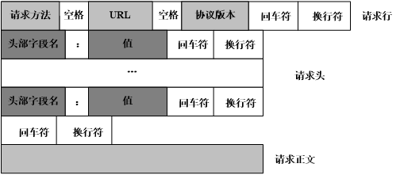
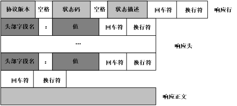
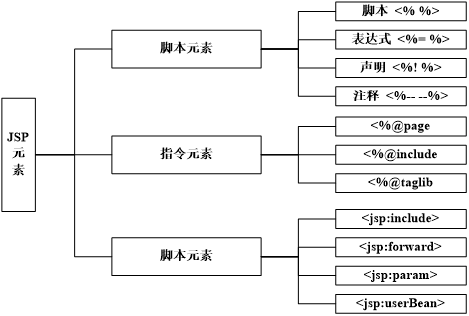

---
title: JavaEE开发技术笔记
date: 2021-02-16 21:24:50
summary: 本文分享基于JavaEE的Web开发笔记。
tags:
- Java
- Servlet
- JSP
- Tomcat
categories:
- Java
---

1. 动态网站和静态网站对比：
    - 静态网站：内容是固定的，不能实现交互操作
    - 动态网站：内容不是固定的，能够实现交互操作
2. B/S与C/S结构程序的对比：
    - B/S：Brower浏览器/Server服务器
        - 程序完全部署在应用程序服务器上
        - 用户通过浏览器就能访问服务器端
        - 服务器端更新客户端不需要更新也能访问
    - C/S：Client客户端/Server服务器
        - 用户必须安装客户端才能够访问服务端
        - 服务器端更新客户端必须更新才能访问
3. [URI与URL](https://blankspace.blog.csdn.net/article/details/105017432)
4. [HTTP协议POST与PUT的区别](https://blankspace.blog.csdn.net/article/details/105379510)
5. [HTTP状态码](https://blankspace.blog.csdn.net/article/details/103303488)
6. HTTP请求

7. HTTP响应

8. [常用的Web服务器](https://blankspace.blog.csdn.net/article/details/113804898)
9. [Tomcat服务器安装目录介绍](https://blankspace.blog.csdn.net/article/details/113804847)
10. Tomcat默认端口号为8080，修改端口号的方法是在Tomcat目录/conf/server.xml修改端口号：\<Connector port="8080" protocol="HTTP/1.1" connectionTimeout="20000" redirectPort="8443" />
11. [配置Tomcat的错误解决方法](https://blankspace.blog.csdn.net/article/details/104982601)
12. [启动Web项目并显示出HelloWorld](https://blankspace.blog.csdn.net/article/details/104990814)
13. [Servlet体系结构](https://blankspace.blog.csdn.net/article/details/113809269)
14. 创建Servlet类的方法：
    1. 创建出自定义类继承HttpServlet
    2. 重写doGet()、doPost()
    3. [配置Servlet](https://blankspace.blog.csdn.net/article/details/113810256)
15. [HTTP协议GET请求与POST请求](https://www.w3school.com.cn/tags/html_ref_httpmethods.asp)
16. [Servlet的生命周期](https://blankspace.blog.csdn.net/article/details/113810312)
17. [Servlet的多线程并发情况](https://blankspace.blog.csdn.net/article/details/113809647)
18. [页面跳转的两种基本方式——请求转发与重定向](https://blankspace.blog.csdn.net/article/details/113810470)
19. [web.xml配置JavaWeb项目首页](https://blankspace.blog.csdn.net/article/details/106292129)
20. [Servlet显示时间和IP等信息](https://blankspace.blog.csdn.net/article/details/105909042)
21. [getInitParameter()发生空指针导致HTTP500的解决方案](https://blankspace.blog.csdn.net/article/details/106038845)
22. [HTTP请求中文乱码的问题](https://blankspace.blog.csdn.net/article/details/113824337)
23. HttpServletRequest对象的常用方法：
    1. 根据请求参数名获取值：`String str = request.getParameter("参数值");`
    2. 设置请求的字符编码（表单POST请求方式提交且允许用户录入中文时）：`request.setCharacterEncoding("utf-8");`
24. HttpServletResponse对象的常用方法：
    1. 重定向方式实现页面跳转：`response.sendRedirect("页面路径");`
25. 页面提交数据到Servlet的方式
    1. 表单提交GET/POST
    2. 超链接发送数据GET：\<a href="路径?参数名=值&参数名2=值2">标签内容\</a>
26. Servlet处理请求数据
    1. `String str = request.getParameter("参数名或表单控件name");`
    2. 与复选框一起使用：`String[] strs = request.getParameterValues("参数名或表单控件name");`
27. PrintWriter对象的用法（一定要在获取out对象之前设置编码，`response.setContentType("text/html;charset=utf-8");`）：
     ```java
     PrintWriter out = response.getWriter();
     out.println("Hello你好<br/>");
     out.print("<strong>World</strong>");
     ```
28. 请求和响应字符编码：
    1. 请求字符编码（页面表单提交允许用户录入中文时）：`request.setCharacterEncoding("utf-8");`
    2. 响应字符编码（Servlet中打印内容到页面，能够打印中文）：`response.setContentType("text/html;charset=utf-8");`
29. 关于Web项目路径的`/`：
    1. `/`前面代表端口号：页面中\<form>中的action、\<a>中的href、\中的src、\<script>中的src、\<link>中的css等，Servlet中使用重定向跳转时，路径为“/项目名/路径”。
    2. `/`前面代表项目名：依据**web.xml**中配置的路径，Servlet中使用请求转发跳转时，路径为"/路径"。
30. [Cookie会话跟踪技术](https://blankspace.blog.csdn.net/article/details/113822653)
31. [Session会话跟踪技术](https://blankspace.blog.csdn.net/article/details/113823013)
32. Cookie和Session的比较：
    1. Cookie的特点：
        1. Cookie存储在客户端
        2. Cookie只能储存字符串类型的数据，不能直接支持储存汉字
        3. 如果使用setMaxAge(正数) 将数据存到本地，则Cookie只在指定的时间内有效
        4. Cookie有存储长度和个数的限制
        5. 相对于Session而言Cookie不安全
        6. Cookie一般用于用户的自动登录，浏览记录等
    2. Session的特点：
        1. Session存储在服务器端
        2. Session可以存储Object及其子孙类型的数据，可以支持储存汉字
        3. Session具备自己的生命周期
        4. Session没有存储长度和个数的限制
        5. 相对于Cookie，Session更安全
        6. Session一般用于存储用户相关的数据
33. URL重写：用户禁用浏览器Cookie之后，希望Session依然有效的，使用URL重写。
    ```java
    response.encodeURL("路径");
    response.sendRedirect(response.encodeURL("GetSessionServlet"));
    out.print("<a href='"+response.encodeURL("add.jsp")+"'>添加</a>");
    ```
34. [JSP与Servlet的关系](https://blankspace.blog.csdn.net/article/details/113825095)
35. [JSP的运行原理](https://blankspace.blog.csdn.net/article/details/113825503)
36. JSP有三种类型的元素：

37. [JSP的四种作用域](https://blankspace.blog.csdn.net/article/details/113825633)
38. EL表达式在JSP页面中使用，从作用范围中取值，语法格式为\${key}：
    1. 取基本类型：\${key} （String、int、double）
    2. 取对象类型：\${key.属性名}
    3. 取指定范围中的值：\${requestScope.uage} （从小范围到大范围查找）
39. JSTL标签库
    1. 项目中导入jar包
    2. 哪个页面想使用标签库，哪个页面就使用taglib引入标签库
40. [过滤器](https://blankspace.blog.csdn.net/article/details/113828538)
41. [监听器](https://blankspace.blog.csdn.net/article/details/113828544)
42. [MVC模式](https://blankspace.blog.csdn.net/article/details/113826730)
43. [JavaBean](https://blankspace.blog.csdn.net/article/details/113825170)
