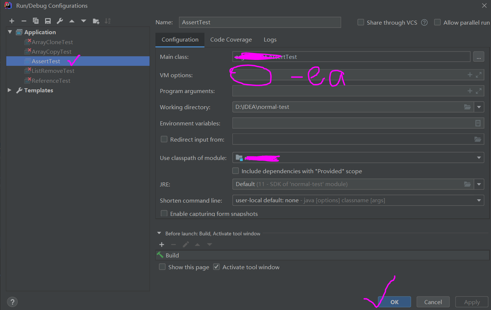

---
title: Java关键词assert解读
date: 2020-03-05 09:34:17
summary: 本文深入解读Java关键词assert，并分享断言与JUnit的基本概念。
tags:
- Java
- JUnit
categories:
- Java
---

# 断言

断言（Assertion）用于在程序中定义和验证假设条件。它是一种用于调试和测试的工具，旨在帮助开发人员在程序中插入检查点，并在条件不满足时抛出异常。断言可以用来确保程序中的特定条件在运行时得到满足，从而提高程序的可靠性和健壮性。

使用断言的目的是为了帮助开发人员在开发和调试阶段发现潜在的错误或逻辑问题。通过在代码中插入断言语句，开发人员可以明确指定一些不可变的条件，然后在程序执行过程中进行验证。如果断言失败，即条件不满足，就会抛出异常，提示开发人员可能存在错误。

使用断言的好处在于它能够帮助开发人员快速发现并定位问题所在。当开发人员对程序的行为有一定的预期时，可以使用断言来验证这些预期是否得到满足。如果断言失败，开发人员可以立即得知问题的所在，而不需要通过调试等复杂的方式来定位问题。

断言在测试阶段也非常有用。开发人员可以在测试用例中使用断言来验证程序的输出是否符合预期。通过编写各种测试用例，并在其中插入断言语句，可以帮助开发人员验证程序的正确性和可靠性。

# assert与断言

关键词assert是Java中的一个用于断言的关键字。它用于在程序中插入检查点，以验证程序的假设条件是否满足。通过使用断言，开发人员可以在代码中定义一些前提条件，并在运行时进行验证，以确保程序的正确性。

assert语法的语法规则形式如下：

```java
assert condition;
```

其中，condition是一个布尔表达式，用于描述一个期望的条件。当condition为false时，断言失败，程序将抛出一个java.lang.AssertionError异常。

除了基本的断言语法外，Java还提供了一种更灵活的断言形式，允许开发人员在断言失败时指定一个错误信息。这种形式的断言语法如下：

```java
assert condition : errorMessage;
```

其中，errorMessage是一个表达式，用于指定断言失败时要显示的错误信息。当断言失败时，将抛出带有错误信息的java.lang.AssertionError异常。这种形式的断言可以提供更详细的错误信息，有助于开发人员更好地理解问题所在。

需要注意的是，断言在默认情况下是被禁用的。也就是说，当Java程序运行时，默认不会执行断言语句。为了启用断言，需要在运行Java程序时使用`-ea`或`-enableassertions`选项。例如：

```shell
java -ea <ClassName>
```

这样可以在运行时启用断言，并执行断言语句。如果断言失败，将抛出java.lang.AssertionError异常。

想要在IDEA中启用断言，应该：从顶部菜单栏中选择Run，找菜单项Edit Configurations...



输入`VM options`后，正常运行程序即可。


# JUnit与断言

在JUnit框架中，不直接使用Java关键字assert。JUnit框架提供了自己的断言方法和断言类，用于编写测试用例和验证测试结果。

在JUnit中，断言方法是通过断言类（JUnit4的org.junit.Assert / JUnit5的org.junit.jupiter.api.Assertions）来调用的，而不是使用Java关键字assert。JUnit的断言方法提供了丰富的验证功能，可以用于比较值、验证条件、检查异常等。

尽管JUnit没有直接使用Java关键字assert，但它提供了更加丰富和灵活的断言方法，可以满足不同的测试需求。通过使用JUnit的断言方法，开发人员可以编写更具表达力和可读性的测试用例，并获得更详细的测试结果和错误信息。

JUnit提供的断言方法典例：
- `assertEquals(expected, actual)`：验证两个值是否相等
- `assertTrue(condition)`：验证条件是否为真
- `assertFalse(condition)`：验证条件是否为假
- `assertNull(object)`：验证对象是否为空
- `assertNotNull(object)`：验证对象是否不为空

这些断言语句用于验证测试结果的正确性。开发人员可以通过编写各种测试用例，并在其中使用断言语句来验证代码的行为是否符合预期。如果断言失败，JUnit会将测试标记为失败，并提供相应的错误信息，帮助开发人员快速定位问题。
