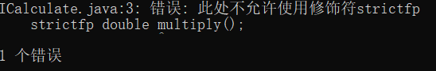

---
title: Java关键词strictfp解读
date: 2020-02-29 18:55:39
summary: 本文深入解读Java关键词strictfp的相关内容。
tags:
- Java
categories:
- 开发技术
---

# strictfp与Java

Java关键词strictfp是指"strict floating-point"（严格浮点），它用于确保浮点计算结果的可移植性，从Java2开始引入，现在已经废弃。

Java浮点运算在不同平台、不同编译器中会有微小的差异，即在不同平台（16/32/64位处理器）上运行类文件时，可能会出现不同的输出（浮点值）。这是因为硬件浮点单位在执行运算时使用的是不同的浮点计算方式，而这些浮点计算方式可能会导致结果的微小差异。在一些需要精确计算的场景，这种差异可能会产生重大影响，因此Java引入了strictfp关键词来避免这种问题。strictfp声明表达式严格遵循IEEE-754算术规范，限制浮点计算的精度和舍入，有助于跨平台特性的实现。

使用strictfp关键词声明类、接口、方法、变量后，就会强制执行严格的浮点运算，以确保在不同平台上的浮点计算结果的一致性。在这种情况下，Java虚拟机会忽略硬件浮点单位的计算方式，而采用一种特定的、固定的浮点计算方式。

strictfp无法保证高精度，真正的高精度浮点运算应该查看java.math.BigDecimal。

需要注意的是，使用strictfp关键词会对性能产生一定的影响，因为它需要使用一种特定的浮点计算方式来进行计算。因此，在一些对性能要求比较高的场景下，应该谨慎使用strictfp关键词。

# strictfp与Java方法

## strictfp与普通方法

下面代码的calMoney()被strictfp修饰了，那就表示这个方法会遵照strictfp的“要求”。

```java
public class Coffee {   
    
    private double price;
    
    private double weight;
    
    public Coffee(double price, double weight) {
        this.price = price;
        this.weight = weight;
    }
    
    public strictfp double calMoney() {
        return price*weight;
    }
    
    //setters and getters
    
}
```

## strictfp与抽象方法

**strictfp绝对不能用于抽象方法！！！会编译错误的！！！**

```java
public interface ICalculate {   

    strictfp double multiply();
     
}
```

上面的代码就是使用了strictfp修饰接口中的抽象方法，编译错误！！！



# strictfp与Java类

## strictfp与普通类

当使用strictfp修饰符声明类时，那么在类中声明的所有方法以及在该类中声明的所有嵌套类型都隐式被strictfp修饰。

```java
public strictfp class Coffee {   
    
    private double price;
    
    private double weight;
    
    public Coffee(double price, double weight) {
        this.price = price;
        this.weight = weight;
    }
    
    public double calMoney() {
        return price*weight;
    }
    
    //setters and getters
    
}
```

如上代码，calMoney() 虽然没有直接被 strictfp 修饰，但由于Coffee这个类被 strictfp 修饰了，所以实际上 calMoney() 还是被strictfp修饰了。

## strictfp与抽象类
strictfp 可以用于抽象类，在抽象类被继承，其中的抽象方法被实现的时候会默认使用 strictfp 修饰。

但是，前面说过，**strictfp 不能用于抽象类中抽象方法的修饰**，再次强调！！！
```java
public abstract strictfp class AbstractCoffee {   
    
    private double price;
    
    public Coffee(double price) {
        this.price = price;
    }
    
    public abstract double calculate();
    
    //setters and getters
    
}
```
```java
public class Coffee extends AbstractCoffee {   
    
    private double weight;
    
    public Coffee(double price, double weight) {
        super(price);
        this.weight = weight;
    }
    
    public double calculate() {
        return getPrice()*weight;
    }
    
    //setters and getters
    
}
```

## strictfp与接口

strictfp 可以用于接口，在接口被实现，其中的抽象方法也被实现的时候会默认使用 strictfp 修饰。

但是，前面说过，**strictfp 不能用于接口中抽象方法的修饰**，再次强调！！！

```java
public strictfp interface ICalculate {   

    double multiply();
     
}
```

如上代码，multiply()虽然没有被（事实上也不能被）strictfp修饰，但下面的multiply()方法就默认了这一点：

```java
public class Coffee implements ICalculate {   
    
    private double price;
    
    private double weight;
    
    public Coffee(double price, double weight) {
        this.price = price;
        this.weight = weight;
    }
    
    public double multiply() {
        return price*weight;
    }
    
    //setters and getters
    
}
```

上面的Coffee类没有被strictfp修饰，multiply()方法也没有被strictfp修饰，但由于multiply()是从ICalculate接口继承过来的，所以默认带上了strictfp的修饰。

抽象类中，strictfp只是不能修饰抽象方法，普通方法不受限。但由于接口的方法是隐式抽象的，因此其实**strictfp 不能用于接口内的任何方法**！！！！ 

# strictfp的测试代码

```java
public class StrictfpTest {

    private static strictfp double add(float a, double b) {
        return a+b;
    }

    public static void main(String[] args) {
        System.out.println(0.6710339+0.04150553411984792);
        System.out.println(add(0.6710339f, 0.04150553411984792));
    }
    
}
```

测试结果：
<font color="red">
0.7125394341198479
0.7125394529774224
</font>
