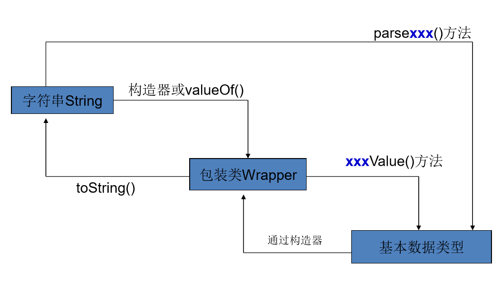

---
title: Java包装类型
date: 2020-03-07 15:23:08
summary: 本文分享Java基本类型与包装类型的相关内容。
tags:
- Java
categories:
- 开发技术
---

# 基本类型

推荐阅读：[Java基本类型](https://blankspace.blog.csdn.net/article/details/104545979)

# 包装类型

在 Java 中，基本类型和包装类型分别表示原始数据类型和对应的引用类型。

基本类型与包装类型的区别：
1. 基本类型变量的默认值不是null，包装类型变量的默认值是null（要注意潜在的java.lang.NullPointerException）。
2. 基本类型不能用于参数化类型（泛型），包装类型可以。
3. 基本数据类型的局部变量存放在JVM栈中的局部变量表中，基本数据类型的成员变量存放在JVM的堆中。包装类型属于引用类型，几乎所有对象实例都存在于堆中。
4. 基本类型变量比起对应的引用类型变量占用的内存空间更小。

Java 中的基本类型包括八种，分别是 boolean、byte、short、int、long、float、double 和 char。而对应的包装类型分别为 Boolean、Byte、Short、Integer、Long、Float、Double 和 Character。

| 数据类型 | 包装类型 | 
|:----:|:----:|
| boolean | java.lang.Boolean | 
| byte | java.lang.Byte |
| char | java.lang.Character |
| double | java.lang.Double |
| float | java.lang.Float |
| int | java.lang.Integer |
| long | java.lang.Long |
| short | java.lang.Short |

# 基本类型与包装类型的转换

## 拆箱与装箱

装箱是指将基本类型的值转换为相应的包装类型对象的过程。例如，将int类型的值转换为Integer类型的对象。自动装箱通过调用包装类型的valueOf方法来完成。

拆箱是指将包装类型对象转换为基本类型值的过程。例如，将Integer类型的对象转换为int类型的值。自动拆箱通过调用包装类型的xxxValue方法来完成，其中xxx表示基本类型。

频繁地装箱与拆箱会影响系统性能，我们要尽量控制装箱与拆箱的次数。

例如：

```java
// 使用包装类型的方法进行转换
Integer e = Integer.valueOf("30");
int f = e.intValue();
```



## 自动装箱与自动拆箱

JDK自从5.0版本后引入自动装箱和自动拆箱机制，可方便程序的编写 。

这两个机制，在进行基本数据类型和对应的包装类转换时，系统将自动进行。

所谓自动装箱，就是直接把一个基本类型的变量赋值给其对应的包装类型。
所谓自动拆箱，就是直接把一个包装类型的变量赋值给其对应的基本类型。

 例如：
 

```java
Integer i = 10; // 自动装箱
int j = i; // 自动拆箱
```

# 包装类型的缓存机制

java.lang.Byte、java.lang.Short、java.lang.Integer、java.lang.Long这四种包装类默认创建了数值在$[-128，127]$之间的相应类型的缓存数据，java.lang.Character默认创建了数值在$[0,127]$之间的缓存数据，java.lang.Boolean缓存了true和false。

包装类型的缓存机制背后用到了设计模式中的享元模式。

Java中的包装类缓存机制都是通过内部类xxxCache实现的。xxxCache类是一个静态内部类，用于缓存数值对象。在xxxCache类中，通过静态块初始化一个cache数组，且每个元素都是相应包装类的对象。当程序需要获取一个数值对象时，首先判断这个数值是否在缓存数组中：如果在，则直接返回缓存数组中的对象；否则重新创建一个新的数值对象。

java.lang.Integer缓存源码：
```java
private static class IntegerCache {
    static final int low = -128;
    static final int high;
    static final Integer[] cache;
    static Integer[] archivedCache;

    static {
        // high value may be configured by property
        int h = 127;
        String integerCacheHighPropValue = VM.getSavedProperty("java.lang.Integer.IntegerCache.high");
        if (integerCacheHighPropValue != null) {
            try {
                h = Math.max(parseInt(integerCacheHighPropValue), 127);
                // Maximum array size is Integer.MAX_VALUE
                h = Math.min(h, Integer.MAX_VALUE - (-low) -1);
            } catch( NumberFormatException nfe) {
                // If the property cannot be parsed into an int, ignore it.
            }
        }
        high = h;

        // Load IntegerCache.archivedCache from archive, if possible
        CDS.initializeFromArchive(IntegerCache.class);
        int size = (high - low) + 1;

        // Use the archived cache if it exists and is large enough
        if (archivedCache == null || size > archivedCache.length) {
            Integer[] c = new Integer[size];
            int j = low;
            for(int i = 0; i < c.length; i++) {
                c[i] = new Integer(j++);
            }
            archivedCache = c;
        }
        cache = archivedCache;
        // range [-128, 127] must be interned (JLS7 5.1.7)
        assert IntegerCache.high >= 127;
    }

    private IntegerCache() {}
}
```

```java
public static Integer valueOf(int i) {
    if (i >= IntegerCache.low && i <= IntegerCache.high)
        return IntegerCache.cache[i + (-IntegerCache.low)];
    return new Integer(i);
}
```

java.lang.Character缓存源码：
```java
private static class CharacterCache {
    private CharacterCache(){}

    static final Character[] cache;
    static Character[] archivedCache;

    static {
        int size = 127 + 1;

        // Load and use the archived cache if it exists
        CDS.initializeFromArchive(CharacterCache.class);
        if (archivedCache == null || archivedCache.length != size) {
            Character[] c = new Character[size];
            for (int i = 0; i < size; i++) {
                c[i] = new Character((char) i);
            }
            archivedCache = c;
        }
        cache = archivedCache;
    }
}
```

```java
public static Character valueOf(char c) {
    if (c <= 127) { // must cache
        return CharacterCache.cache[(int)c];
    }
    return new Character(c);
}
```

java.lang.Boolean缓存源码：
```java
public static Boolean valueOf(String s) {
    return parseBoolean(s) ? TRUE : FALSE;
}
```

# 包装类型的比较

对于两个包装类型的对象，不能使用"\=\="来比较它们是否相等，因为"\=\="比较的是对象的引用地址。应该使用equals()方法来比较它们的值是否相等。
