---
title: Java图形用户界面开发技巧总结
date: 2019-12-09 15:58:37
summary: 本文分享基于Java内置的AWT和Swing框架开发GUI的技巧。
tags:
- Java
- GUI
categories:
- Java
---

# 开发技巧

## JScrollPane内容显示与刷新

### 情况引入

JScrollPane是支持滚卷的中间容器，所以JList、JTable、JTree等组件放在JScrollPane里还是很合适的。但是我的JTable如果创建时指定内容，则不会自动刷新；如果不指定，干脆不会显示。

博主试过各种奇奇怪怪的方法，始终不能解决，比如：
- 新建Model
- 删除JTable并重建
- updateUI()
- repaint()
- ……

全部无效。

后来发现了自己的错误所在，偶然想起来，分享给大家。

### 情况描述

之前遇到了一个令人困惑不解的问题：为什么我的JScrollPane里的JTable没显示数据？（经测试数据已经传到前端）：

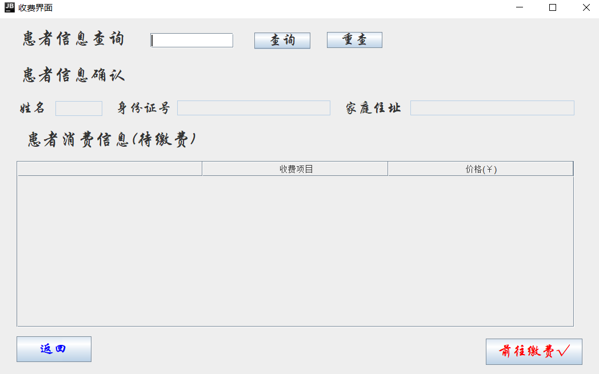

查询患者信息及其待缴费的消费信息：
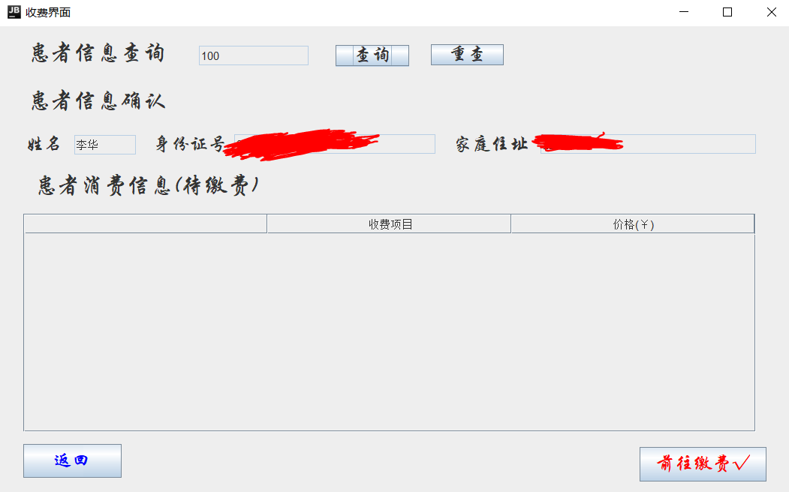

可惜的是消费信息这部分，我们必须拖动顶部的栏才能显示出来：
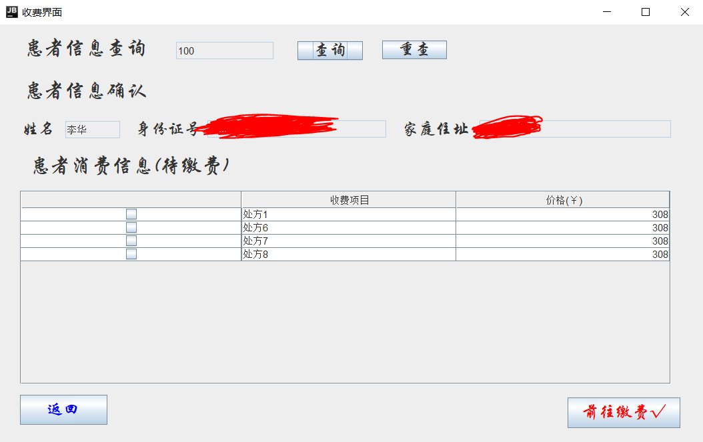

这显然是不合规范的，我们必须寻求改变。

### 情况分析

后来我发现错误的地方在于如何把JTable、JList、JTree等组件插入ScrollPane里。

```java
// ...
String[] columnNames = {"", "收费项目", "价格(￥)"};
tableModel = new MyTableModel();
tableModel.setColumnNames(columnNames);
table = new JTable(tableModel);
JScrollPane scrollPane = new JScrollPane(table);
scrollPane.setBounds(25, 200, 781, 233);
contentPane.add(scrollPane);
//...    
```

其实是add()的问题。

```java
tableModel = new DefaultTableModel(tableData, tableHeader);
table = new JTable(tableModel);
scrollPane_1.setViewportView(table);
```

如果是这样的语句，把add()换成setViewportView()，问题就会得到解决。

官方API文档给出了下面的图：
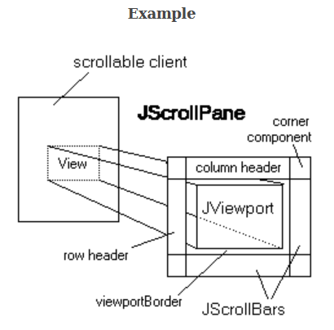

所以，实际上我们添加到的位置是JViewport这块区域。

### 情况总结

- 多积累经验是很重要的。对于有些不容易解决的问题，我们在遇到过并整理过以后，下次就会好很多。
- 遇到不会的内容一定要积极地查看官档，本文所述的这种错误往往源于编程的人不了解API的内容。
- 具体有关于JScrollPane的内容请查看[官方文档](https://docs.oracle.com/en/java/javase/11/docs/api/java.desktop/javax/swing/JScrollPane.html)。
- 至于说怎么刷新组件，不是本文描述的重点。给点提示：修改Model就OK，毕竟Swing是MVC模式的。

## JTable元素结点排序

### 解决方案

响应并处理选中的结点：
```java
// 设置节点选中监听器
tree.addTreeSelectionListener(new TreeSelectionListener() {
    @Override
    public void valueChanged(TreeSelectionEvent e) {
        DefaultMutableTreeNode target = (DefaultMutableTreeNode)tree.getLastSelectedPathComponent();
        list = controller.readList(target);
        tableData = controller.showPatients(list);
        tableModel.setDataVector(tableData, tableHeader);
    }
});
```

因为我们知道DefaultTableModel里的数据存在二维数组里，所以我们可以将二维数组转成List再进行排序，List标定的泛型类型是实体类，确保重排的是整行数据。

将二维数组转成List：
```java
public List<PatientInfo> readList(DefaultMutableTreeNode target) {
    DiseaseType node = (DiseaseType)target.getUserObject();
    List<PatientInfo> patientInfoSet = node.getPatientSet();
    return patientInfoSet;
}

/**
  * 查询文件，在选中某结点以后查询出所有的患者并建立二维数组(JTable的Model)
  * @param patientInfoSet
  * @return
  */
public Object[][] showPatients(List<PatientInfo> patientInfoSet) {
    int size = patientInfoSet.size();
    Object[][] tableData = new Object[size][2];
    int i = 0;
    for (PatientInfo patient : patientInfoSet) {
        tableData[i][0] = patient.getId();
        tableData[i][1] = patient.getName();
        i++;
    }
    return tableData;
}
```

按照ID排序：
```java
JButton btnNewButton = new JButton("按ID排序");
btnNewButton.addMouseListener(new MouseAdapter() {
    @Override
    public void mouseClicked(MouseEvent e) {
        controller.quickSortById(list, 0, list.size()-1);
        tableData = controller.showPatients(list);
        // System.out.println(tableData.length);
        tableModel.setDataVector(tableData, tableHeader);
    }
});
btnNewButton.setFont(new Font("黑体", Font.BOLD, 15));
btnNewButton.setBounds(47, 27, 127, 27);
panel.add(btnNewButton);
```

前端排序，按照需求不需要在后端修改：
```java
/**
 * 对查询到的数据进行排序(按照ID)
 * 排序在前端完成，不返回后台
 */
public void sortById(List<PatientInfo> list) {
    Collections.sort(list, new Comparator<PatientInfo>(){
        /*
         * int compare(PatientInfo p1, PatientInfo p2) 返回一个基本类型的整型，
         * 返回负数表示：p1 小于p2，
         * 返回0 表示：p1和p2相等，
         * 返回正数表示：p1大于p2
         */
        public int compare(PatientInfo p1, PatientInfo p2) {
            // 按照Person的ID进行升序排列
            if (p1.getId() > p2.getId()){
                return 1;
            }
            if (p1.getId() == p2.getId()){
                return 0;
            }
            return -1;
        }
    });
}
```

按照Name排序：
```java
JButton button = new JButton("按姓名排序");
button.addMouseListener(new MouseAdapter() {
    @Override
    public void mouseClicked(MouseEvent e) {
       controller.quickSortByName(list, 0, list.size()-1);
       tableData = controller.showPatients(list);
       // System.out.println(tableData.length);
       tableModel.setDataVector(tableData, tableHeader);
    }
});
button.setFont(new Font("黑体", Font.BOLD, 15));
button.setBounds(234, 27, 127, 27);
panel.add(button);
```

前端排序，按照需求不需要在后端修改：

```java
/**
 * 对查询到的数据进行排序(按照名字)
 * 排序在前端完成，不返回后台
 */
public void sortByName(List<PatientInfo> list) {
    Collections.sort(list, new Comparator<PatientInfo>(){
        /*
         * int compare(PatientInfo p1, PatientInfo p2) 返回一个基本类型的整型，
         * 返回负数表示：p1 小于p2，
         * 返回0 表示：p1和p2相等，
         * 返回正数表示：p1大于p2
         */
        public int compare(PatientInfo p1, PatientInfo p2) {
            return (p1.getName()).compareTo(p2.getName());
        }
    });
}
```

下面两个图就是点击两个JButton的效果：
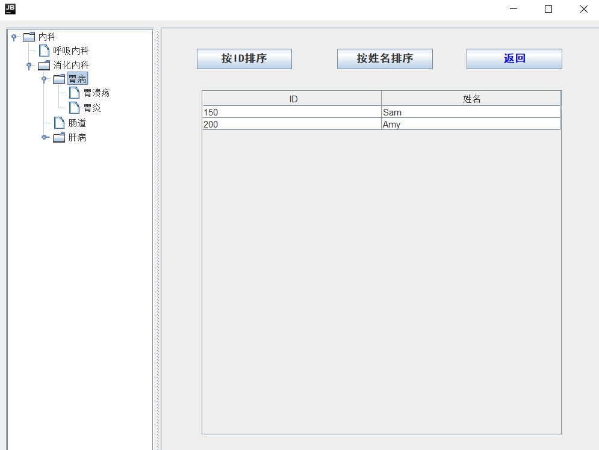
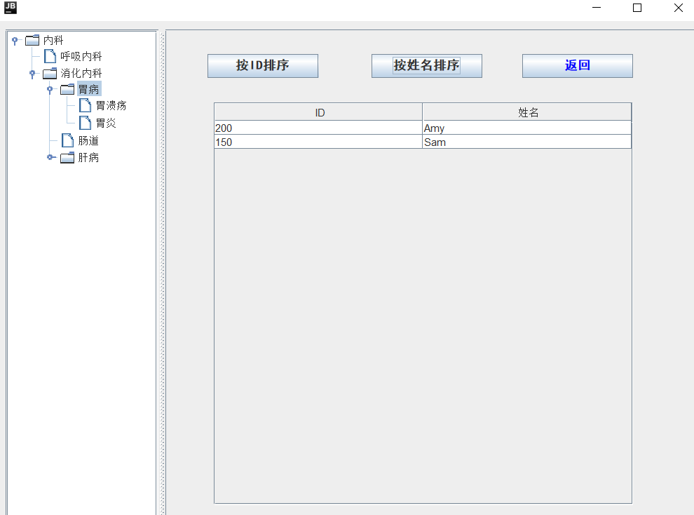

但是内置的排序效率据说不会特别高，我们也可以自己写排序(快速排序)：
```java
public void quickSortById(List<PatientInfo> list, int low, int high) {
    // start是list的第一位，end是list的最后一位，start和end都是list的下标；
    int start = low;
    int end = high;
    // key作为参考值，取未排序的list第一位key的首字母作为参考
    // 下方的算法大体思路，就是拿list的第一位和key比较，排序，key值前都比value小，key值后都比key大
    Integer key = list.get(low).getId();
    while (end > start) {
        // 从后往前比较
        // list.get(end).getId()是list最后一个值的ID
        while (end > start && list.get(end).getId() >= key) {
            end--;
        }
        if (list.get(end).getId() <= key) {
            // 此时list第一位和最后一位需要调换位置，先将list第一位的值保存起来
            PatientInfo keyStarts = list.get(start);
            // 此处调换位置，使用list的set方法，由于第一位放入了最后一个值，所以最后一位需要放入之前的第一位的值
            list.set(start, list.get(end));
            list.set(end, keyStarts);
        }
        // 从前往后比较
        while (end > start && list.get(start).getId() <= key) {
            start++;
        }
        if (list.get(start).getId() >= key) {
            // 同理从后往前比较，需要将第一位的值先保存，方便调换
            PatientInfo keyStarts = list.get(start);
            list.set(start, list.get(end));
            list.set(end, keyStarts);
        }
        if (start > low) quickSortById(list, low, start - 1);
        if (end < high) quickSortById(list, end + 1, high);
    }
}

public void quickSortByName(List<PatientInfo> list, int low, int high) {
    // start是list的第一位，end是list的最后一位，start和end都是list的下标；
    int start = low;
    int end = high;
    // value作为参考值，取未排序的list第一位key的首字母作为参考
    // 下方的算法大体思路，就是拿list的第一位和key比较，排序，key值前都比key小，key值后都比value大
    String key = list.get(low).getName();
    while (end > start) {
        // 从后往前比较
        // list.get(end).getId()是list最后一个值的ID
        while (end > start && list.get(end).getName().compareTo(key) >= 0) {
            end--;
        }
        if (list.get(end).getName().compareTo(key) <= 0) {
            // 此时list第一位和最后一位需要调换位置，先将list第一位的值保存起来
            PatientInfo keyStarts = list.get(start);
            // 此处调换位置，使用list的set方法，由于第一位放入了最后一个值，所以最后一位需要放入之前的第一位的值
            list.set(start, list.get(end));
            list.set(end, keyStarts);
        }
        // 从前往后比较
        while (end > start && list.get(end).getName().compareTo(key) <= 0) {
            start++;
        }
        if (list.get(end).getName().compareTo(key) >= 0) {
            // 同理从后往前比较，需要将第一位的值先保存，方便调换
            PatientInfo keyStarts = list.get(start);
            list.set(start, list.get(end));
            list.set(end, keyStarts);
        }
        if (start > low) quickSortByName(list, low, start - 1);
        if (end < high) quickSortByName(list, end + 1, high);
    }
}
```

## GUI避免用户篡改查询结果

### 情况引入

我们常常将查询结果下JTextField对象或者JTextArea对象里显示出来，但如果用户私自非法篡改内容，这是可能会引来麻烦的，我们必须对此处理。

### 情况描述

我们看下面的部分UI视图：
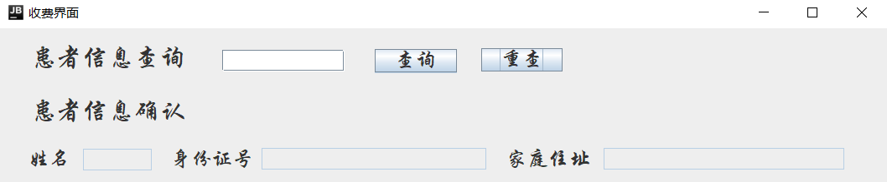

如果我们查询到的信息可以被用户任意篡改，那么会比较麻烦，所以我认为应该做控制，制止用户修改权限。

这个所谓的“权限”，其实主要通过下面两个方法实现的：
- ` setEditable() `
- ` setText() `

第一个是set文本是否可编辑的，第二个是改文本内容的。

首先是下面的“患者信息确认”，那里的三个JTextField对象里的内容必须始终setEditable(false)，不允许用户编辑。

我们可以设置监听，鼠标点击的监听，针对的是“查询”按钮，当查询按钮被点击以后如果查不到可以对用户“报错”并不做处理；如果查到了数据，可以对下面的三个JTextField分别setText()，修改内容，并对患者查询栏设置setEditable(false)。

我们可以允许继续操作，这就要求有“重查”功能。

点击“重查”按钮，把患者查询栏设置setEditable(true)，并将患者信息的三三个JTextField分别setText("")，即清空，避免引起麻烦。

效果演示：
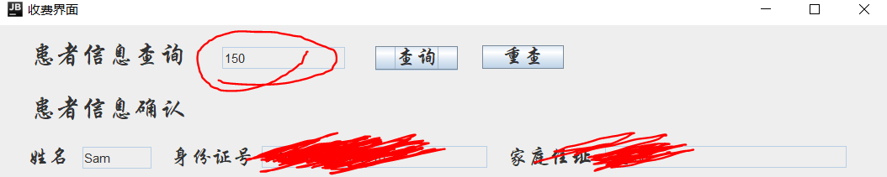

## GUI界面切换

### 情况引入

我们在用Swing编写复杂GUI程序的时候，不可避免的会遇到切换界面的情况，那么如何实现呢？

### 情况描述

比如下面的两个界面：

NurseFrame：
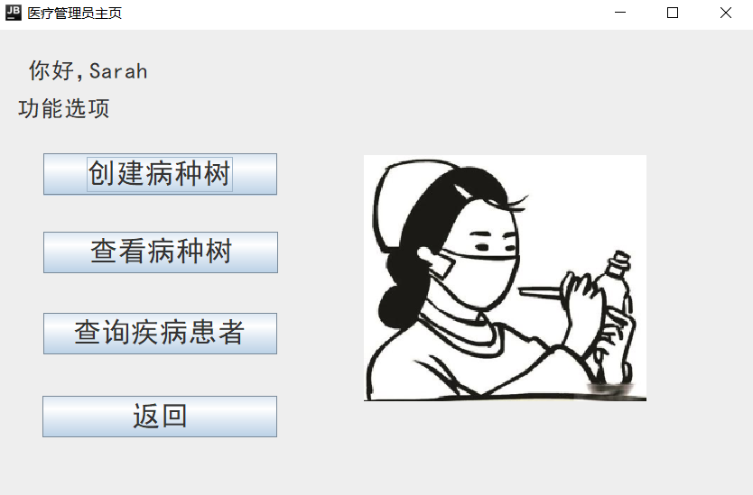

CreateDiseaseTypesFrame：
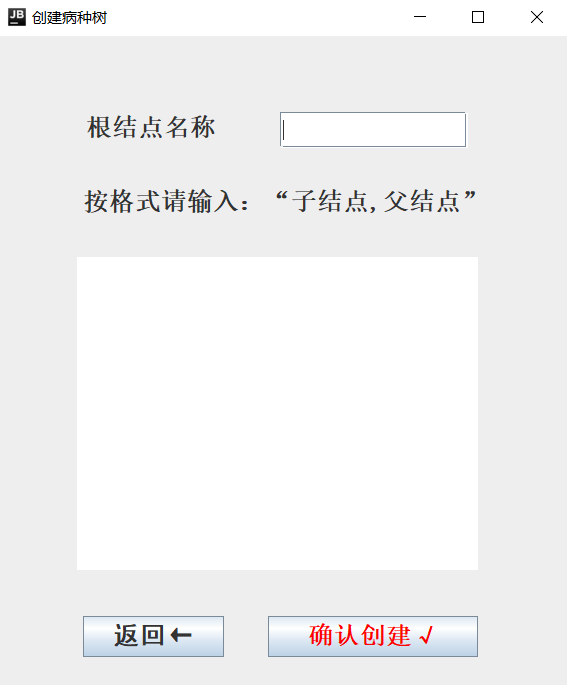

在NurseFrame里点击“创建病种树”的JButton（按钮）时，我们期望弹出CreateDiseaseTypesFrame而关闭NurseFrame；在CreateDiseaseTypesFrame界面里点击“返回”的JButton时，我们期望弹出NurseFrame而关闭CreateDiseaseTypesFrame。

上述的描述，实现起来其实就是“切换界面”。

### 双界面切换的解决方案

不加以讲解，可看注释~~

NurseFrame的代码：

```java
JButton button_1 = new JButton("创建病种树");
button_1.addMouseListener(new MouseAdapter() {
    @Override
    public void mouseClicked(MouseEvent e) {
        // 释放当前界面对象的内存
        NurseFrame.this.dispose();
        // 创建新的JFrame的对象
        new CreateDiseaseTypesFrame(name);
    }
});
button_1.setFont(new Font("黑体", Font.PLAIN, 25));
button_1.setBounds(42, 110, 207, 37);
contentPane.add(button_1);
```

CreateDiseaseTypesFrame的代码：

```java
JButton button_2 = new JButton("返回←");
button_2.addMouseListener(new MouseAdapter() {
    @Override
    public void mouseClicked(MouseEvent e) {
        SearchPatientsByDiseaseTypeFrame.this.dispose();
        new NurseFrame(name);
    }
});
button_2.setFont(new Font("黑体", Font.BOLD, 20));
button_2.setBounds(195, 565, 113, 33);
contentPane.add(button_2);
```

有必要解释一下dispose()相关的问题，这是本文的核心内容。

### dispose()原理

java.desktop模块里的java.awt.Window类定义了dispose()方法。
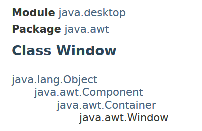

我们的类继承自JFrame，但由于JFrame本身就算Window的子孙类，所以继承了dispose()，供我们使用。
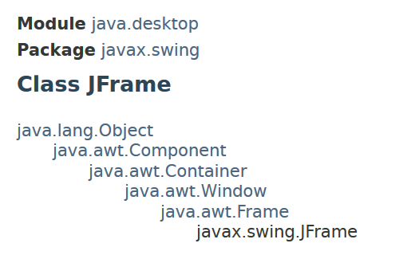

java.awt.Window的dispose()方法的API文档描述：

***public void dispose()***

***Releases all of the native screen resources used by this Window, its subcomponents, and all of its owned children. That is, the resources for these Components will be destroyed, any memory they consume will be returned to the OS, and they will be marked as undisplayable.
The Window and its subcomponents can be made displayable again by rebuilding the native resources with a subsequent call to pack or show. The states of the recreated Window and its subcomponents will be identical to the states of these objects at the point where the Window was disposed (not accounting for additional modifications between those actions).
Note: When the last displayable window within the Java virtual machine (VM) is disposed of, the VM may terminate. See AWT Threading Issues for more information.***

翻译：
释放此Window及其子组件及其所有子级使用的所有本机屏幕资源。 也就是说，这些组件的资源将被销毁，它们消耗的任何内存都将返回给OS，并将它们标记为不可显示。
通过重建本机资源以及随后的打包或显示调用，可以再次显示Window及其子组件。 重新创建的Window及其子组件的状态与放置Window时这些对象的状态相同（不考虑这些动作之间的其他修改）。
注意：丢弃Java虚拟机（VM）中的最后一个可显示窗口时，VM可能会终止。 有关更多信息，请参见AWT线程问题。

### 理解ClassName.this.dispose()

有的初学者可能认为找不到dispose()的调用者，这是因为this关键词掌握的不好，建议好好学习一下this。

另外有人会认为是this.dispose()就够了，其实不然。
这个Adaptor是MouseAdapter，所以没有dispose()方法，直接用this的话，this代表当前MouseAdaptor对象，故而this.dispose()是编译错误的。
所以必须用ClassName.this.dispose()，表示当前JFrame的子类的对象作为方法的调用者。

这里涉及匿名内部类的知识，不了解的可以了解一下。

说明：ClassName指类名，是一个代指的，不是说直接写ClassName。

### 三个界面切换的解决方案

比如可以在某JFrame的构造器里传入JFrame对象，通过仔细的设置进行调节。

```java
public MedicineSupplementFrame(JFrame frame, PrescribeItem item, List<PrescribeItem> itemList, int prescriptionId, int medicineNumber) {
```

这里说的调节包括很多内容，比如：
- 当前界面点击关闭按钮会带来什么影响？（关闭自己/关闭自己连带着关闭其他并“回滚”/程序结束/……）
- 当前界面操作完成以后是弹出新窗口继续业务还是返回原界面？
- ……

### 情况总结
1. 这方面的内容是难以避免的，建议认真体会。
2. 只有自己尝试过，再次写的时候才能有把握。
3. 每一次都要反复测试，找到无误的解决方案。

# 问题解决

## panel.getGraphics()调用出现空指针异常

请看如下的Swing代码：
```java
public class GraphicsNullPointerDemo {
    public static void main(String[] args) {
        JFrame frame = new JFrame("空指针异常");
        frame.setLayout(new FlowLayout());
        frame.setSize(400, 200);
        frame.setLocationRelativeTo(null);
        frame.setDefaultCloseOperation(JFrame.EXIT_ON_CLOSE);
        JPanel panel = new JPanel();
        frame.add(panel, BorderLayout.CENTER);
        System.out.println(panel.getGraphics());
        frame.setVisible(true);
    }
}
```

输出的`panel.getGraphics()`值是`null`。

反之，调换`frame.setVisible(true)`和`panel.getGraphics()`的顺序，则不会为null。

事实上，`getGraphics()`经常有空指针异常的可能性，所谓"This method will return null if this component is currently not displayable."，因此应该先`setVisible(true)`后`getGraphics()`。

## ImageIcon读取图片出现空指针异常

基于Maven工程结构，开发Swing程序，ImageIcon读取图片失败出现空指针异常。

使用window-builder选择icon，生成这样的路径，运行可显示：
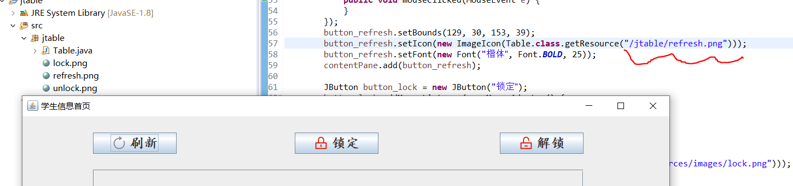

但是这种路径只是普通Java项目的路径，但是当我们遇到这样的Maven项目时：
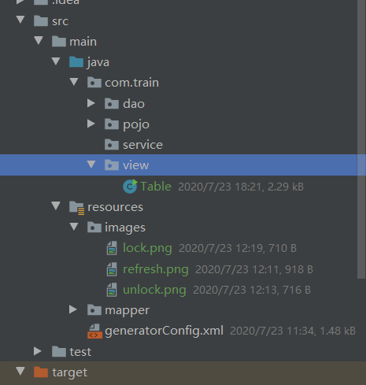

使用类似于上述的路径会疯狂报错：
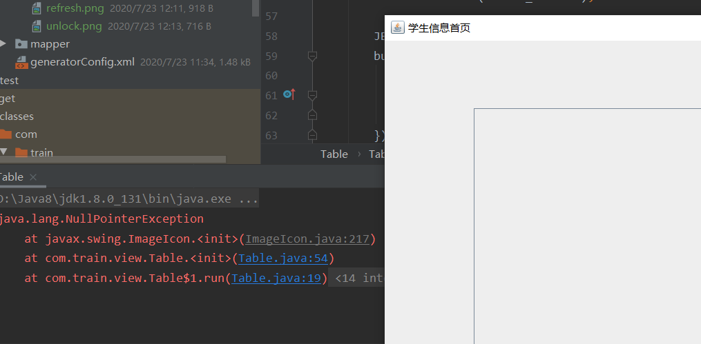

信息如下：
```
java.lang.NullPointerException
	at javax.swing.ImageIcon.<init>(ImageIcon.java:217)
	at com.train.view.Table.<init>(Table.java:54)
	at com.train.view.Table\$1.run(Table.java:19)
	at java.awt.event.InvocationEvent.dispatch(InvocationEvent.java:311)
	at java.awt.EventQueue.dispatchEventImpl(EventQueue.java:756)
	at java.awt.EventQueue.access\$500(EventQueue.java:97)
	at java.awt.EventQueue\$3.run(EventQueue.java:709)
	at java.awt.EventQueue\$3.run(EventQueue.java:703)
	at java.security.AccessController.doPrivileged(Native Method)
	at java.security.ProtectionDomain\$JavaSecurityAccessImpl.doIntersectionPrivilege(ProtectionDomain.java:80)
	at java.awt.EventQueue.dispatchEvent(EventQueue.java:726)
	at java.awt.EventDispatchThread.pumpOneEventForFilters(EventDispatchThread.java:201)
	at java.awt.EventDispatchThread.pumpEventsForFilter(EventDispatchThread.java:116)
	at java.awt.EventDispatchThread.pumpEventsForHierarchy(EventDispatchThread.java:105)
	at java.awt.EventDispatchThread.pumpEvents(EventDispatchThread.java:101)
	at java.awt.EventDispatchThread.pumpEvents(EventDispatchThread.java:93)
	at java.awt.EventDispatchThread.run(EventDispatchThread.java:82)s
```

博主查了做了很多尝试，也思考了很久如何处理这个路径的问题。诸如`src`这种，都不能读取icon。

我怀疑是Eclipse和IDEA存在差异，决定在Eclipse里模拟这种包结构：
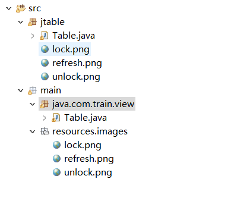

同样把路径配置交给window-builder：
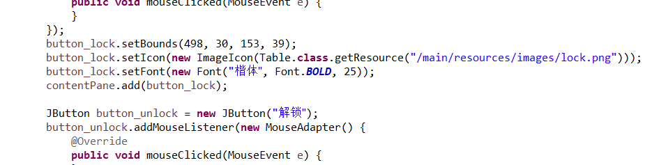

将这种写法沿用到IDEA中，还是报错空指针。

最终，我想到这里使用了Table.class，我决定去Maven工程目录下找到这个文件：
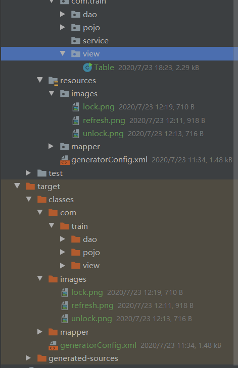

我恍然大悟：问题不在IDE，这种Maven工程结构与传统的JavaSE工程结构不同。这里找路径要基于.class所在的target，我们放置在resources下的images文件都被放到和com“平级”的目录下，所以需要把路径改成这样：
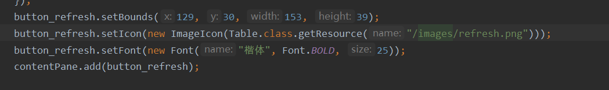

此时直接使用Crtl+左键单击即可访问图片，运行也能看到我们想看到的了：
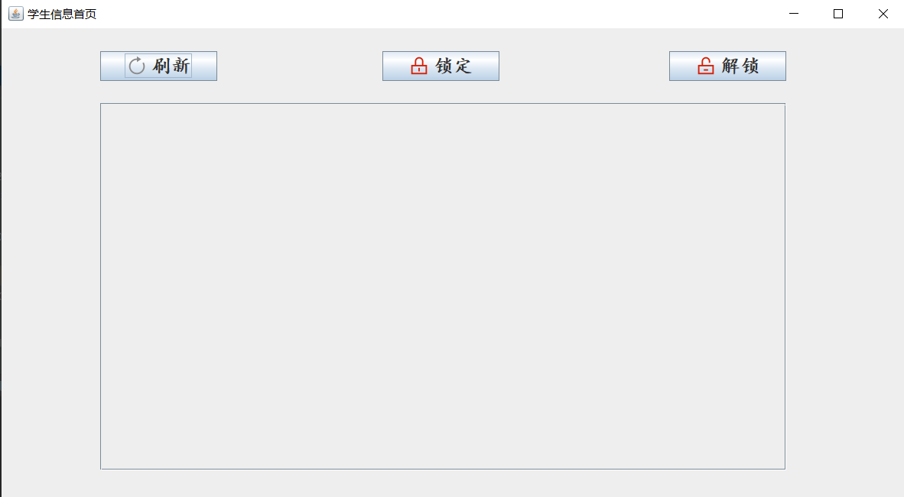

问题如此解决，再次提醒大家，找ImageIcon的图片路径要看.class！
