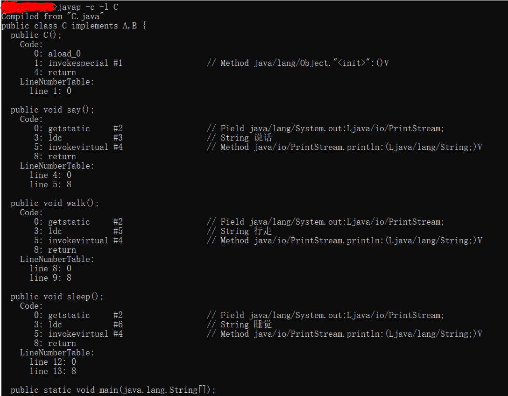
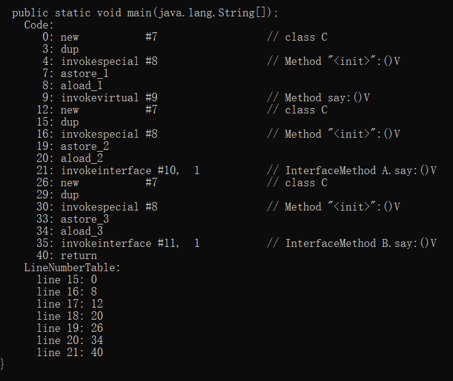

---
title: Java实现多接口时同名方法冲突问题
date: 2019-11-16 13:21:31
summary: 本文探究Java实现多接口时同名方法冲突问题。
tags:
- Java
categories:
- Java
---

# 问题由来

今天与朋友们聊天谈到C++的多继承问题，朋友觉得非常麻烦，特别是遇到方法重复的时候。
这时，我突然想到既然Java通过多接口的implement代替了复杂的多继承，那如果两个甚至多个接口存在相同的方法，会被怎样处理呢？

有这样几种想法：
- A：会爆出CE（编译错误）。
- B：调用时会爆出RE（运行时异常）。
- C：会按照编译时类型来指定，否则会报错。
- D：实现的是先被指定的接口的方法。
- E：两个接口的方法被“合并”了。

由于大家对Java的研究还是不够深，还是没有一个定论。

# 为探究设计的Demo

先来看这样一个例子：
首先是有两个接口A和B，各有各的方法（含一个同名的say()方法）：
```java
public interface A {
	void say();
	void walk();
}
```

```java
public interface B {
	void sleep();
	void say();
}
```
然后，我们设计一个C类来实现A和B两个接口：
```java
public class C implements A, B {
	@Override
	public void say() {
		System.out.println("说话");
	}
	@Override
	public void walk() {
		System.out.println("行走");
	}
	@Override
	public void sleep() {
		System.out.println("睡觉");
	}
}
```

# 设计测试与结果分析

```java
	public static void main(String[] args) {
		C c = new C();
		c.say();
	}
```

运行是正常的，可见不是简单的CE或者RE，**排除A、B、C三种想法**。
然后我们加上新的语句：

```java
		A a = new C();
		a.say();
		B b = new C();
		b.say();
```
发现均能达到效果。

由于我采用的是记事本编辑+命令行终端运行的方式，所以不便于直接确定say()方法是从哪里继承过来的，这时可以打开Eclipse IDE，找到say()，按住Ctrl，点击Super Implement，可以看到：
- c的say()来自A。
- a的say()来自A。
- b的say()来自B。

但这还不够，我们不能确定D想法是不是靠谱，我们需要做一组对照实验，对照组就是上述的例子，实验组就是在其他都相同的情况下把implement后面的A和B换序。

```java
public class C implements B, A {
	@Override
	public void say() {
		System.out.println("说话");
	}
	@Override
	public void walk() {
		System.out.println("行走");
	}
	@Override
	public void sleep() {
		System.out.println("睡觉");
	}
}
```

这时，我们发现c的say()指向的是B。
这印证了我们的D思路。

因为Eclipse IDE自身有一些问题，所以我们不能直接相信Eclipse，D与E之间还需要继续探究。

# 利用javap命令继续分析




# 得出结论

由于是接口方法，毕竟不是真正的多继承，还是存在一定的差别的。
下面的内容，先声明——由于我个人对这里的认识也不是很深，所以只讲出自己的看法：

（1）如果是

```java
A a = new C();
```
或是
```java
B b = new C();
```
这样两种情况，则依据javap可以看出，重名方法会跟着接口走，毕竟是编译时类型嘛。

（2）如果是

```java
C c = new C();
```
这种情况，编译时类型和运行时类型相同，都是实现类的话，我认为是会优先“继承”先implement的接口的同名方法，然后实现。此时，这个方法是子类的，它的super是优先implement的接口的public abstract方法。

因此，个人认为，D想法和E想法都有一定的成立理由，原因应该是二者的结合。
