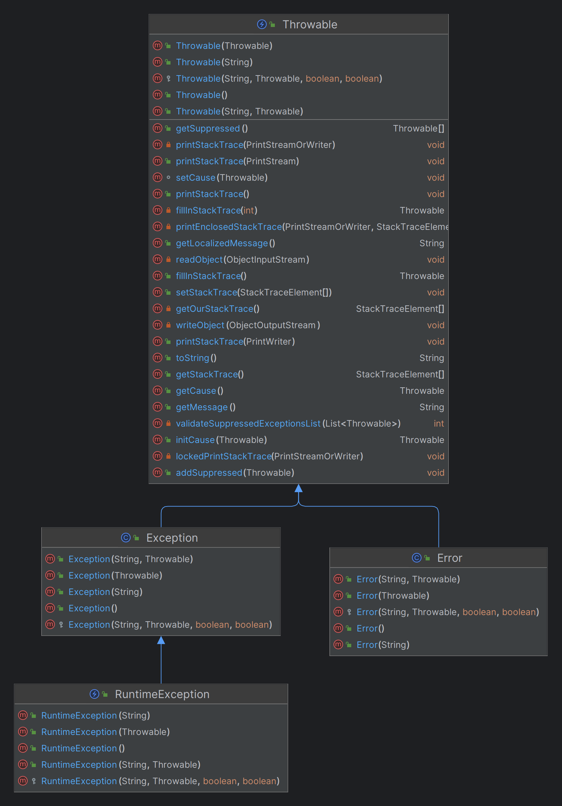

---
title: Java异常处理
date: 2020-02-27 15:58:51
summary: 本文分享Java异常处理体系的相关内容，以java.lang.Throwable、java.lang.Exception、java.lang.RuntimeException、java.lang.Error四个类为核心。
tags:
- Java
categories:
- Java
---

# 异常继承关系

Java异常类的基类是java.lang.Throwable，java.lang.Throwable的两个派生类是java.lang.Exception和java.lang.Error。

java.lang.Throwable的常用方法：
- <font color="blue">public Throwable fillInStackTrace()</font>：用当前的调用栈层次填充Throwable 对象栈层次，添加到栈层次任何先前信息中。
- <font color="blue">public Throwable getCause()</font>：返回一个Throwable 对象代表异常原因。
- <font color="blue">public String getMessage()</font>：返回关于发生的异常的详细信息。这个消息在Throwable 类的构造函数中初始化了。
- <font color="blue">public void printStackTrace()</font>：打印toString()结果和栈层次到System.err，即错误输出流。
- <font color="blue">public StackTraceElement[] getStackTrace()</font>：返回一个包含堆栈层次的数组。下标为0的元素代表栈顶，最后一个元素代表方法调用堆栈的栈底。
- <font color="blue">public String toString()</font>：使用getMessage()的结果返回类的串级名字。



# 异常分类

java.lang.Exception可分为受检查的异常（CheckedException）和不受检查的异常（UncheckedException），其中UncheckedException是运行时异常，继承自java.lang.RuntimeException，而java.lang.RuntimeException又继承自java.lang.Exception；CheckedException是编译时异常，不继承自java.lang.RuntimeException。

# 常见的异常

常见的UncheckedException：
- <font color="blue">java.lang.ArithmeticException</font>：当出现异常的运算条件时，抛出此异常。例如，一个整数"除以零"时，抛出此类的一个实例。
- <font color="blue">java.lang.ArrayIndexOutOfBoundsException</font>：用非法索引访问数组时抛出的异常。如果索引为负或大于等于数组大小，则该索引为非法索引。
- <font color="blue">java.lang.ArrayStoreException</font>：试图将错误类型的对象存储到一个对象数组时抛出的异常。
- <font color="blue">java.lang.ClassCastException</font>：当试图将对象强制转换为不是实例的子类时，抛出该异常。
- <font color="blue">java.lang.IllegalArgumentException</font>：抛出的异常表明向方法传递了一个不合法或不正确的参数。
- <font color="blue">java.lang.IllegalMonitorStateException</font>：抛出的异常表明某一线程已经试图等待对象的监视器，或者试图通知其他正在等待对象的监视器而本身没有指定监视器的线程。
- <font color="blue">java.lang.IllegalStateException</font>：在非法或不适当的时间调用方法时产生的信号。换句话说，即 Java 环境或 Java 应用程序没有处于请求操作所要求的适当状态下。
- <font color="blue">java.lang.IllegalThreadStateException</font>：线程没有处于请求操作所要求的适当状态时抛出的异常。
- <font color="blue">java.lang.IndexOutOfBoundsException</font>：指示某排序索引（例如对数组、字符串或向量的排序）超出范围时抛出。
- <font color="blue">java.lang.NegativeArraySizeException</font>：如果应用程序试图创建大小为负的数组，则抛出该异常。
- <font color="blue">java.lang.NullPointerException</font>：当应用程序试图在需要对象的地方使用 null 时，抛出该异常。
- <font color="blue">java.lang.NumberFormatException</font>：当应用程序试图将字符串转换成一种数值类型，但该字符串不能转换为适当格式时，抛出该异常。
- <font color="blue">java.lang.SecurityException</font>：由安全管理器抛出的异常，指示存在安全侵犯。
- <font color="blue">java.lang.StringIndexOutOfBoundsException</font>：此异常由 String 方法抛出，指示索引或者为负，或者超出字符串的大小。
- <font color="blue">java.lang.UnsupportedOperationException</font>：当不支持请求的操作时，抛出该异常。

常见的CheckedException：
- <font color="blue">java.lang.ClassNotFoundException</font>：应用程序试图加载类时，找不到相应的类，抛出该异常。
- <font color="blue">java.lang.CloneNotSupportedException</font>：当调用 Object 类中的 clone 方法克隆对象，但该对象的类无法实现 Cloneable 接口时，抛出该异常。
- <font color="blue">java.lang.IllegalAccessException</font>：拒绝访问一个类的时候，抛出该异常。
- <font color="blue">java.lang.InstantiationException</font>：当试图使用 Class 类中的 newInstance 方法创建一个类的实例，而指定的类对象因为是一个接口或是一个抽象类而无法实例化时，抛出该异常。
- <font color="blue">java.lang.InterruptedException</font>：一个线程被另一个线程中断，抛出该异常。
- <font color="blue">java.lang.NoSuchFieldException</font>：请求的变量不存在。
- <font color="blue">java.lang.NoSuchMethodException</font>：请求的方法不存在。

推荐阅读：[常见的Java异常与错误](https://blankspace.blog.csdn.net/article/details/130397871)

# 异常处理注意事项

成功的异常处理应该实现下面四个目标：
- 使程序代码混乱最小化。
- 捕获并保留诊断信息。
- 通知合适的人员。
- 采用合适的方式结束异常活动。

为更好地实现上述效果，以下基本准则需要注意：
- 不要过度使用异常。事实上，对完全已知的或者普通的错误应该编写处理错误的代码。只有对外部的、不能确定和预知的运行时错误才使用异常。<br>过度使用异常的两个主要表现：
    - 把异常处理和普通错误混淆在一起，不再编写任何错误处理代码，而是以简单地抛出异常来代替所有的异常处理。
    - 使用异常处理来代替流程控制。
- 不要使用过于庞大的try块。try语句块较为复杂时，分析异常的逻辑会变得复杂。应该把大的try语句块分割成多个可能出现异常的程序段落，并把它们放在单独的try语句块中，从而分别捕获并处理异常。
- 避免使用如下所示的Catch-All语句。
    ```java
    try {
    	// 可能引发Checked异常的代码
    } catch (Throwable t) {
    	// 进行异常处理
    	t.printStackTrace();
    }
    ```
- 不要忽略捕获到的异常。建议处理异常、重新抛出异常后者等到合适的层处理异常。
