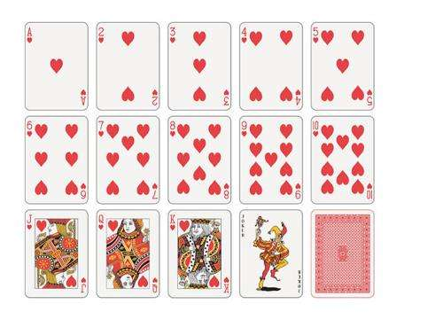

---
title: Java扑克顺子判定的设计与实现
date: 2020-02-10 23:07:23
summary: 本文分享基于Java实现的扑克牌判定程序。
tags:
- Java
categories:
- 开发技术
---

# 题目要求

斗地主中顺子是一种出牌牌型，分为单顺子和双顺子。
单顺子包含五张或更多连续的单牌，不包括2和大小王，例如：单3+单4+单5+单6+单7。
双顺子，也称连对，包含三对或更多连续的对牌，不包括2和大小王，例如：对3+对4+对5。
通常，顺子指单顺子。


现有一组扑克牌，不分花色，牌面分别是 **3, 4, 5, 6, 7, 8, 9, 10, J, Q, K, A, 2** 。



要求编写一个程序，判断抽到的n张牌是不是顺子。

# 程序设计

由于 $3 < 4 < 5 < 6 < 7 < 8 < 9 < 10 < J < Q < K < A$，我们要用Character肯定不好直接处理。

因此，可以引入一个映射关系的HashMap，用于查找。
将J定义为11，Q定义为12，K定义为13，A定义为14。

顺子必须是5张牌以上，所以先输入的num不足5就Pass。

接下来把获取的卡放进TreeSet里，如果Map里没有，就不能凑成顺子。还要判重，如果重复就不是顺子。

最后做一下数据统计，TreeSet能保证数据有序，能够保证每一个输出的数值都是前一个的值+1。

该思路不见得是最好的思路，但比较实用，可解决问题。

# 实现代码

```java
import java.util.HashMap;
import java.util.Map;
import java.util.Scanner;
import java.util.Set;
import java.util.TreeSet;

public class StraightCards {
    public static void main(String[] args) {
        Map<String, Integer> map = new HashMap<>(13);
        map.put("3", 3);
        map.put("4", 4);
        map.put("5", 5);
        map.put("6", 6);
        map.put("7", 7);
        map.put("8", 8);
        map.put("9", 9);
        map.put("10", 10);
        map.put("J", 11);
        map.put("Q", 12);
        map.put("K", 13);
        map.put("A", 14);
        Set<Integer> set = new TreeSet<>();
        Scanner scanner = new Scanner(System.in);
        int num = scanner.nextInt();
        if (num < 5) {
            System.out.println("NO");
            return;
        }
        for (int i = 0; i < num; i++) {
            String input = scanner.next();
            if (!map.containsKey(input)) {
                System.out.println("NO");
                return;
            }
            int card = map.get(input);
            if (set.contains(card)) {
                System.out.println("NO");
                return;
            }
            set.add(card);
        }
        scanner.close();
        int prev = 0, counter = 0;
        for (int i : set) {
            if (counter == 0) {
                prev = i;
                counter++;
            } else {
                if (prev == i-1) {
                    prev = i;
                } else {
                    System.out.println("NO");
                    return;
                }
            }
        }
        System.out.println("YES");
    }
}
```
