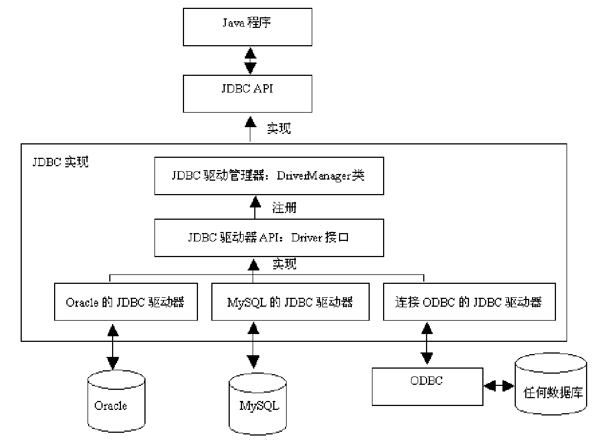
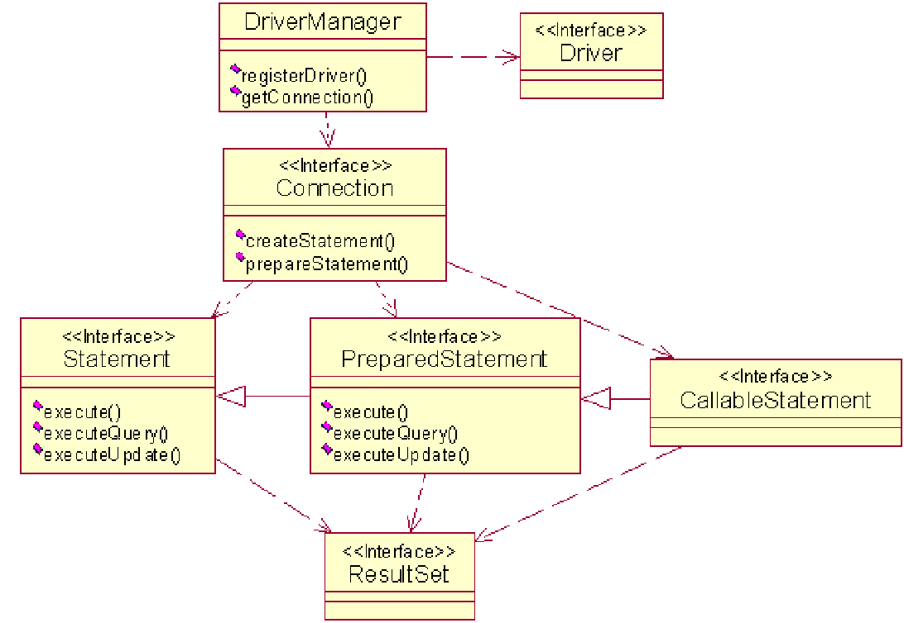

---
title: Java数据库访问
date: 2020-03-08 21:58:57
summary: 本文总结归纳JDBC与Java数据库访问体系的重点内容。
tags:
- Java
categories:
- Java
---

# 荐读

- [《MySQL命令行测试基础SQL》](https://blankspace.blog.csdn.net/article/details/104615308)
- [《数据库与SQL》](https://blankspace.blog.csdn.net/article/details/103186430)
- [《JDBC连接MySQL、SQLServer、Oracle三种数据库》](https://blankspace.blog.csdn.net/article/details/104707654)
- [《JDBC连接MySQL驱动》](https://blankspace.blog.csdn.net/article/details/104706238)

# JDBC体系

JDBC：**Java Database Connectivity**


SQLite这种也是支持的，但Java8开始不支持ODBC了。

## 关键的类或接口

- Connection 连接
- Statement 语句 或 PreparedStatement
- ResultSet 结果集 → 可以用 next() 方法来遍历所有的记录

## java.sql



## 加载驱动及连接数据库

加载驱动程序：

```java
Class.forName("org.sqlite.JDBC");
```
得到与数据库的连接 ：

```java
String connString = "jdbc:sqlite:d:/test3.db";
Connection conn = DriverManager.getConnection(connString);
```
## 执行语句

得到一个Statement对象 ：

```java
Statement stat = conn.createStatement();
```
执行非查询：

```java
stat.executeUpdate("delete from DemoTable;");
```
查询数据库得到记录集：

```java
ResultSet rs = stat.executeQuery("select * from people;");
```

## 结果集遍历

```java
System.out.println("Display all results:");
while(rs.next()) {
    int theInt= rs.getInt("test_id");
    String str = rs.getString("test_val");
    System.out.println("\ttest_id= " + theInt + "\tstr = " + str);
}
```

## PreparedStatement

PreparedStatement表示经过编译的语句~
- 如果多次使用同样的语句，执行速度略快一些（联想到native没）
- 可以方便地加上参数
- 更安全，避免sql注入攻击 

# JDBC连接SQLite数据库

```java
import java.sql.*;

public class JDBC4Sqlite {
	public static void main(String[] args) throws Exception {
		Class.forName("org.sqlite.JDBC");
		String connString = "jdbc:sqlite:d:/test3.db";
		Connection conn = DriverManager.getConnection(connString);
		conn.setAutoCommit(false);
		Statement stat = conn.createStatement();
		//stat.executeUpdate("drop table if exists people;");
		stat.executeUpdate("create table if not exists people (id char(10), name char(20), age int, gender bit ) ;");
		stat.executeUpdate("insert into people values ('001', 'Tom', 18, 1);");
		stat.executeUpdate("insert into people values ('002', 'Marry', 20, 0);");
		stat.executeUpdate("insert into people values ('003', 'Peter', 25, 1);");
		stat.executeUpdate("update people set age=age+1 whre id='003';");
		conn.commit();
		String sql = "select * from people;";
		ResultSet rs = stat.executeQuery(sql);
		while (rs.next()) {
			String name = rs.getString("name");
			int age = rs.getString("age");
			boolean gender = rs.getBoolean(4);
			System.out.printf("name = %s; occupation = %s\n",
				name, occupation);
		}
		rs.close();
		conn.close();
	}
}
```
