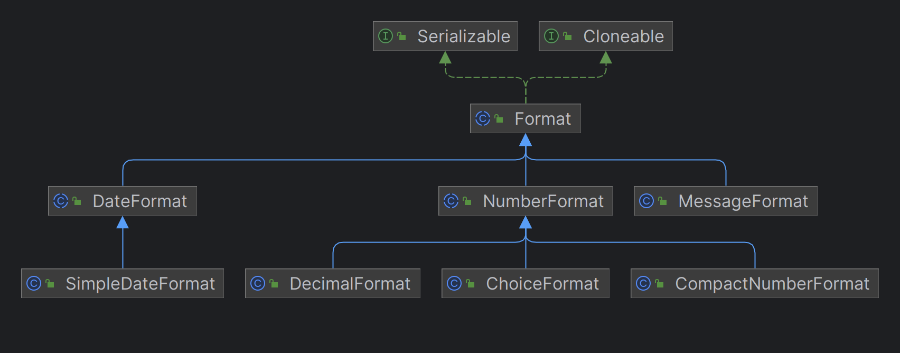

---
title: Java数据格式化
date: 2020-03-07 14:24:13
summary: 本文分享Java格式化处理体系的相关内容，以java.text.Format、java.text.DateFormat、java.text.MessageFormat、java.text.NumberFormat四个类为核心。
tags:
- Java
categories:
- Java
---

# 格式化继承关系

Format体系涉及的主要有java.io.Serializable、java.lang.Cloneable、java.text.Format、java.text.DateFormat、java.text.SimpleDateFormat、java.text.NumberFormat、java.text.DecimalFormat、java.text.ChoiceFormat、java.text.CompactNumberFormat、java.text.MessageFormat、java.time.format.DateTimeFormatter.ClassicFormat。



# java.text.Format

java.text.Format是Java中的一个抽象类，用于格式化和解析数据。它是格式化和解析的基础类，提供了一种通用的方式来处理各种数据类型，如数字、日期、时间等。

java.text.Format类是一个抽象类，不能直接实例化，而是通过其派生类来实现具体的格式化和解析逻辑。其直接派生类包括：java.text.DateFormat、java.text.MessageFormat、java.text.NumberFormat、java.time.format.DateTimeFormatter.ClassicFormat。

java.text.Format类定义了以下两个核心方法：
- `format(Object obj)`：将给定的对象格式化为字符串。不同的子类实现此方法以提供特定类型的格式化逻辑。
- `parseObject(String source)`：将给定的字符串解析为对象。不同的子类实现此方法以提供特定类型的解析逻辑。

java.text.Format类及其子类在多线程环境下是不安全的，不建议将其作为共享的实例。通常情况下，每个线程应该创建自己的Format实例来进行格式化和解析操作。

## java.text.DateFormat

java.text.DateFormat是Java中用于格式化和解析日期和时间的类。它是抽象类，提供了日期和时间的格式化、解析和语言环境相关的功能。

java.text.DateFormat类的常用方法包括：
- `format(Date date)`：将给定的Date对象格式化为字符串表示。它将Date对象按照指定的格式转换为字符串。
- `parse(String source)`：将给定的字符串解析为Date对象。它根据指定的格式将字符串转换为Date对象。
- `getInstance()`：获取默认的日期和时间格式化实例。
- `getDateTimeInstance(style)`：获取指定风格的日期和时间格式化实例，风格包括SHORT、MEDIUM、LONG和FULL。
- `getDateInstance(style)`：获取指定风格的日期格式化实例。
- `getTimeInstance(style)`：获取指定风格的时间格式化实例。
- `setLenient(boolean lenient)`：设置解析日期和时间时是否宽松模式。如果设置为true，则在解析过程中允许存在一些非法的日期和时间值；如果设置为false，则要求解析的字符串必须完全符合格式要求。
- `setDateFormatSymbols(DateFormatSymbols formatSymbols)`：设置用于日期和时间格式化的符号集合。

java.text.DateFormat类中，以下常量代表了不同的格式样式：
- `FULL`：表示完整的日期和时间格式。通常包括日期、时间、星期几和时区信息。
- `LONG`：表示较长的日期和时间格式。通常包括日期、时间和时区信息，但不包括星期几。
- `MEDIUM`：表示中等长度的日期和时间格式。通常包括日期和时间，但不包括时区信息。
- `SHORT`：表示较短的日期和时间格式。通常只包括日期和时间的基本信息，不包括其他附加信息。

| 字母 | 日期或时间元素 |
|:----:|:----:|
| y | 年  |
| M | 年中的月份  |
| d  |月份中的天数  |
|  E|  星期中的天数  |
|  a  |Am/pm 标记  |
|  H  |一天中的小时数（0-23） |
|  h | am/pm 中的小时数（1-12）  |
|  m | 小时中的分钟数  |
|  s  |分钟中的秒数  |
|  S | 毫秒数 |

```java
DateFormat df = DateFormat.getInstance(); // 获取默认的日期和时间格式化实例
String formattedDate = df.format(new Date()); // 将当前日期格式化为字符串
Date parsedDate = df.parse("2023-01-01"); // 将字符串解析为日期对象

DateFormat dfShort = DateFormat.getDateInstance(DateFormat.SHORT); // 获取指定风格的日期格式化实例
String formattedShortDate = dfShort.format(new Date()); // 将当前日期按短格式（如"yy/MM/dd"）格式化为字符串

DateFormat dfCustom = new SimpleDateFormat("yyyy-MM-dd HH:mm:ss"); // 自定义日期和时间的格式
String formattedCustomDate = dfCustom.format(new Date()); // 将当前日期按自定义格式格式化为字符串
Date parsedCustomDate = dfCustom.parse("2023-01-01 12:00:00"); // 将自定义格式的字符串解析为日期对象
```

## java.text.MessageFormat

java.text.MessageFormat是Java中用于格式化消息的类。它提供了一种将占位符替换为实际值的方式，用于生成具有可变内容的文本消息。

java.text.MessageFormat类的常用方法包括：
- `format(String pattern, Object... arguments)`：此方法是最常用的格式化方法。它接受一个消息模板字符串和一个可变数量的参数数组，将占位符替换为实际的值，并返回格式化后的字符串。消息模板字符串中的占位符由花括号括起来，并使用索引指定参数的位置。
    ```java
    String pattern = "Hello, {0}. Today is {1,date,yyyy-MM-dd}.";
    String formattedMessage = MessageFormat.format(pattern, "John", new Date());
    System.out.println(formattedMessage);
    // 在图形界面中显示 formattedMessage
    ```
- `formatToCharacterIterator(Object arguments)`：此方法接受一个对象作为参数，该对象包含要替换占位符的值。它返回一个AttributedCharacterIterator，可以用于在图形界面中显示格式化的消息。
    ```java
    String pattern = "Hello, {0}. Today is {1,date,yyyy-MM-dd}.";
    Object[] arguments = { "John", new Date() };
    MessageFormat messageFormat = new MessageFormat(pattern);
    AttributedCharacterIterator formattedMessage = messageFormat.formatToCharacterIterator(arguments);
    ```
- `applyPattern(String pattern)`：此方法用于设置消息模板的格式。可以通过调用此方法来更改消息模板字符串的格式。
    ```java
    MessageFormat messageFormat = new MessageFormat("");
    messageFormat.applyPattern("Hello, {0}. Today is {1,date,yyyy-MM-dd}.");
    ```
- `setFormat(int argumentIndex, Format format)`：此方法用于为特定参数设置格式化对象。可以通过调用此方法来自定义参数的格式化方式。参数argumentIndex表示要设置格式的参数在消息模板中的索引位置。
    ```java
    String pattern = "Your balance is {0,number,currency}.";
    MessageFormat messageFormat = new MessageFormat(pattern);
    messageFormat.setFormat(0, NumberFormat.getCurrencyInstance(Locale.US));
    ```

java.text.MessageFormat类中，以下常量代表了不同的格式样式：
- `SEG_RAW`：表示原始文本段。这是消息格式中不需要进行任何格式化或替换的部分。
- `SEG_INDEX`：表示占位符索引。占位符用花括号 {} 表示，并在内部包含一个整数索引，用于指定要替换的参数的位置。
- `SEG_TYPE`：表示占位符类型。占位符中的类型信息用冒号 : 后面的字符表示，指定参数的格式化类型。例如，{0,number} 中的 number 表示要对参数进行数字格式化。
    - `TYPE_NULL`：表示空值占位符类型。它指示占位符应该替换为空字符串。
    - `TYPE_NUMBER`：表示数字占位符类型。它指示占位符内的参数应该按数字格式进行格式化。
        - `MODIFIER_DEFAULT`：默认数字样式。
        - `MODIFIER_CURRENCY`：货币数字样式。
        - `MODIFIER_PERCENT`：百分比数字样式。
        - `MODIFIER_INTEGER`：整数数字样式。
    - `TYPE_DATE`：表示日期占位符类型。它指示占位符内的参数应该按日期格式进行格式化。
    - `TYPE_TIME`：表示时间占位符类型。它指示占位符内的参数应该按时间格式进行格式化。
    - `TYPE_CHOICE`：表示选择占位符类型。它用于根据参数的值选择要替换的文本。选择占位符的语法类似于条件语句，可以指定多个选择项。
- `SEG_MODIFIER`：表示占位符修饰符。占位符中的修饰符用花括号 {} 内的逗号 , 后面的内容表示，用于指定对参数进行进一步的修饰或格式化。修饰符可以包括日期格式、数值格式、货币符号等。
    - `MODIFIER_SHORT`：表示较短的日期和时间格式。通常只包括日期和时间的基本信息，不包括其他附加信息。
    - `MODIFIER_MEDIUM`：表示中等长度的日期和时间格式。通常包括日期和时间，但不包括时区信息。
    - `MODIFIER_LONG`：表示较长的日期和时间格式。通常包括日期、时间和时区信息，但不包括星期几。
    - `MODIFIER_FULL`：表示完整的日期和时间格式。通常包括日期、时间、星期几和时区信息。

## java.text.NumberFormat

java.text.NumberFormat是用于格式化数字的类，它提供了一系列方法来格式化数字，并支持本地化的数字格式。

java.text.NumberFormat类的常用方法包括：
- `getInstance()`：该静态方法返回当前默认的NumberFormat实例，该实例根据默认的本地化规则进行数字格式化。
    ```java
    NumberFormat numberFormat = NumberFormat.getInstance();
    ```
- `getInstance(Locale locale)`：该静态方法返回指定本地化规则的NumberFormat实例，该实例将根据指定的本地化规则进行数字格式化。
    ```java
    NumberFormat numberFormat = NumberFormat.getInstance(Locale.US);
    ```
- `format(double number)`、`format(long number)`：这些方法将给定的数字格式化为字符串。它们接受一个double或long类型的数字作为参数，并返回格式化后的字符串。
    ```java
    NumberFormat numberFormat = NumberFormat.getInstance();
    String formattedNumber = numberFormat.format(12345.678);
    System.out.println(formattedNumber);
    ```
- `parse(String text)`：该方法将给定的字符串解析为数字。它接受一个表示数字的字符串作为参数，并返回对应的Number对象。
    ```java
    NumberFormat numberFormat = NumberFormat.getInstance();
    try {
        Number parsedNumber = numberFormat.parse("12,345.678");
        double value = parsedNumber.doubleValue();
        System.out.println(value);
    } catch (ParseException e) {
        e.printStackTrace();
    }
    ```
- `setMaximumFractionDigits(int newValue)`、`setMinimumFractionDigits(int newValue)`：这些方法用于设置格式化数字时的小数位数的最大值和最小值。
    ```java
    NumberFormat numberFormat = NumberFormat.getInstance();
    numberFormat.setMaximumFractionDigits(2);
    numberFormat.setMinimumFractionDigits(0);
    ```

java.text.NumberFormat类中，以下常量代表了不同的格式样式：
- `NUMBERSTYLE`：表示数字样式，用于格式化普通数字。例如，将数字 12345.678 格式化为 "12,345.678"。
- `CURRENCYSTYLE`：表示货币样式，用于格式化货币值。格式化后的字符串将包括货币符号、千位分隔符和小数位数。例如，将数字 12345.678 格式化为 "$12,345.68"。
- `PERCENTSTYLE`：表示百分比样式，用于格式化百分比值。格式化后的字符串将将数字乘以 100 并添加百分号符号。例如，将数字 0.75 格式化为 "75%"。
- `SCIENTIFICSTYLE`：表示科学计数法样式，用于格式化科学计数法表示的数字。例如，将数字 1.2345E+4 格式化为 "1.2345E4"。
- `INTEGERSTYLE`：表示整数样式，用于格式化整数值。格式化后的字符串将不包括小数位数和千位分隔符。例如，将数字 12345 格式化为 "12345"。
- `COMPACTSTYLE`：表示紧凑样式，用于格式化大数字，并使用紧凑的表示方式，例如使用 "K" 表示千，"M" 表示百万等。例如，将数字 1000000 格式化为 "1M"。
