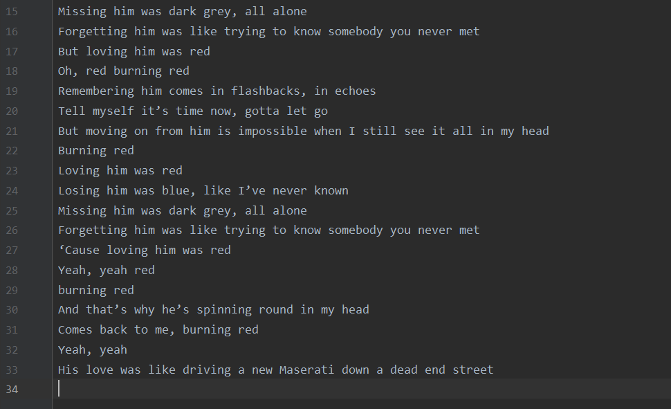
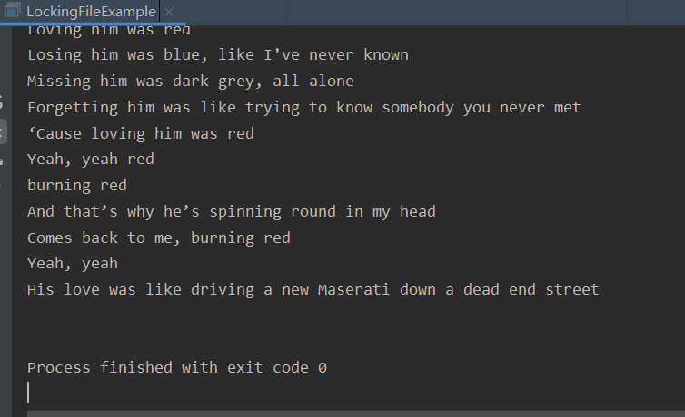
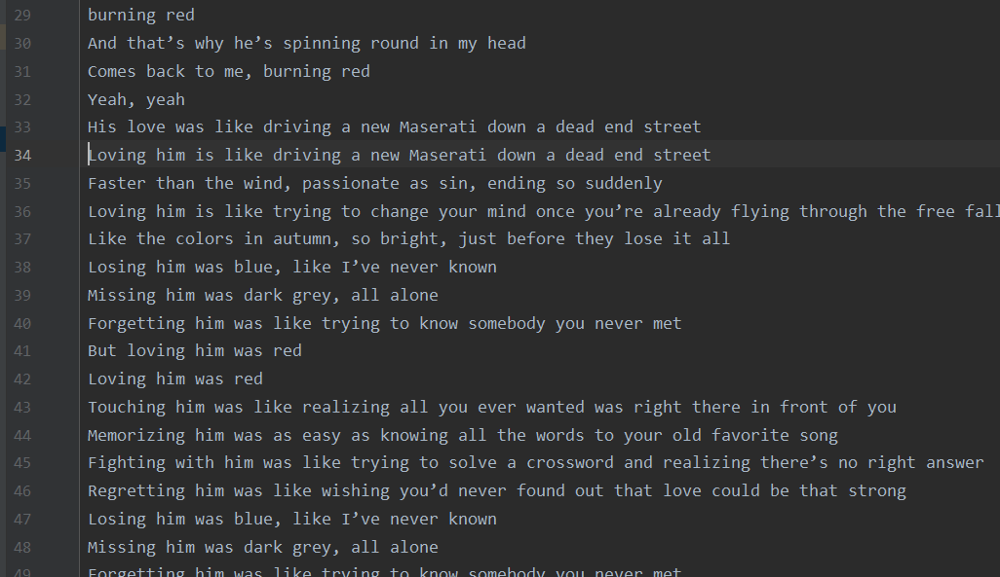

---
title: Java文件锁定与系列NIO操作
date: 2019-12-15 17:00:03
summary: 本文分享Java文件锁定与系列NIO操作。
tags:
- Java
categories:
- Java
---

# 前言

Java中，获取文件锁的API需要访问文件的FileChannel。
lock()可以获得锁，release()可以释放锁。
详见[API文档](https://docs.oracle.com/en/java/javase/11/docs/api/java.base/java/nio/channels/FileChannel.html)

# 样例

样例基于Java的IO和NIO编写，有互斥锁和共享锁两种，分别对这个RandomAccessFile对象生成的FileChannel对象加锁/释放锁。
为保证锁的释放，需要finally块中进行处理。
前面有建立ByteBuffer，后面则是将ByteBuffer对象转成CharBuffer对象从而在控制台打印出来~~

详细说明见代码，大多数注释都是用嘤文加的~~

```java
import java.io.*;
import java.nio.*;
import java.nio.channels.*;
import java.nio.charset.*;

public class LockingFileExample {
    //排它/互斥
    public static final boolean EXCLUSIVE = false;
    //共享
    public static final boolean SHARED = true;
    //文件路径
    private static final String FILE_PATH = "src/.../file.txt";

    public static void main(String[] args) throws IOException {
        //共享锁
        FileLock sharedLock = null;
        //排它锁/互斥锁
        FileLock exclusiveLock = null;
        try {
            RandomAccessFile raf = new RandomAccessFile(FILE_PATH, "rw");
            //get the channel from the file
            FileChannel ch = raf.getChannel();
            ByteBuffer buffer = ch.map(FileChannel.MapMode.READ_ONLY, 0, raf.length());
            //this locks the first half of the file - exclusive
            exclusiveLock = ch.lock(0, raf.length()/2, EXCLUSIVE);
            /* Now modify the data . . . */
            ch.position(raf.length());
            ch.write(buffer);
            //release the lock
            exclusiveLock.release();
            //this locks the second half of the file - shared
            sharedLock = ch.lock(raf.length()/2+1, raf.length(), SHARED);
            /* Now read the data . . . */
            ByteBuffer buffer2 = ch.map(FileChannel.MapMode.READ_WRITE, 0, raf.length());
            ch.read(buffer2);
            //release the lock
            sharedLock.release();
            buffer = ch.map(FileChannel.MapMode.READ_ONLY, 0, raf.length());
            //create the UTF-8 decoder
            Charset charset = Charset.forName("UTF-8");
            CharsetDecoder charsetDecoder = charset.newDecoder();
            //ByteBuffer -> CharBuffer
            CharBuffer charBuffer = charsetDecoder.decode(buffer);
            //output
            System.out.println(charBuffer);
        } catch (IOException ioe) {
            ioe.printStackTrace();
        } finally {
            if (exclusiveLock != null) {
                exclusiveLock.release();
            }
            if (sharedLock != null) {
                sharedLock.release();
            }
        }
    }
}

```

# 文件内容

霉霉的《Red》，很喜欢的一首歌~~

```
Loving him is like driving a new Maserati down a dead end street
Faster than the wind, passionate as sin, ending so suddenly
Loving him is like trying to change your mind once you’re already flying through the free fall
Like the colors in autumn, so bright, just before they lose it all
Losing him was blue, like I’ve never known
Missing him was dark grey, all alone
Forgetting him was like trying to know somebody you never met
But loving him was red
Loving him was red
Touching him was like realizing all you ever wanted was right there in front of you
Memorizing him was as easy as knowing all the words to your old favorite song
Fighting with him was like trying to solve a crossword and realizing there’s no right answer
Regretting him was like wishing you’d never found out that love could be that strong
Losing him was blue, like I’ve never known
Missing him was dark grey, all alone
Forgetting him was like trying to know somebody you never met
But loving him was red
Oh, red burning red
Remembering him comes in flashbacks, in echoes
Tell myself it’s time now, gotta let go
But moving on from him is impossible when I still see it all in my head
Burning red
Loving him was red
Losing him was blue, like I’ve never known
Missing him was dark grey, all alone
Forgetting him was like trying to know somebody you never met
‘Cause loving him was red
Yeah, yeah red
burning red
And that’s why he’s spinning round in my head
Comes back to me, burning red
Yeah, yeah
His love was like driving a new Maserati down a dead end street

```

# 运行效果

【原文件】


【Console】
打印文件内容：


【文件】

