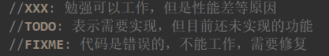
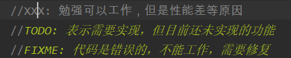
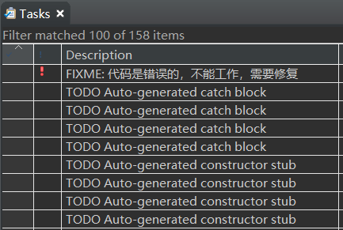
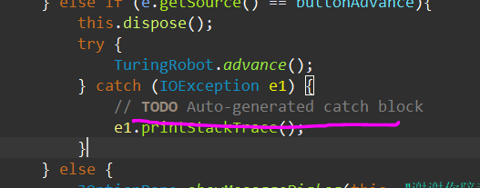
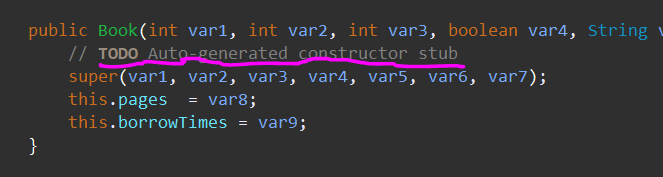
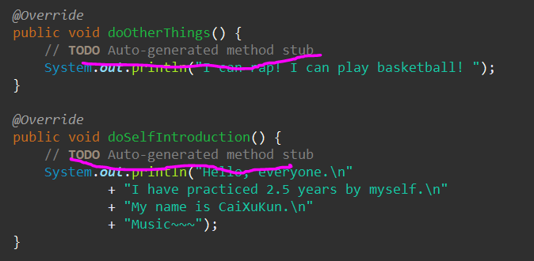

---
title: Java特殊注释TODO、FIXME、XXX
date: 2020-03-05 00:47:04
summary: 本文分享Java注释//TODO、//FIXME、//XXX的具体含义。
tags:
- Java
categories:
- Java
---

# TODO、FIXME、XXX

- `//TODO `： 表示待实现的功能
- `//FIXME`： 代码存在Bug，不能Run或运行结果不正确，需要修复
- `//XXX &nbsp;`： 勉强可以工作，但是实现的方法不一定很好

## TODO

```java
//TODO something
```

顾名思义，`//TODO`说明标识处有功能代码未实现，待实现的功能说明会在`//TODO`后面简略表述。

## FIXME

```java
//FIXME something
```
顾名思义，`//FIXME`说明标识处代码需要修正。被`//FIXME`表示的代码基本是错误的、不能工作的、需要修复的，修正的说明会在`//FIXME`后面简略表述。

## XXX

```java
//XXX something
```
如果代码中有`//XXX`，说明标识处代码虽然实现了功能，但是实现的方法不一定很好，留待商榷并希望未来版本中能改进，要改进的说明会在`//XXX`后面简略表述。

# IDE显示

## Eclipse

除了TODO和FIXME，XXX还是识别的


## IntelliJ IDEA

只识别TODO和FIXME，不识别XXX


# Eclipse-Tasks栏视图

所有的特殊注释都会被识别，我没额外配置，其实自己可以调的。


# Eclipse自动生成的TODO注释

Eclipse可以自动生成TODO注释，我印象中有catch语句块和重写构造器、方法……

## catch块的TODO

catch块之所以标上TODO主要是为了告诉开发者，应该去做好异常处理而不是简简单单的抛出异常或者打印异常栈。


## 构造器和重写方法的TODO

生成的TODO是也是提醒开发者不要空有壳子，应该认真地编写具体的实现代码。



# 说明

虽然我们知道了三者的实际表示的意义，但标注归标注，标注的目的是为了解决问题，让程序更加Nice。所以怎么加上的，就怎么努力更正并删去吧！
