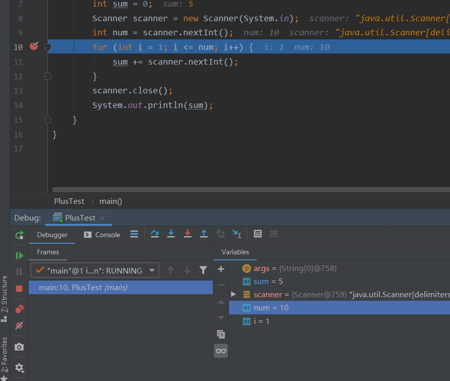
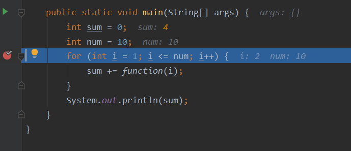

# 软件调试

调试出现在成功的测试之后，当测试用例发现错误时，调试是致使错误消除的行为。


通过系统评估、直觉和运气相结合可以实现目标。

调试的思路：
- 蛮力法：运行跟踪，在程序中加载大量输出语句，在产生的大量信息中找到错误线索。
- 回溯法：从发现症状的地方开始，向后追踪源代码，直到发现错误的原因。
- 原因排除法：通过演绎或归纳并引入二分法的概念来实现，对与错误出现相关的数据加以组织，以分离出潜在的错误原因。

调试的技巧：
 - 断点（breakpoint）
   - 打上断点以后，程序运行到断点处就会暂停，可以一步一步观察运行情况。
 - 跟踪（trace）
   - 跟着流程一步一步走，看看程序代码的执行流程。
   - 跟着流程一步一步走，看看变量动态的变化情况。
 - 监视（watch）
   - 即时监视：鼠标指向变量。
   - 快速监视：点右键，Inspector。
   - 添加监视：点右键，Watch。

# IntelliJ IDEA

## 最简单的调试

先随着一个最简单的程序看IDEA的Debug流程。

我们选择一个1+2+...+10的程序，我们通过这个最基本的程序了解如何去Debug。
IDEA我个人比较喜欢用F8来逐行运行观察，发现问题再追踪。

在标注行数的左边栏的空白处，点一下，会出现一个红点，带出一条红线，这叫断点（IDEA的断点真的比Eclipse好看和便于增删）。

打断点的目的是使程序Debug运行到这里的时候会停住，我们能逐步地观察变量的变化、程序语句执行的流程等等。

根据我的观察，其实对于初学者，需要测试的部分中一个方法打一个断点就够了，因为一直按F8就会继续逐行执行，希望我这么说会比较容易接受一些。


右键Debug运行，注意不要Run，Run的话断点就无效了。


开始运行后，可以看出程序停在了打断点的那一行处，并且有很多灰色的k-v对，下方的Variable栏就会出现各种变量的值，可以追踪各个变量的当前值和值的变化。

按F8就可以继续执行。


Variable栏中蓝色的变量表示刚刚被修改过：


运行结束，得到结果：（事实上如果真有Bug，能发现的话在过程中就发现了）


## 不断的输入

我们可能需要命令行输入很多数据，有时候我们选择复制后一股脑输入Debug的Console中，但很多时候我们输入几个值并按回车就自动进入了Debug。而Debug运行到需要IO的地方就会阻塞，那么怎么去增加新的输入呢？

先输入10，然后回车：


程序跳到上面讲过的Debug界面：


顺着执行，会被IO卡住，那怎么办呢？点击Console，切到Console界面：


输入新的值，回车：

这次就不是自动切回去了，需要点击下方的Debugger：


程序继续执行：


Console识别在一次IO后就切Debugger，所以比较省事的做法是，第一次就把所有的数据输进去。

## 中断调试

想中断Debug就和中断Run一样，左边栏的红色方框，点一下就能结束。

## 多方法打断点

下面的代码除了main()外还有一个多行的方法被调用，如果我们在for那里打上断点能不能进入function()呢？
```java
public class PlusTest {

    private static int function(int num) {
        int sum = 0;
        for (int i = 1; i <= num; i++) {
            sum += i;
        }
        return sum;
    }

    public static void main(String[] args) {
        int sum = 0;
        int num = 10;
        for (int i = 1; i <= num; i++) {
            sum += function(i);
        }
        System.out.println(sum);
    }
    
}
```

从这个时候开始观测（只有这一个断点）：

下一步：

下一步：


我们发现，并没进入function()，这怎么办呢？

当然是把function()也打上断点：


接着走下去：


下一步：


哇偶，进去了！我们可以在function()方法里继续观察变量的变化了。

## 递归函数的调试

递归的话有明显的回溯感，特别是对于二叉树递归算法，要是打断点会感觉一会儿前进一会儿回溯。

要把握清楚到底在哪个子过程中递归，看准变量的变化。

这里也不拿很复杂的递归函数说事了，就说说阶乘递归函数吧：

```java
public class PlusTest {

    private static int function(int num) {
        if (num == 0 || num == 1) {
            return 1;
        }
        return num * function(num-1);
    }

    public static void main(String[] args) {
        int num = 10;
        System.out.println(function(num));
    }

}
```

向下分解问题、递归：


递归到终止条件了：


到达递归终止条件后，就开始一步步弹出栈、形成答案了：


输出结果：


# Eclipse

左边小圆点是断点，左键单击可标注：


右键选择Debug运行：

会提示选择进入Debug的模式，一定要进去，点Switch：


左边有调用栈的信息，右边有变量表、断点表等信息，中间是代码，下面是Console：


这里提示全部的断点，不用的时候别忘了取消：


递归回溯的时候，左边调用栈瞩目：


按F6就像IDEA的F8一样啦，一行一行执行；而F5的话还能追溯调用栈找到源码：


鼠标移到变量上还能直接看变量的值和状况：


右上角的小Bug图案，右键点击，选择Close即可退出Debug样式、返回普通模式：

