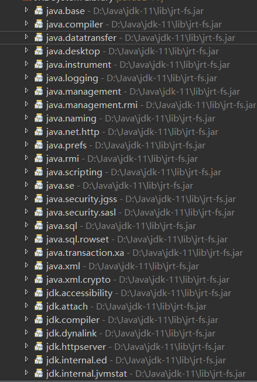

---
title: Java编程的逻辑学习笔记
date: 2019-10-23 16:42:20
summary: 本文分享《Java编程的逻辑》第3章、第4章、第6章学习笔记。
tags:
- Java
categories:
- 开发技术
---

# 第3章 类的基础

1.通过类实现自定义的数据类型，封装该类型的数据所具有的的属性和操作，隐藏实现细节，从而在更高的层次（类和对象层次，而非基本数据类型和函数类型的层次）上考虑和操作数据，是计算机程序解决复杂问题的一种重要的思维方式。

2.在设计线的时候，我们考虑的功能是点，而非考虑点的内部实现细节。每个类封装其内部细节，对外提供高层次的功能，使得其他类在更高层次上考虑和解决问题，是程序设计的一种基本的思维方式。

3.将现实概念映射为类以及类组合的过程，这个过程大概就是，想想现实问题大概有哪些概念，这些概念有哪些属性、哪些行为，概念之间有什么关系，然后定义类、定义属性、定义方法、定义类之间的关系。概念的属性和行为可能是非常多的，但定义的类只需要包括那些与现实问题相关的就行了。

4.类中实例变量的类型可以是当前定义的类型，两个类之间可以相互引用，这些初听起来可能难以理解，但是现实世界就是这样的，创建对象的时候这些值不需要一开始就有，也可以没有，所以是没有问题的。

5.分解现实问题中涉及的概念以及概念之间的关系，将概念表示为多个类，通过类之间的组合来表达更为复杂的概念以及概念之间的关系，是计算机程序的一种基本的思维方式。

6.Java API中所有的类和接口都位于包java或者javax下，java是标准包，javax是扩展包。

7.合理使用包的一些好处：

 - 避免命名冲突。
 - 便于模块化开发。
 - 方便封装。

8.jar包打包的一般不是源代码，而是编译后的代码。打包将多个编译后的文件打包为一个文件，方便其他程序调用。

9.Java9中清晰引入了模块化的概念，JDK和JRE都按照模块化进行了重构，传统的组织机制依然是支持的，但是新应用可以使用模块。一个应用可以由多个模块组成，一个模块可以由多个包组成。
（下面我给大家展示一下Eclipse显示的Java重构后的部分模块化结构：）

（当然了，还有其他的模块，就不一一展示了）

10.java.lang的lang是language。

11.import是编译时的概念，用于确定完全限定名，在运行时，只是根据完全限定名寻找并加载类。

# 第4章 类的继承

1.继承可以复用代码，公共的属性和行为可以放到父类中，而子类只需要关注子类特有的就可以了；另一方面，不同子类的对象可以更方便的被统一管理。

2.super可以引用父类非私有的变量。
（这句话对于Java的非初学者倒是了解，主要是super确实不能引用父类的私有属性，这是不被允许的，这点需要注意呀）

3.可以说，多态和动态绑定是计算机程序的一种重要的思维方式，使得操作对象的程序不需要关注对象的实际类型，从而可以统一处理不同对象，但又能实现每个对象的特有行为。

4.静态绑定在程序编译阶段就被确定，而动态绑定则需要等到程序运行时才能确定。
（多态对于面向对象的初学者可能有点“玄学”，在我个人看来：
首先，多态基于继承，一般来讲狭义上的多态是基于子类继承父类体现出来的。
然后，看下面的一行代码：

```java
SuperClass sup = new SubClass();
```
在李刚老师的《疯狂Java讲义》中，左边的SuperClass被称为编译时类型，右边的SubClass被称为运行时类型，如果马俊昌老师的讲解和李刚老师的讲解结合一下，想来是不难以理解的）

5.实例变量、静态变量、静态方法、private方法，都是静态绑定的。

6.当有多个重名函数时，在决定要调用哪个函数的过程中，首先是按照参数类型进行匹配的，换句话说，寻找在所有重载版本中最匹配的，然后才看变量的动态类型，进行动态绑定。
（注意在匹配的时候，如果有同类型的单参数的和不定长参数的两个重载函数时，使用匹配的单参数会优先匹配单参数函数，而不是不定长函数）

7.一个父类变量能不能转换成一个子类变量，取决于这个父类变量的动态类型（即引用的对象类型）是不是这个子类或者这个子类的子类。
（向下转型的时候-instanceof要用好，防止运行时异常java.lang.ClassCastException）

8.重写时，子类只能提升（或者保持）父类方法的可见性（访问权限）而不能降低。
private < （默认）< protected < public
（这个要记得啊……也是常识……）

9.final修饰的不能被继承。
（常识……）

10.继承中，用好protected可以便于实现模板模式（一种设计模式），具体的实现由子类提供。

11.继承为什么具有破坏力呢？
主要是因为继承可能会破坏封装，而封装可以说是程序设计的第一原则；另外，继承可能没有反映出is-a关系。

12.什么是封装？
封装就是隐藏实现细节，提供简化接口。
使用者只需关注怎么使用而不需要关注内部是怎么实现的。实现细节可以随时修改而不影响使用者。函数是封装，类也是封装。通过封装，才能在更高的层次上考虑和解决问题。可以说，封装是程序设计的第一原则，没有封装，代码之间就会存在着各种实现细节的依赖，这在构建和维护复杂程序时是难以想象的。

13.继承可能会破坏封装是因为子类和父类可能存在着实现细节上的依赖。
子不知道父类方法的实现细节，就难以正确的进行扩展，甚至引发错误。
子类扩展父类的时候，仅仅知道父类能做什么是不够的，还需要知道父类是怎么做的，而父类的实现细节也不能随意修改，否则可能影响子类。
更具体地说，子类需要知道父类可重写方法之间的依赖关系，而且这个依赖关系，父类不能随意改变。
即使这个依赖关系不变，封装还是可能会被破坏。
父类不能随意设置public方法，因为给父类增加public方法就是在给所有子类增加，而子类可能必须要重写该方法才能保证方法的正确性。
总结一下：
对于子类而言，通过继承实现是没有安全保障的，因为父类修改内部实现细节，它的功能就可能会被破坏；而对于父类而言，让子类继承和重写方法，就可能丧失随意修改内部实现的自由。

11.继承是用来反映is-a关系的，但是Java并没办法约束，父类有的属性和行为，子类不一定都适用，子类还可以重写父类的方法，实现与父类预期完全不一样的行为。
但对于父类引用操作子类对象的程序而言，它是把对象当做父类对象来看待的，期望对象符合父类中声明的属性和行为。如果不符合，结果是什么呢？混乱。

# 第6章 异常

1.异常栈信息包括了从异常发生点到最上层调用者的轨迹，还包括行号，可以说，这个栈信息是分析异常最为重要的信息。

2.Java默认的异常处理机制：打印异常栈，退出程序（非正常退出），异常发生点之后的代码都不会执行。

3.return和throw的对比：
- return是正常退出，throw是异常退出；
- return的返回位置是确定的，就是上一级调用者，而throw后执行哪行代码则经常是不确定的，由异常处理机制动态决定。

4.常见的RuntimeException：
| 异常 | 说明 |
|:----:|:----:|
| NullPointerException | 空指针异常 |
| IllegalStateException | 非法状态 |
| ClassCastException | 非法强制类型转换 |
| IllegalArgumentException | 参数错误 |
| NumberFormatException | 数字格式错误 |
| IndexOutOfBoundsException | 索引越界 |
| ArrayIndexOutOfBoundsException | 数组索引越界 |
| StringIndexOutOfBoundsException | 字符串索引越界 |

5.如此多的的异常类其实并没有比Throwable这个父类多多少属性和方法，大部分类异常在继承了父类以后只是定义了几个构造方法，这些构造方法也只是调用了父类的构造方法，没有什么额外的操作。
然而，定义如此多的的异常类的原因是：为了让名字不同。
异常类的名字本身就代表了异常的关键信息，无论是抛出还是捕获异常，使用合适的名字都有助于代码的可读性和可维护性。

6.checked Exception和unchecked Exception
unchecked Exception：RuntimeException + Error
checked Exception：Exception
checked Exception和unchecked Exception的区别在于Java自身如何处理这两种异常。
遇到前者，Java会强制要求程序员处理，否则会有CE；
而遇到后者，Java没有这个要求。

7.这样的代码也是可以的（JDK7+）
```java
try {
    //操作代码
} catch (ExceptionA | ExceptionB e) {
	//异常处理
}
```
这样可以一次统一处理多个异常（但是要慎重考虑，并且不建议catch All）

8.继承自Exception的子类属于checked Exception；继承自RuntimeException的子类属于unchecked Exception。

9.Java7+支持一种try-with-resources的结构，其实是省却了finally语句块或者手动关闭的麻烦，可以实现“自动关闭资源”。这种语法针对实现了java.lang.AutoCloseable接口的对象。
java.lang.AutoCloseable接口的定义：

```java
public interface AutoCloseable {
    void close() throws Exception;
}
```
资源可以定义多个，用分号（注意，是分号是分号是分号，不是逗号不是逗号不是逗号~~~）。
Java9-的时期，资源必须声明和初始化在try语句块内，而Java9允许资源在try块外初始化但是必须是final的或者事实上是final的（虽然没被声明为final但也不能重新赋值）。
