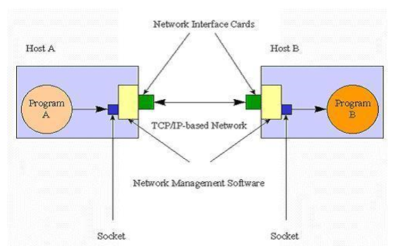
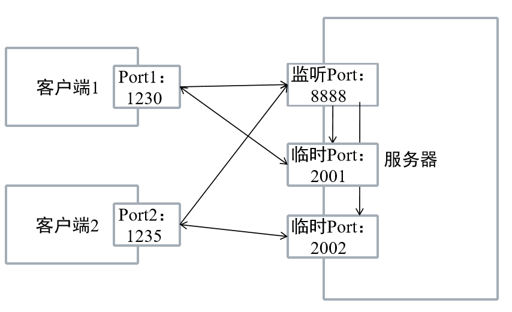
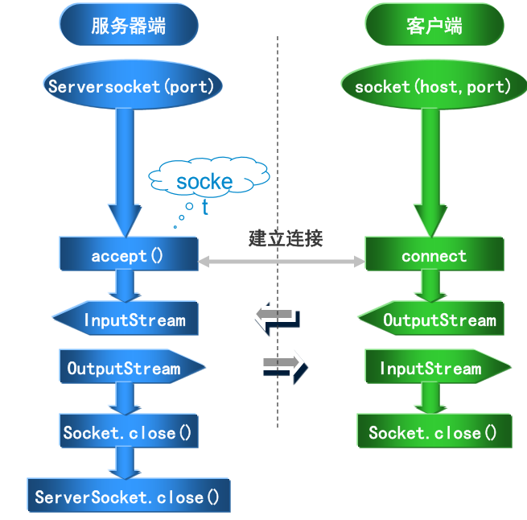
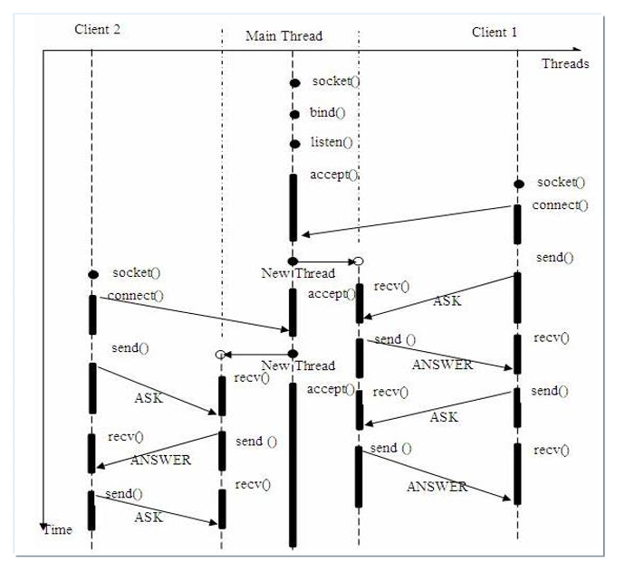

---
title: Java网络编程Socket解读与实战
date: 2020-03-07 21:59:34
summary: 本文解读Socket网络编程，提供实战案例。
tags:
- Java
categories:
- Java
---

# Socket原理

## Socket原理

[《Socket 到底是什么》](https://blankspace.blog.csdn.net/article/details/104731763)
- Socket——套接字
- 是网络应用程序编程的接口和一种机制
- 用套接字中的相关函数来建立连接和完成通信
- Socket可以看成在两个程序进行通讯连接中的一个端点
- 将区分不同应用程序进程的三个参数：通信的目的的IP地址、使用的传输层协议、使用的端口号 与一个socket绑定



## 端口工作原理

服务器上的端口不是监听端口。 


# 基于TCP的Socket编程

## 基于TCP的Socket编程

- 利用TCP协议进行通信  
存在两个应用程序，有主从之分。一个称为服务器程(Server)，另外一个称为客户机程(Client) 
- 交互过程 
1. 服务器程序创建一个ServerSocket，然后调用accept方法等待客户来连接
2. 客户端程序创建一个Socket并请求与服务器建立连接
3. 刚才建立了连接的两个Socket在一个单独的线程上对话
4. 服务器开始等待新的连接请求



## ServerSocket —— java.net.ServerSocket

- 实现服务器套接字  
- 构造函数
  - ServerSocket(int port)
  - ServerSocket(int port, int maxqu) 
- accept( ) 方法用于等待客户端触发通信，返回值类型为 Socket 

## Socket —— java.net.Socket

- 实现客户端套接字
- 构造函数
  - Socket(String hostName, int port)
  - Socket(InetAddress a, int port)
- 可用方法
  - InetAddress getInetAddress( ) 
  - int getPort( ) 
  - int getLocalPort( ) 
  - InputStream getInputStream()
  - OutputStream getOutputStream()
  - void close() 

# 基于多线程的Socket编程

```java
import java.io.IOException;
import java.net.ServerSocket;
import java.net.Socket;

public class TServer {
	public static void main(String[] args) {
		ServerSocket ss = null;
		try {
			ss = new ServerSocket(8888);
			System.out.println("服务器启动");
			while(true) {
				Socket s = ss.accept();
				System.out.println("连接的客户端IP "+s.getInetAddress().getHostAddress());
				Servicer ser = new Servicer(s);
				Thread t = new Thread(ser);
				t.start();
			}
		} catch (IOException e) {
			e.printStackTrace();
		}
	}
}
```

```java
import java.io.BufferedReader;
import java.io.IOException;
import java.io.InputStreamReader;
import java.io.OutputStreamWriter;
import java.io.PrintWriter;
import java.net.Socket;
import java.net.UnknownHostException;
import java.util.Scanner;

public class TClient {
	public static void main(String[] args) {
		Socket s = null;
		try {
			s = new Socket("127.0.0.1", 8888);
			BufferedReader in = new BufferedReader(new InputStreamReader(s.getInputStream()));
			PrintWriter out = new PrintWriter(new OutputStreamWriter(s.getOutputStream()), true);
			while (true) {
				Scanner sc = new Scanner(System.in);
				System.out.println("客户端：");
				String str = sc.nextLine();
				//将控制台输入的信息，发送给服务器
				out.println(str);
				if (str.equals("exit")) {
					break;
				}
				//接收服务器端传来的信息
				String msg = in.readLine();
				System.out.println("接收服务器数据：" + msg);
			}
			System.out.println("客户端退出");
		} catch (UnknownHostException e) {
			e.printStackTrace();
		} catch (IOException e) {
			e.printStackTrace();
		} finally {
			try {
				if (s != null) {
					s.close();
				}
			} catch (IOException e) {
				e.printStackTrace();
			}
		}
	}
}
```



# 经典案例-Socket网络聊天室

发过三个版本的，分享一下！
- [简单版](https://blog.csdn.net/weixin_43896318/article/details/103323413)
- [升级版](https://blog.csdn.net/weixin_43896318/article/details/104722783)
- [GUI+命令行结合版](https://blog.csdn.net/weixin_43896318/article/details/103329152)
