---
title: Java菜鸟教程基础测试笔记
date: 2020-04-05 12:14:29
summary: 本文记录菜鸟教程的Java基础测试笔记。
tags:
- Java
categories:
- Java
---

# 错题

[测试链接](https://www.runoob.com/quiz/java-quiz.html)

## Topic 1

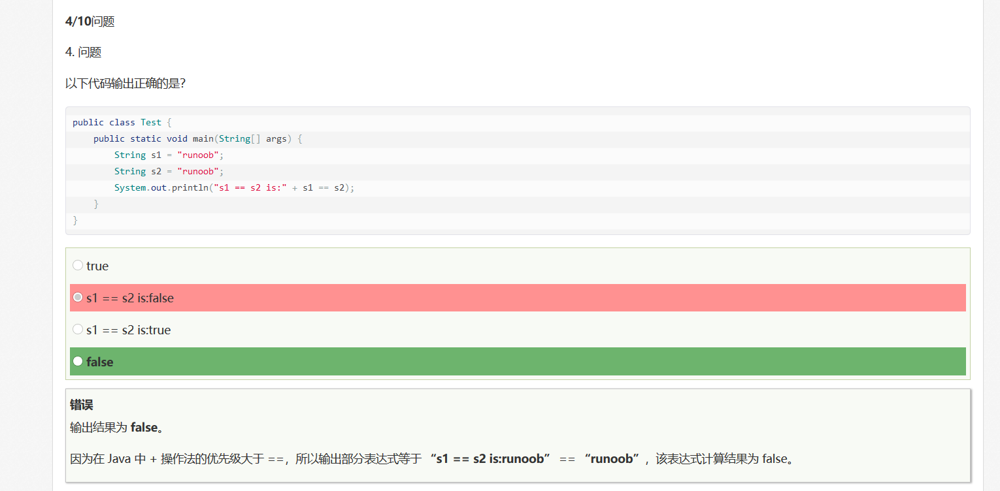

【分析】
+的优先级大于==

## Topic 2

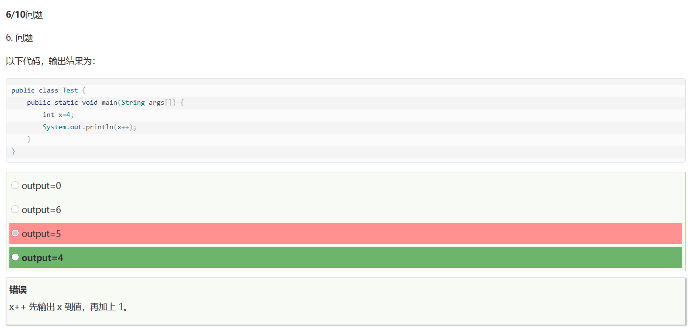

【分析】
++相关文章：
- [《探究自增运算符++的原理》](https://blankspace.blog.csdn.net/article/details/104648167)
- [《javap命令行分析(a++ + ++a)的虚拟机指令》](https://blankspace.blog.csdn.net/article/details/104626322)
- [《批判一个有关++的Java选择题》](https://blankspace.blog.csdn.net/article/details/103308723)
- [《C语言里++能随便用吗？》](https://blankspace.blog.csdn.net/article/details/103299802)

【解析】
其实看起来是解析说的那样，但其实不是。并不是先输出再++，而应该是类似于返回值，具体看上面的文章即可。

## Topic 3

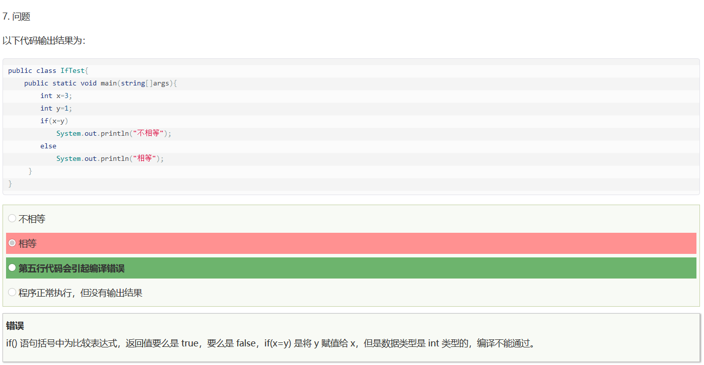

【解析】
\=是赋值，\=\=是等于（注意基本类型还是引用类型）

# 更新错题

原先只有一套题，现在更新至五套题。

## Topic 4

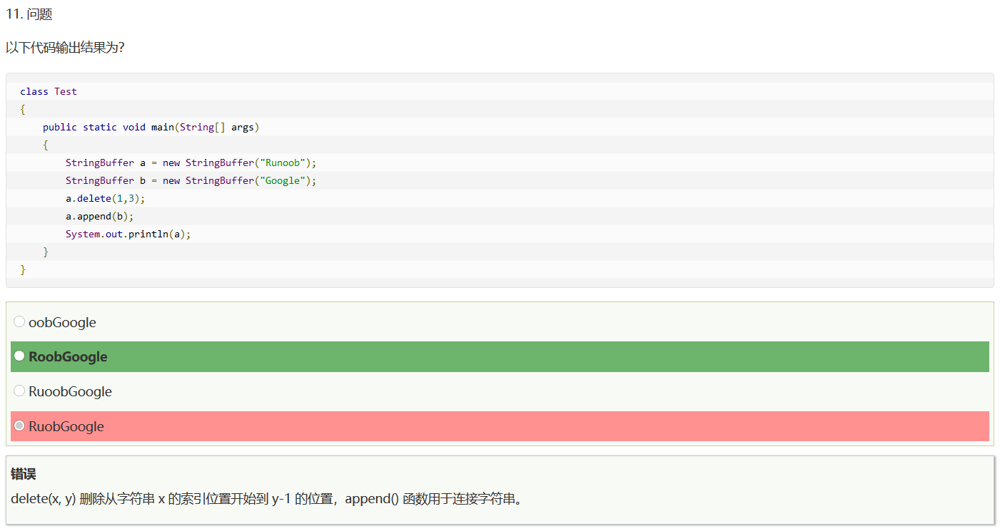

【分析】
推荐阅读：[编程语言的区间为何常是左闭右开](https://blankspace.blog.csdn.net/article/details/99618264)

## Topic 5

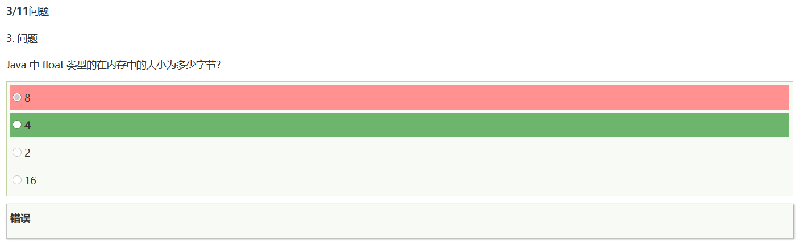

【解析】
float是32bit，而1byte=8bit。

## Topic 6

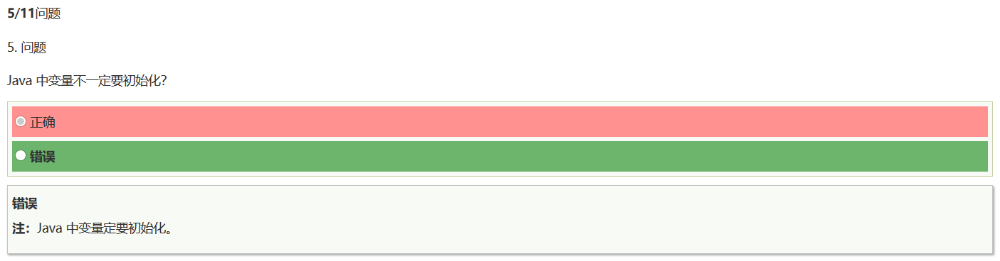

【解析】
乍一看，好像不必初始化？

想想出题人的意思是啥emmm我们分类讨论一下：
- 基本类型：不初始化就使用会CE
- 引用类型：不初始化就使用会java.lang.NullPointerException

综上，必须初始化（出题人应该没考虑到一个变量没被用到的情况，不过也说得过去）

## Topic 7

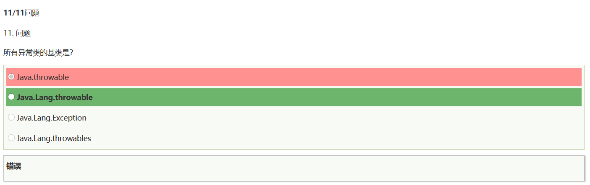

【解析】
没仔细看，看到Throwable就选了，注意全名。
（话说不应该是小写包名吗？）

## Topic 8

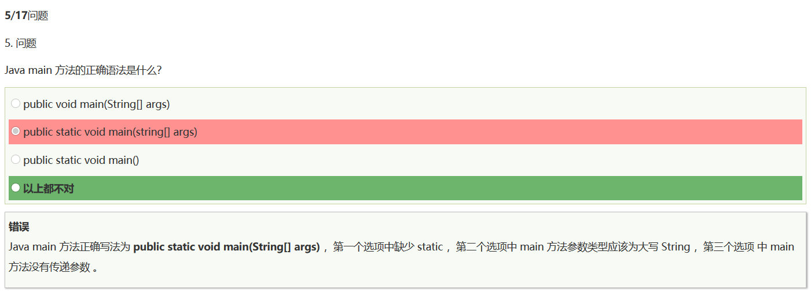

【解析】
做的时候没仔细看大小写，B的String写成了string，所以不对。

## Topic 9

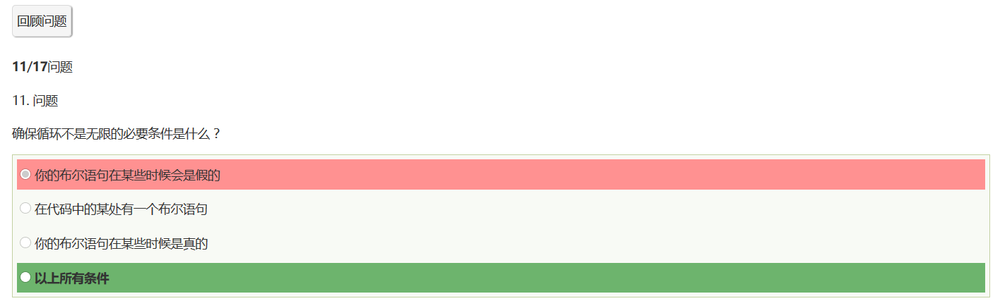

【解析】
我大致觉得一个循环可能进不去也算，这里应该认为要进去（存真+有布尔）+能出来

## Topic 10

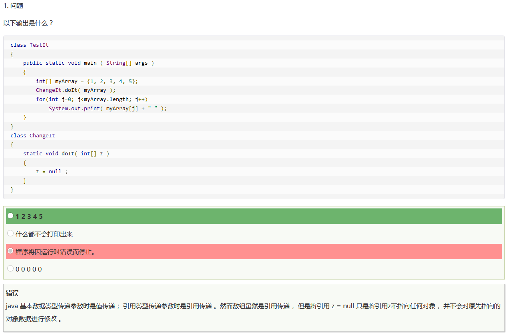

【解析】
这个null的赋值，无非是把这里的引用给断了，但不影响本来的值。

## Topic 11

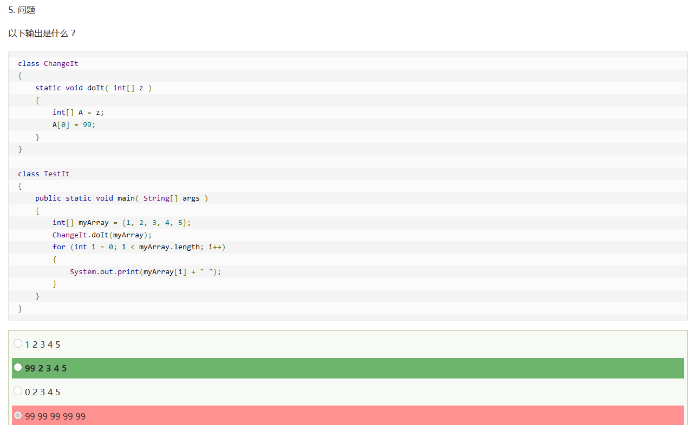

【解析】
大致一看还以为全改成99了，实则不是。

## Topic 12

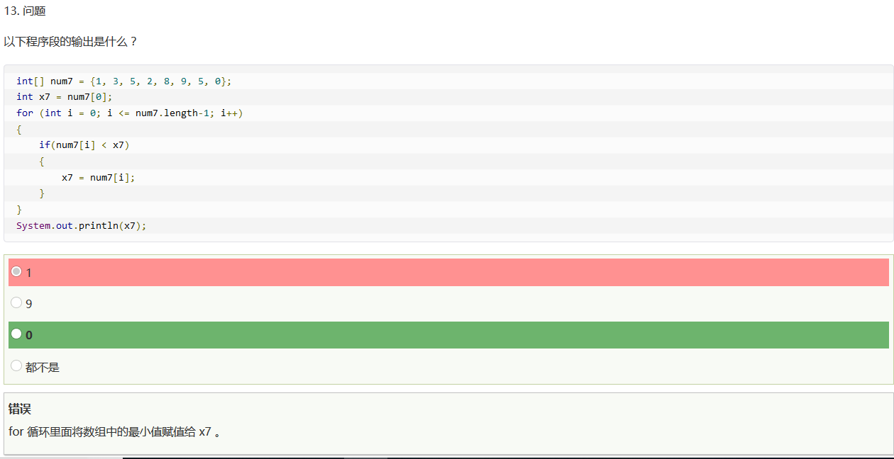

【解析】
大致一看，就觉得单调递增，没看到还有一个0。
其实此题就是找数组最小值的暴力算法。

## Topic 13

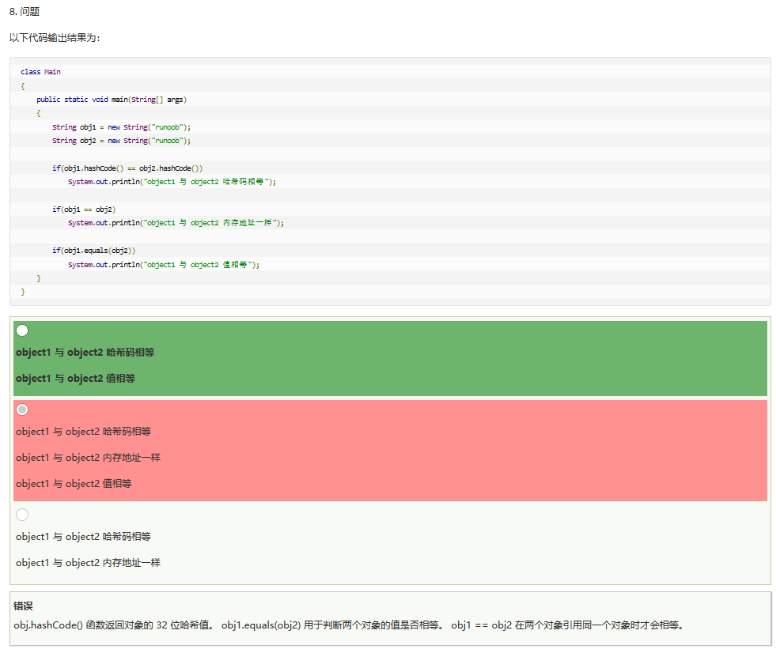

【解析】
想到了字符串常量池。
事实上，比如说这么写：

```javascript
String obj1 = "runoob";
String obj2 = "runoob";
```
结果就是：

```javascript
object1 与 object2 哈希码相等
object1 与 object2 内存地址一样
object1 与 object2 值相等
```

然而new了之后就不同了，因为地址不同。

那为什么hashCode()一样呢？
因为String的hashCode()参照了Times-33算法，使用31轮乘之前的值再加当前位，所以其实既然equals()能一样，那理论上hashCode()就能相等。

## Topic 14

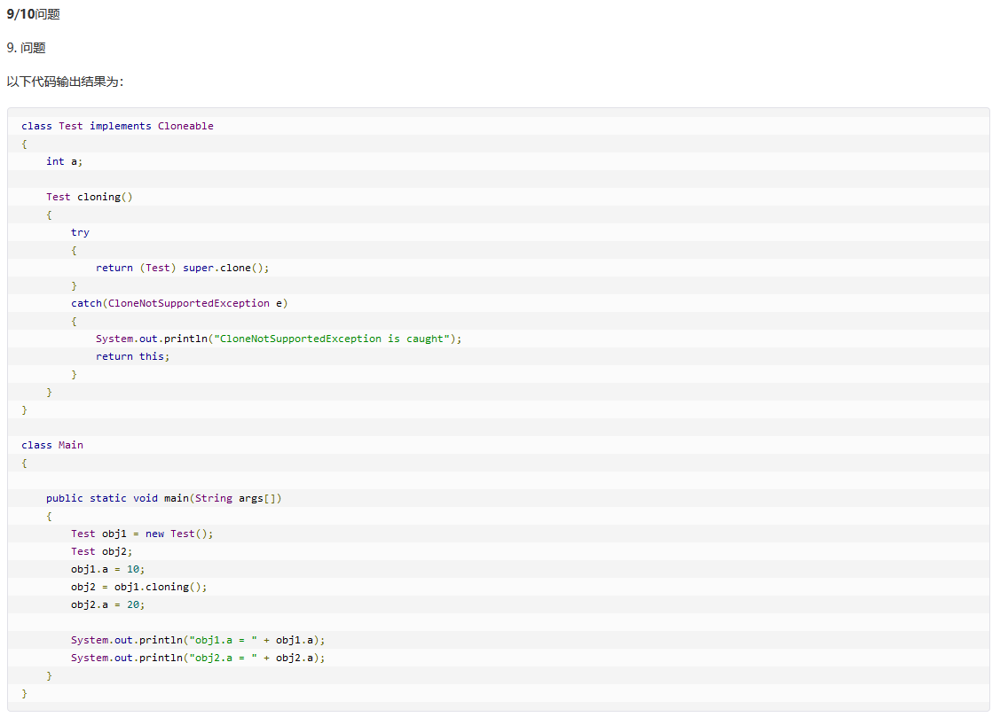

【解析】
开始以为是浅拷贝，仔细看发现`return (Test) super.clone();`这里重写了clone()，那就不难理解是深拷贝了。

感兴趣的可以复制代码自己测一下obj1和obj2（直接打印），看打印出来的地址是不是一样。（事实上是不一样的）

# 推荐题目

## Topic 15

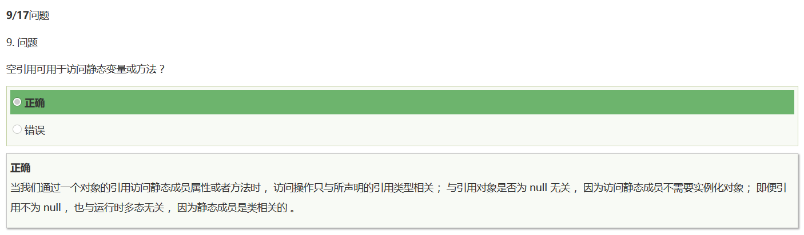

【解析】
如果访问成员函数，这个null将导致空指针异常，但访问类的方法就不会出问题。

## Topic 16

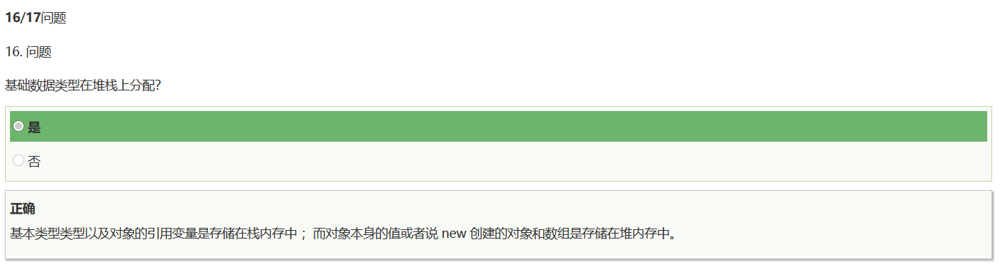

## Topic 17

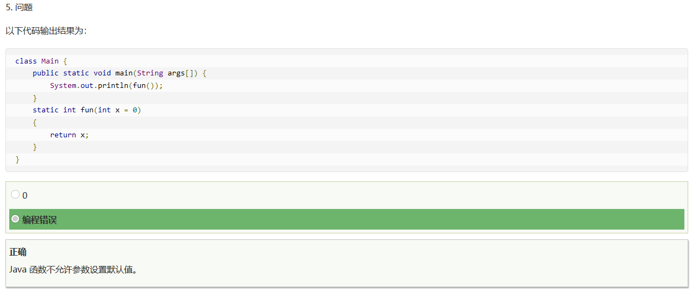

【解析】
Python允许函数参数有默认值，但Java并不支持。

## Topic 18

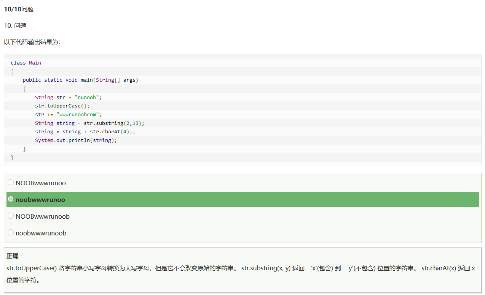

【解析】
主要是要熟悉String的这些方法，最主要的是注意toUpperCase()其实是返回大写String而不是直接改，所以不赋值就没用。

# 总结

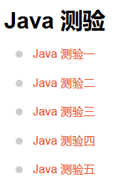

我简单刷了一遍，希望我的一些解读能帮助需要的人吧！

开始真没看得起这种题，就随便做做，结果反而犯了不少错误，希望大家能认真完成吧！这些题虽说简单，但也真的挺坑。

**做题的时候有什么不理解的欢迎留言！我看到以后尽量为你解答！**
