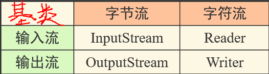
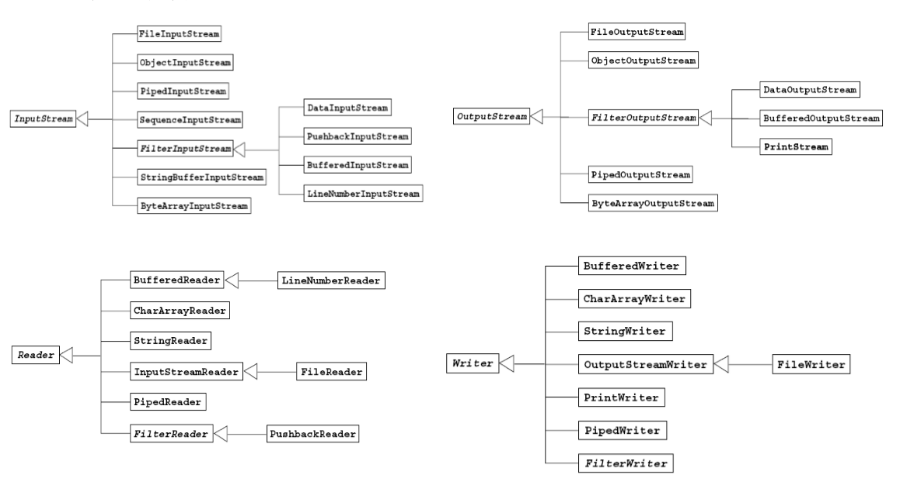
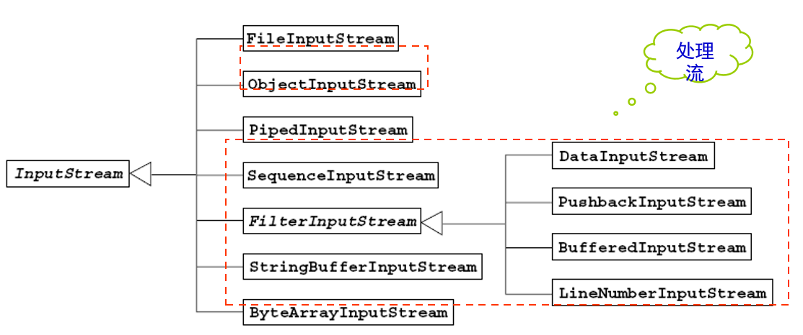
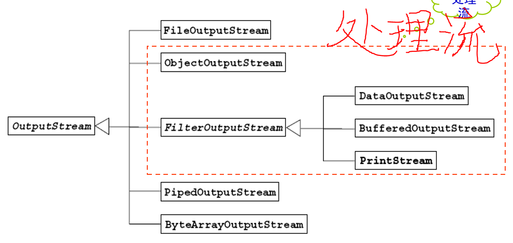
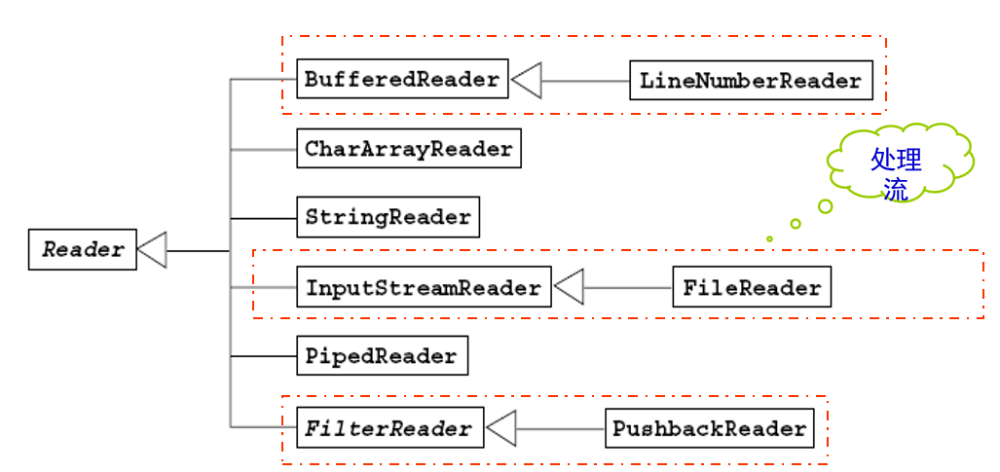
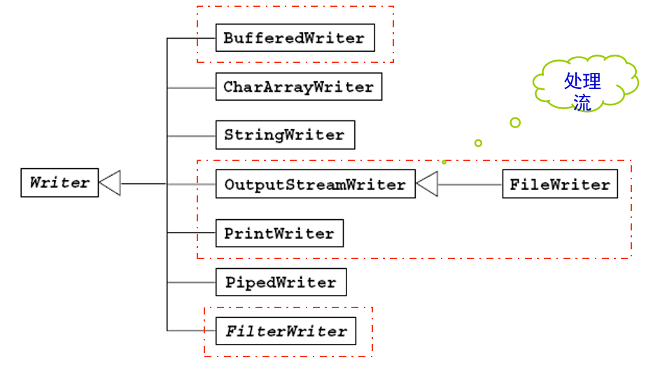

---
title: Java输入输出
date: 2020-03-08 00:57:11
summary: 本文浅谈Java基于Stream建立的I/O体系。
tags:
- Java
categories:
- Java
---

# 流

**流**（Stream），代表的是程序中数据的流通。
数据流是一串连续不断的数据的集合，而每一比特的数据，就如同水管（假设足够狭窄）中串行流淌的一滴水。

在Java程序中，对于数据的 I/O 操作是以流的方式进行的。
我认为，“流”这个概念，构建起了Java整个I/O体系的框架。

在学习《程序设计基础》的时候，我们就应该知道——I/O的数据流向和我们固有的认知相反：
输入流：流入程序的数据
输出流：流出程序的数据

在Java程序中，从输入流读取数据（读到内存中），而从输出流输出数据（从内存存储到文件或显示到屏幕上）。

## 流的分类

- 按流的方向不同 
  - 输入流
  - 输出流
- 按处理数据的单位不同
  - 字节流
  - 字符流
- 按功能不同
  - 节点流
  - 处理流 

## java.io

Java语言中，控制数据流的类都放在java.io包中 
java.io包中有两大继承体系：
- 以byte处理为主的Stream类， 其命名方式是：XXXStream（XXXInputStream/XXXOutputStream）
- 以字符处理为主的Reader/Writer类，他们的命名方式是：XXXReader/XXXWriter

## I/O体系的四大抽象类

InputStream、OutputStream、Reader、 Writer这四个类，是这两大继承体系的父类，全是抽象类。 

# 流的分类总结表

Note：*斜体表示抽象类*，**加粗表示节点流**。

| 分类 | 字节输入流 | 字节输出流 | 字符输入流 | 字符输出流 |
|:----:|:----:|:----:|:----:|:----:|
| 抽象父类 | *InputStream* | *OutputStream* | *Reader* | *Writer* |
| 访问文件 | **FileInputStream** | **FileOutputStream** | **FileReader** | **FileWriter** |
| 访问数组 | **ByteArrayInputStream** | **ByteArrayOutputStream** | **CharArrayReader** | **CharArrayWriter** |
| 访问管道 | **PipedInputStream** | **PipedOutputStream** | **PipedReader** | **PipedWriter** |
| 访问字符串 |  |  | **StringReader** | **StringWriter** |
| 缓冲流 | BufferedInputStream | BufferedOutputStream | BufferedReader | BufferedWriter |
| 转换流 |  |  | InputStreamReader | OutputStreamWriter |
| 对象流 | ObjectInputStream | ObjectOutputStream |  |  |
| 抽象父类 | *FilterInputStream* | *FilterOutputStream* | *FilterReader* | *FilterWriter* |
| 打印流 |  | PrintStream |  | PrintWriter |
| 推回输入流 | PushbackInputStream |  | PushbackReader |  |
| 特殊流 | DataInputStream | DataOutputStream |  |  |

# 流的层次结构图

## 字节输入流的层次结构图

## 字节输出流的层次结构图

## 字符输入流的层次结构图

## 字符输出流的层次结构图

