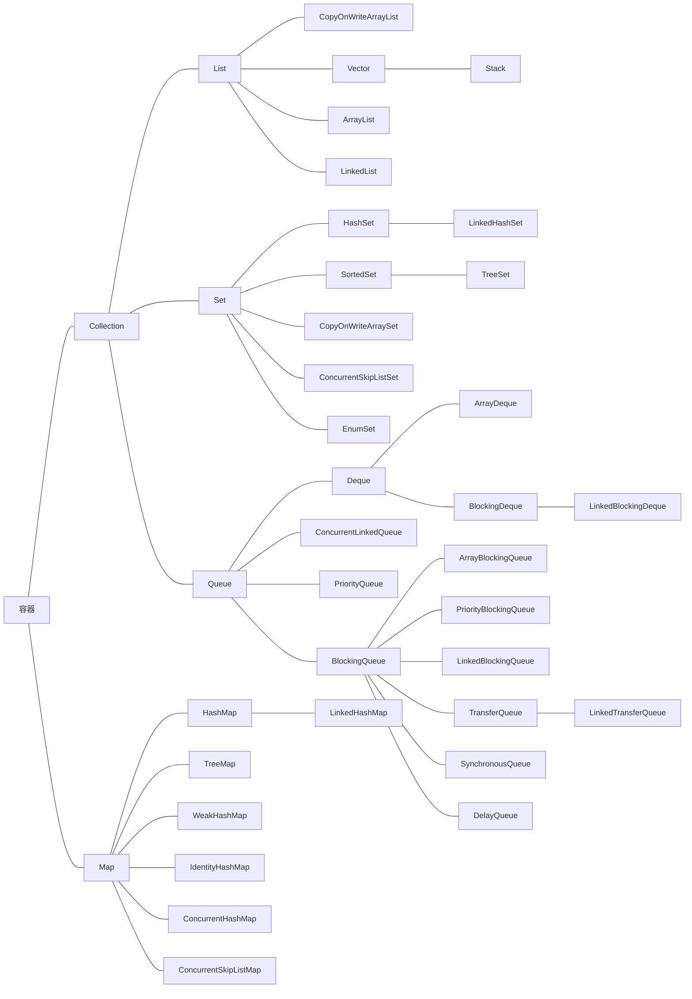

---
title: Java集合框架
date: 2023-04-05 15:22:57
summary: 本文分享Java集合框架最基本的体系结构图。
tags:
- Java
categories:
- Java
---

下图列出了Java内置集合框架的体系结构：

```mermaid
flowchart LR
    容器 --- Collection
    Collection --- List
    List --- CopyOnWriteArrayList
    List --- Vector
    Vector --- Stack
    List --- ArrayList
    List --- LinkedList
    Collection --- Set
    Set --- HashSet
    HashSet --- LinkedHashSet
    Set --- SortedSet
    SortedSet --- TreeSet
    Set --- CopyOnWriteArraySet
    Set --- ConcurrentSkipListSet
    Set --- EnumSet
    Collection --- Queue
    Queue --- Deque
    Deque --- ArrayDeque
    Deque --- BlockingDeque
    BlockingDeque --- LinkedBlockingDeque
    Queue --- ConcurrentLinkedQueue
    Queue --- PriorityQueue
    Queue --- BlockingQueue
    BlockingQueue --- ArrayBlockingQueue
    BlockingQueue --- PriorityBlockingQueue
    BlockingQueue --- LinkedBlockingQueue
    BlockingQueue --- TransferQueue
    TransferQueue --- LinkedTransferQueue
    BlockingQueue --- SynchronousQueue
    BlockingQueue --- DelayQueue
    容器 --- Map
    Map --- HashMap
    HashMap --- LinkedHashMap
    Map --- TreeMap
    Map --- WeakHashMap
    Map --- IdentityHashMap
    Map --- ConcurrentHashMap
    Map --- ConcurrentSkipListMap
```
