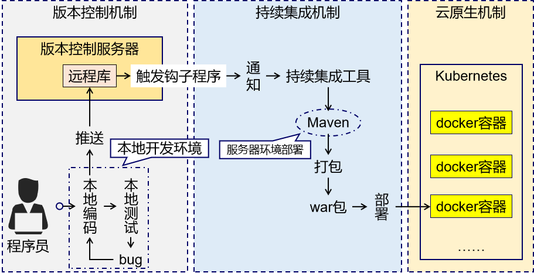
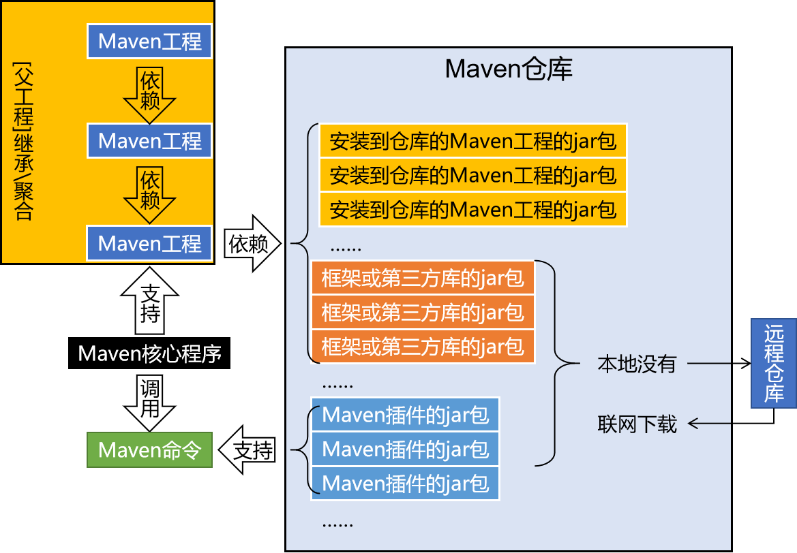

---
title: Maven必知必会
date: 2022-02-07 14:54:16
summary: 本文分享Maven相关基础知识。
tags:
- Maven
- Java
categories:
- Java
---

# Maven


[Maven官网链接](https://maven.apache.org)
[Maven下载链接](https://maven.apache.org/download.cgi)

# Maven目录结构

`M2_HOME`目录是Maven根目录：
- 📁 bin
    - 🗄️ m2.conf
    - 🗄️ mvn
    - 🗄️ mvn.cmd
    - 🗄️ mvnDebug
    - 🗄️ mvnDebug.cmd
    - 🗄️ mvnyjp
- 📁 boot
    - 🗄️ plexus-classworlds-x.x.x.jar : Java类加载器框架
- 📁 conf
    - 📁 logging
        - 🗄️ simplelogger.properties
    - 🗄️ settings.xml : Maven核心配置文件
    - 🗄️ toolchains.xml
- 📁 lib : Maven运行时需要的Java类库
    - 📁 ext
        - 🗄️ README.txt
    - 📁 jansi-native
        - 📁 freebsd32
            - 🗄️ libjansi.so
        - 📁 freebsd64
            - 🗄️ libjansi.so
        - 📁 linux32
            - 🗄️ libjansi.so
        - 📁 linux64
            - 🗄️ libjansi.so
        - 📁 osx
            - 🗄️ libjansi.jnilib
        - 📁 windows32
            - 🗄️ jansi.dll
        - 📁 windows64
            - 🗄️ jansi.dll
        - 🗄️ README.txt
    - 🗄️ ......
- 🗄️ LICENSE
- 🗄️ NOTICE
- 🗄️ README.txt

# Maven构建项目



构建过程包含的主要的环节：
- 清理：删除上一次构建的结果，为下一次构建做好准备
- 编译：Java源程序编译成*.class字节码文件
- 测试：运行提前准备好的测试程序
- 报告：针对刚才测试的结果生成一个全面的信息
- 打包
    - Java工程：jar包
    - Web工程：war包
- 安装：把一个Maven工程经过打包操作生成的jar包或war包存入Maven仓库
- 部署
    - 部署jar包：把一个jar包部署到Nexus私服服务器上
    - 部署war包：借助相关Maven插件，将war包部署到Tomcat服务器上

# Maven生命周期

Maven的生命周期就是为了对所有的构建过程进行抽象和统一。Maven的生命周期是抽象的，这意味着生命周期本身不做任何实际的工作。

Maven拥有三套相互独立的生命周期，它们分别为clean、default、site。
- `clean`生命周期的目的是清理项目。
    - `pre-clean`：执行一些清理前需要完成的工作。
    - `clean`：清理上一次构建生成的文件。
    - `post-clean`：执行一些清理后需要完成的工作。
- `default`生命周期的目的是构建项目。
    - `validate`
    - `initialize`
    - `generate-sources`
    - `process-sources`：处理项目主资源文件。一般来说，是对`src/main/ resources`目录的内容进行变量替换等工作后，复制到项目输出的主classpath目录中。
    - `generate-resources`
    - `process-resources`
    - `compile`：编译项目的主源码。一般来说，是编译`src/main/ java`目录下的Java文件至项目输出的主classpath目录中。
    - `process-classes`
    - `generate-test-sources`
    - `process-test-sources`：处理项目测试资源文件。一般来说，是对`src/test/ resources`目录的内容进行变量替换等工作后，复制到项目输出的测试classpath目录中。
    - `generate-test-resources`
    - `process-test-resources`
    - `test-compile`：编译项目的测试代码。一般来说，是编译`src/test/java`目录下的Java文件至项目输出的测试classpath目录中。
    - `process-test-classes`
    - `test`：使用单元测试框架运行测试，测试代码不会被打包或部署。
    - `prepare-package`
    - `package`：接受编译好的代码，打包成可发布的格式，如JAR。
    - `pre-integration-test`
    - `integration-test`
    - `post-integration-test`
    - `verify`
    - `install`：将包安装到Maven本地仓库，供本地其他Maven项目使用。
    - `deploy`：将最终的包复制到远程仓库，供其他开发人员和Maven项目使用。
- `site`生命周期的目的是建立项目站点。
    - `pre-site`：执行一些在生成项目站点之前需要完成的工作。
    - `site`：生成项目站点文档。
    - `post-site`：执行一些在生成项目站点之后需要完成的工作。
    - `site-deploy`：将生成的项目站点发布到服务器上。

每个Maven生命周期包含一些阶段(phase)，这些阶段是有顺序的，并且后面的阶段依赖于前面的阶段，用户和Maven最直接的交互方式就是调用这些生命周期阶段。

较之于生命周期阶段的前后依赖关系，三套生命周期本身是相互独立的，用户可以仅仅调用clean生命周期的某个阶段，或者仅仅调用default生命周期的某个阶段，而不会对其他生命周期产生任何影响。例如，当用户调用clean生命周期的clean阶段的时候，不会触发default生命周期的任何阶段，反之亦然，当用户调用default生命周期的compile阶段的时候，也不会触发clean生命周期的任何阶段。

Maven的核心仅仅定义了抽象的生命周期，具体的任务是交由插件完成的，插件以独立的构件形式存在。Maven的生命周期与插件相互绑定，用以完成实际的构建任务。具体而言，是生命周期的阶段与插件的目标相互绑定，以完成某个具体的构建任务。
为了能让用户几乎不用任何配置就能构建Maven项目，Maven在核心为一些主要的生命周期阶段绑定了很多插件的目标，当用户通过命令行调用生命周期阶段的时候，对应的插件目标就会执行相应的任务。
除了内置绑定以外，用户还能够自己选择将某个插件目标绑定到生命周期的某个阶段上，这种自定义绑定方式能让Maven 项目在构建过程中执行更多更富特色的任务。

完成了插件和生命周期的绑定之后，用户还可以配置插件目标的参数，进一步调整插件目标所执行的任务，以满足项目的需求。几乎所有Maven插件的目标都有一些可配置的参数，用户可以通过命令行和POM 配置等方式来配置这些参数。

# Maven配置信息

代理配置：
```xml
  <proxies>
    <proxy>
      <id>optional</id> 
      <active>true</active>
      <protocol>http</protocol>
      <host>127.0.0.1</host>
      <port>7089</port>
    </proxy>
  </proxies>
```

镜像配置：
```xml
  <mirrors>
    <mirror>
        <id>aliyun</id>
        <mirrorOf>*</mirrorOf>
        <name>aliyun Maven</name>
        <url>http://maven.aliyun.com/nexus/content/groups/public</url>
    </mirror>
  </mirrors>
```

默认JDK版本配置：
```xml
	<profile>
	  <id>jdk-1.8</id>
	  <activation>
		<activeByDefault>true</activeByDefault>
		<jdk>1.8</jdk>
	  </activation>
	  <properties>
		<maven.compiler.source>1.8</maven.compiler.source>
		<maven.compiler.target>1.8</maven.compiler.target>
		<maven.compiler.compilerVersion>1.8</maven.compiler.compilerVersion>
	  </properties>
	</profile>
```

# Maven单元测试

在默认情况下，`maven-surefire-plugin`插件的test目标会自动执行测试源码路径（默认为`/src/test/java/`）下所有符合一组命名模式的测试类：
- `**/Test*.java`：何子目录下所有命名以Test开头的Java类。
- `**/*Test.java`：任何子目录下所有命名以Test结尾的Java类。
- `**/*TestCase.java`：任何子日录下所有命名以TestCase结尾的Java类。

# Maven模型POM

POM（Project Object Model）：项目对象模型。
DOM（Document Object Model）：文档对象模型。

## Maven常见POM元素

常见pom.xml元素如下所示：
- `<groupId></groupId>`：项目所隶属的实际项目ID，未必是一对一的关系（必须定义）
- `<artifactId></artifactId>`：项目中的一个子Maven项目（模块）（必须定义）
- `<version></version>`：项目当前版本（必须定义）
    - `SNAPSHOT`：表示快照版本，正在迭代过程中，不稳定的版本
    - `RELEASE`：表示正式版本
- `<packaging></packaging>`：项目打包方式，默认为jar（可选定义）
- `<name></name>`：项目名称（更用户友好的名称）
- `<description></description>`：项目详情介绍
- `<properties></properties>`：项目属性
- `<dependencies></dependencies>`：项目依赖

Maven规定：所有Java组件都可以用Maven坐标唯一标识。Maven坐标的元素包括：`groupId`、`artifactId`、`version`、`packaging`、`classifier`。Maven提供了一个内含多数流行Java项目组件的中央仓库。

`classifier`不可以直接定义，需要通过附加插件辅助生成。

## Maven的POM聚合

```xml
<modules>
  <module>module1</module>
  <module>module2</module>
</modules>
```

对于聚合模块来说，它知道有哪些被聚合的模块，但那些被聚合的模块不知道这个聚合模块的存在。

## Maven的POM继承

```xml
<parent>
  <groupId></groupId>
  <artifactId></artifactId>
  <version></version>
  <relativePath></relativePath>
</parent>
```

对于继承关系的父POM来说，它不知道有哪些子模块继承于它，但那些子模块都必须知道自己的父POM是什么。

可继承的POM元素：
- `groupld`：项目组ID，项目坐标的核心元素。
- `version`：项目版本，项目坐标的核心元素。
- `description`：项目的描述信息。
- `organization`：项目的组织信息。
- `inceptionYear`：项目的创始年份。
- `url`：项目的URL地址。
- `developers`：项目的开发者信息。
- `contributors`：项目的贡献者信息。
- `distributionManagement`：项目的部署配置。
- `issueManagement`：项目的缺陷跟踪系统信息。
- `ciManagement`：项目的持续集成系统信息。
- `scm`：项目的版本控制系统信息。
- `mailingLists`：项目的邮件列表信息。
- `properties`：自定义的Maven属性。
- `dependencies`：项目的依赖配置。
- `dependencyManagement`：项目的依赖管理配置。
- `repositories`：项目的仓库配置。
- `build`：包括项目的源码目录配置、输出目录配置、插件配置、插件管理配置等。
- `reporting`：包括项目的报告输出目录配置、报告插件配置等。

# Maven工程目录

Maven提倡“约定优于配置”，其中Maven工程目录结构也有所约定。

Maven工程基本目录结构：
- 📁 src
    - 📁 main
        - 📁 java
        - 📁 resources
    - 📁 test
        - 📁 java
        - 📁 resources
- 📁 target
    - 📁 classes (程序类编译结果)
    - 📁 test-classes (测试类编译结果)
    - 📁 surefire-reports (测试报告)

# Maven依赖

依赖管理中要解决的具体问题：
- jar包的下载：使用Maven之后，jar包会从规范的远程仓库下载到本地
- jar包之间的依赖：通过依赖的传递性自动完成
- jar包之间的冲突：通过对依赖的配置进行调整，让某些jar包不会被导入

## Maven依赖范围

- `compile`：默认依赖范围，编译、测试、运行时classpath都可用。
- `test`：编译、运行时classpath不可用，只有测试classpath可用。
- `provided`：运行时classpath不可用，编译、测试classpath可用。
- `runtime`：编译classpath不可用，测试、运行时classpath可用。
- `system`：必须通过systemPath元素显式指定，与本机系统绑定。
- `import`：不对编译、测试、运行时classpath产生实质性的影响。

| 依赖范围(scope) | 对编译classpath有效 | 对测试classpath有效 | 对运行时classpath有效 | 例子 |
|:----:|:----:|:----:|:----:|:----:|
|  compile  | √ | √ | √ | spring-core |
|  test  | × | √ | × | junit |
|  provided  | √ | √ | × | servlet-api |
|  runtime  | × | √ | √ | jdbc实现 |
|  system  | √ | √ | × | 本地Maven仓库以外的类库文件 | 

## Maven依赖传递

| 依赖范围(scope) |  compile  |  test  |  provided  |  runtime  |
|:----:|:----:|:----:|:----:|:----:|
|  compile  |  compile  | × | × | runtime |
|  test  |  test  | × | × | test |
|  provided  |  provided  | × | provided | provided |
|  runtime  |  runtime  | × | × | runtime |

## Maven依赖冲突

依赖冲突的调节：
- 路径最近者优先
- 首先声明者优先

查看当前项目最终已解析依赖：
```shell
mvn dependency:list
```

查看当前项目最终已解析依赖树：
```shell
mvn dependency:tree
```

分析当前项目的依赖：
```shell
mvn dependency:analyze
```

## Maven依赖排除

在`<dependency></dependency>`中添加`<exclusions></exclusions>`可以排除不需要的依赖。

```xml
    <dependencies>
        <dependency>
            <groupId></groupId>
            <artifactId></artifactId>
            <version></version>
            <exclusions>
                <exclusion>
                    <groupId></groupId>
                    <artifactId></artifactId>
                </exclusion>
            </exclusions>
        </dependency>
    </dependencies>
```

## Maven依赖解析

Maven依赖解析机制：
1. 当依赖的范围是system的时候，Maven直接从本地文件系统解析构件。
2. 根据依赖坐标计算仓库路径后，尝试直接从本地仓库寻找构件，如果发现相应构件，则解析成功。
3. 在本地仓库不存在相应构件的情况下，如果依赖的版本是显式的发布版本构件，如1.2、2.1-beta-1等，则遍历所有的远程仓库，发现后，下载并解析使用。
4. 如果依赖的版本是RELEASE或者LATEST，则基于更新策略读取所有远程仓库的元数据`groupld/artifactId/maven-metadata.xml`，将其与本地仓库的对应元数据合并后，计算出RELEASE或者LATEST真实的值，然后基于这个真实的值检查本地和远程仓库。
5. 如果依赖的版本是SNAPSHOT，则基于更新策略读取所有远程仓库的元数据`groupld/artifactId/ version/maven-metadata.xml`，将其与本地仓库的对应元数据合并后，得到最新快照版本的值，然后基于该值检查本地仓库，或者从远程仓库下载。
6. 如果最后解析得到的构件版本是时间戳格式的快照，如1.4.1-20091104.121450-121，则复制其时间戳格式的文件至非时间戳格式，如SNAPSHOT，并使用该非时间戳格式的构件。


# Maven属性

同类Maven依赖版本可以通过定义Maven属性统一起来：
```xml
    <properties>
        <swagger.version>2.9.2</swagger.version>
    </properties>
    <dependencies>
        <dependency>
            <groupId>io.springfox</groupId>
            <artifactId>springfox-swagger2</artifactId>
            <version>${swagger.version}</version>
        </dependency>
        <dependency>
            <groupId>io.springfox</groupId>
            <artifactId>springfox-swagger-ui</artifactId>
            <version>${swagger.version}</version>
        </dependency>
    </dependencies>
```

# Maven仓库

Maven仓库的分类：
- 远程仓库
    - 中央仓库
    - 私有仓库
    - 其他公共仓库
- 本地仓库

Maven仓库中，路径与Maven依赖坐标的关系是：`<groupId>/<artifactId>/<version>/<artifactId>-<version>.<packaging>`。

需要根据Maven依赖坐标寻找Maven依赖组件时，会先在本地仓库查找，如果本地没有则去远程仓库
查找。

本地仓库原本不存在，当执行第一条Maven命令后，才会创建本地仓库。

私有仓库是架设在局域网内部的仓库，代理广域网上的中央仓库，有助于：
- 节省外网带宽
- 加速Maven构建
- 部署第三方组件
- 提高稳定性，增强控制
- 降低中央仓库的负载



# Maven镜像

如果仓库X可以提供仓库Y存储的所有内容，那么就可以认为X是Y的一个镜像。换句话说．任何一个可以从仓库Y获得的构件，都能够从它的镜像中获取。

关于镜像的一个更为常见的用法是结合私服。由于私服可以代理任何外部的公共仓库（包括中央仓库），因此，对于组织内部的Maven用户来说，使用一个私服地址就等于使用了所有需要的外部仓库，这可以将配置集中到私服，从而简化Maven本身的配置。在这种情况下，任何需要的构件都可以从私服获得，私服就是所有仓库的镜像。

镜像配置规则：
- `<mirrorOf> * </mirrorOf>`：匹配所有远程仓库。
- `<mirrorOf> external: * </mirrorOf>`：匹配所有远程仓库，使用localhost的除外，使用file://协议的除外。也就是说，匹配所有不在本机上的远程仓库。
- `<mirrorOf> repo1 , repo2 </mirrorOf>`：匹配仓库repo1和repo2，使用逗号分隔多个远程仓库。
- `<mirrorOf> * , !repo1 </mirrorOf>`：匹配所有远程仓库，repo1除外，使用感叹号将仓库从匹配中排除。

# Maven命令参数

Maven执行与构建有关的命令时，必须在pom.xml路径下执行，否则报错：`The goal you specified requires a project to execute but there is no POM in this directory`

## Maven命令参数

| 缩略参数 | 完整参数 | 参数说明 |
|:----:|:----:|:----:|
| `-am` | `--also-make` | 如果指定了项目列表，则还构建列表所需的项目 |
| `-amd` | `--also-make-dependents` | 如果指定了项目列表，则还构建依赖于列表上项目的项目 |
| `-B` | `--batch-mode` | 以非交互（批处理）模式运行（禁用输出颜色） |
| `-b` | `--builder <arg>` | 要使用的构建策略的id |
| `-C` | `--strict-checksums` | 如果校验和不匹配则构建失败 |
| `-c` | `--lax-checksums` | 如果校验和不匹配则发出警告 |
| `-cpu` | `--check-plugin-updates` | 无效，仅保留用于向后兼容 |
| `-D` | `--define <arg>` | 定义系统属性 |
| `-e` | `--errors` | 产生执行错误消息 |
| `-emp` | `--encrypt-master-password <arg>` | 加密主安全密码 |
| `-ep` | `--encrypt-password <arg>` | 加密服务器密码 |
| `-f` | `--file <arg>` | 强制使用备用POM文件（或带有pom.xml的目录） |
| `-fae` | `--fae-at-end` | 仅在之后使构建失败； 允许所有不受影响的构建继续 |
| `-ff` | `--fail-fast` | 在反应式构建中第一次失败时停止 |
| `-fn` | `--fail-never` | 无论项目结果如何，构建都不会失败 |
| `-gs` | `--global-settings <arg>` | 全局设置文件的备用路径 |
| `-gt` | `--global-toolchains <arg>` | 全局工具链文件的备用路径 |
| `-h` | `--help` | 显示帮助信息 |
| `-l` | `--log-file <arg>` | 所有构建输出将进入的日志文件（禁用输出颜色） |
| `-llr` | `--legacy-local-repository` | 使用Maven2旧版本地存储库行为，即不使用`_remote.repositories`。 也可以使用`-Dmaven.legacyLocalRepo=true`激活 |
| `-N` | `--non-recursive` | 不递归到子项目中 |
| `-npr` | `--no-plugin-registry` | 无效，仅保留用于向后兼容 |
| `-npu` | `--no-plugin-updates` | 无效，仅保留用于向后兼容 |
| `-nsu` | `--no-snapshot-updates` | 禁止快照更新 |
| `-o` | `--offline` | 离线工作 |
| `-P` | `--activate-profiles <arg>` | 要激活的以逗号分隔的配置文件列表 |
| `-pl` | `--projects <arg>` | 以逗号分隔的要构建的指定反应器项目列表，而不是所有项目。项目可以通过`[groupId]:artifactId`或其相对路径指定 |
| `-q` | `--quiet` | 安静输出-只显示错误 |
| `-rf` | `--resume-from <arg>` | 从指定项目恢复reactor |
| `-s` | `--settings <arg>` | 用户设置文件的备用路径 |
| `-t` | `--toolchains <arg>` | 用户工具链文件的备用路径 |
| `-T` | `--threads <arg>` | 线程数，例如2.0C，其中C是核心乘积 |
| `-U` | `--update-snapshots` | 强制检查远程存储库上丢失的版本和更新的快照 |
| `-up` | `--update-plugins` | 无效，仅保留用于向后兼容 |
| `-v` | `--version` | 显示版本信息 |
| `-V` | `--show-version` | 显示版本信息而不停止构建 |
| `-X` | `--debug` | 产生执行调试输出 |

## Maven基本命令

```shell
# 清除编译结果，删除target目录
mvn clean
# 主程序编译
mvn compile
# 测试程序编译
mvn test-compile
# 测试程序
mvn test
# 程序打包
mvn package
# 将本地构建过程中生成的jar包存入Maven本地仓库
mvn install
```

## Maven进阶命令参数

```shell
# 离线模式，相当于以本地模式执行
mvn -o | mvn clean install -o
# 禁用递归查找 pom.xml，多 module 工程中可以用来单独 install 'parent'
mvn -N | mvn clean install -N
# 禁用交互模式（听说在 jenkins 上可以禁止输出下载进度？）
mvn -B | mvn clean install -B
# 多 module 工程中指定打包某个 module 和其依赖的 module，若指定多个以逗号分隔
mvn -pl xxx -am | mvn clean package -pl xxx-api -am
# 多 module 工程中指定从某个 module 开始构建，可以和 -pl 联用
mvn -rf | mvn clean package -rf xxx-api
# 异常时打印堆栈
mvn -e
# 开启 debug 模式，打开后日志茫茫多，包括 -e 的内容
mvn -X
# 开启多线程构建，'C' 代表 cpu 核数，'0.5C' 表示有 core/2 个线程，'4' 表示固定 4 个线程
mvn -T 0.5C | mvn -T 4
# 指定 pom.xml 文件路径
mvn -f
# 指定 settings.xml 文件路径
mvn -s
# 强制更新依赖
mvn -U
# 强制更新插件
mvn -up
# 禁止更新依赖
mvn -nsu
# 禁止更新插件
mvn -npu
# 激活 profile
mvn -P
# 开启静默模式，只输出异常，某些场景下非常有用
mvn -q | mvn help:evaluate -q -DforceStdout -Dexpression=project.version
```


