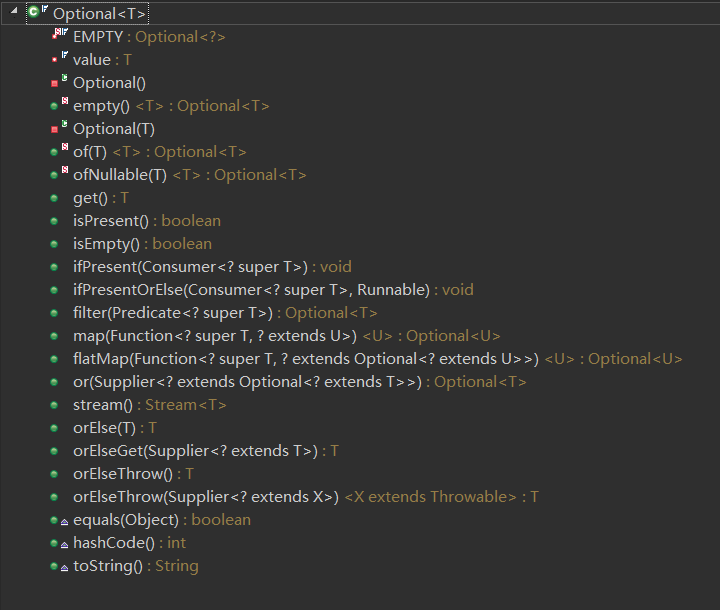
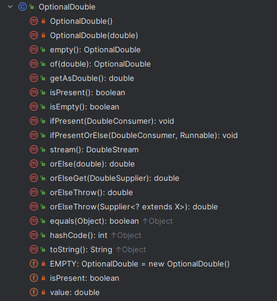
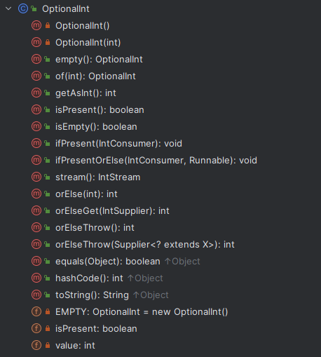
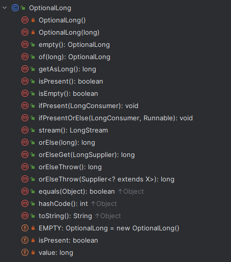

---
title: Optional、OptionalDouble、OptionalInt、OptionalLong
date: 2019-11-23 23:04:37
summary: 本文分享Java8推出的Optional容器体系，包括java.util.Optional、java.util.OptionalDouble、java.util.OptionalInt、java.util.OptionalLong。
tags:
- Java
categories:
- Java
---

# java.util.Optional

java.util.Optional类是一个可以为null的容器对象。如果值存在则isPresent()方法会返回true，调用get()方法会返回该对象。

java.util.Optional是个容器：它可以保存类型T的值，或者仅仅保存null。java.util.Optional提供很多有用的方法，这样我们就不用显式进行空值检测。

java.util.Optional类的引入很好的解决空指针异常。

## API用法说明



| 编号 | 方法定义 | 功能说明 |
|:----:|:----:|:----:|
| 1 | 	static \<T> Optional\<T> empty() |返回空的 Optional 实例。|
| 2 | 	boolean equals(Object obj) |判断其他对象是否等于 Optional。|
| 3 |	Optional\<T> filter(Predicate<? super \<T> predicate) |如果值存在，并且这个值匹配给定的 predicate，返回一个Optional用以描述这个值，否则返回一个空的Optional。|
| 4 |\<U> Optional\<U> flatMap(Function<? super T,Optional\<U>> mapper) |如果值存在，返回基于Optional包含的映射方法的值，否则返回一个空的Optional。|
| 5 |T get() |如果在这个Optional中包含这个值，返回值，否则抛出异常：NoSuchElementException。|
| 6 |int hashCode() |返回存在值的哈希码，如果值不存在 返回 0。|
| 7 |void ifPresent(Consumer<? super T> consumer) |如果值存在则使用该值调用 consumer , 否则不做任何事情。|
| 8 |boolean isPresent() |如果值存在则方法会返回true，否则返回 false。|
| 9 | \<U>Optional\<U> map(Function<? super T, ? extends U> mapper) |如果有值，则对其执行调用映射函数得到返回值。如果返回值不为 null，则创建包含映射返回值的Optional作为map方法返回值，否则返回空Optional。|
| 10 |static \<T> Optional\<T> of(T value) |返回一个指定非null值的Optional。
| 11 |static \<T> Optional\<T> ofNullable(T value) |如果为非空，返回 Optional 描述的指定值，否则返回空的 Optional。|
| 12 |T orElse(T other) |如果存在该值，返回值， 否则返回 other。
| 13 |T orElseGet(Supplier<? extends T> other) |如果存在该值，返回值， 否则触发 other，并返回 other 调用的结果。|
| 14 |\<X extends Throwable> T orElseThrow(Supplier<? extends X> exceptionSupplier) |如果存在该值，返回包含的值，否则抛出由 Supplier 继承的异常。|
| 15 |String toString() |返回一个Optional的非空字符串，用来调试。|

## 代码示例

java.util.Optional主要被用于Java8的Stream中：

```java
import java.util.Optional;
import java.util.stream.Stream;

public class OptionalStreamDemo {
    public static void main(String[] args) {
        Stream<String> names = Stream.of("Viper", "Ruler", "Elk");
        Optional<String> startswl = names.filter(name -> name.startsWith("V")).findFirst();
        // 判断是否不为null
        startswl.ifPresent(System.out::println);
        // if值为null：打印“null”；if值不为null：打印原值
        System.out.println(startswl.orElse("null"));
        // if值不为null，执行Lambda表达式
        startswl.ifPresent(name -> {
            String s = name.toUpperCase();
            System.out.println(s);
        });
    }
}
```

java.util.Optional的API应用：

```java
import java.util.Optional;

public class OptionalDemo {
    public static Integer sum(Optional<Integer> var1, Optional<Integer> var2) {
        // Optional.isPresent - 判断值是否存在
        System.out.println("第一个参数值存在：" + var1.isPresent());
        System.out.println("第二个参数值存在：" + var2.isPresent());
        // Optional.orElse - 如果值存在，返回它，否则返回默认值
        Integer var3 = var1.orElse(Integer.parseInt("0"));
        // Optional.get - 获取值，值需要存在
        Integer var4 = var2.get();
        return var3 + var4;
    }

    public static void main(String[] args) {
        Integer var1 = null;
        Integer var2 = Integer.parseInt("1");
        // Optional.ofNullable() - 允许传递为null参数
        Optional<Integer> op1 = Optional.ofNullable(var1);
        // Optionanl.of() - 如果传参为null则爆NullPointerException
        Optional<Integer> op2 = Optional.of(var2);
        try {
            Optional<Integer> op3 = Optional.of(var1);
        } catch (NullPointerException npe) {
            System.out.println("空指针异常");
        }
        System.out.println(sum(op1, op2));
    }
}
```

# java.util.OptionalDouble

OptionalDouble、OptionalInt 和 OptionalLong不是Optional 的子类。它们是独立的类，用于包装对应的基本类型值，并提供了特定于基本类型的方法。虽然如此，但OptionalDouble、OptionalInt 和 OptionalLong与Optional类具有相似的目的和使用方式。它们都是用于表示可能存在或可能不存在值的容器。使用这些类可以避免直接使用基本类型的包装类（Double、Integer、Long）来处理可能为空的基本类型值。

在处理基本类型值的情况下，开发者可以用OptionalDouble、OptionalInt、OptionalLong，以一种更语义化和类型安全的方式进行操作。这些类提供了一组方法，如 isPresent()、orElse()、ifPresent() 等，用于检查值是否存在、获取值或执行特定的操作。

OptionalDouble是一个容器对象，可以包含或不包含double值。如果存在值，则isPresent()方法返回true。如果没有值，则该对象被视为空，并且isPresent()方法返回false。

OptionalDouble还提供了其他依赖于包含值的存在与否的方法，例如orElse()（如果没有值，则返回默认值）和ifPresent()（如果存在值，则执行操作）。



这是一个基于值的类。程序员应该将相等的实例视为可互换的，并且不应将实例用于同步，否则可能会出现不可预测的行为。例如，在将来的版本中，同步可能会失败。

# java.util.OptionalInt

OptionalInt是一个容器对象，可以包含或不包含int值。如果存在值，则isPresent()方法返回true。如果没有值，则该对象被视为空，并且isPresent()方法返回false。

OptionalInt还提供了其他依赖于包含值的存在与否的方法，例如orElse()（如果没有值，则返回默认值）和ifPresent()（如果存在值，则执行操作）。



这是一个基于值的类。程序员应该将相等的实例视为可互换的，并且不应将实例用于同步，否则可能会出现不可预测的行为。例如，在将来的版本中，同步可能会失败。

```java
import java.util.OptionalInt;

public class OptionalIntDemo {
    public static void main(String[] args) {
        OptionalInt optionalInt1 = OptionalInt.of(10);
        OptionalInt optionalInt2 = OptionalInt.empty();
        // 使用isPresent()方法检查是否存在值
        System.out.println("optionalInt1 is present: " + optionalInt1.isPresent());
        System.out.println("optionalInt2 is present: " + optionalInt2.isPresent());
        // 使用getAsInt()方法获取值（注意要先检查是否存在值）
        if (optionalInt1.isPresent()) {
            int value = optionalInt1.getAsInt();
            System.out.println("optionalInt1 value: " + value);
        }
        // 使用orElse()方法获取值，如果不存在则返回默认值
        int defaultValue = 0;
        int value1 = optionalInt1.orElse(defaultValue);
        int value2 = optionalInt2.orElse(defaultValue);
        System.out.println("optionalInt1 value: " + value1);
        System.out.println("optionalInt2 value: " + value2);
        // 使用ifPresent()方法执行操作（只有存在值时才执行）
        optionalInt1.ifPresent(num -> System.out.println("optionalInt1 value: " + num));
        optionalInt2.ifPresent(num -> System.out.println("optionalInt2 value: " + num));
    }
}
```

# java.util.OptionalLong

OptionalLong是一个容器对象，可以包含或不包含long值。如果存在值，则isPresent()方法返回true。如果没有值，则该对象被视为空，并且isPresent()方法返回false。

OptionalLong还提供了其他依赖于包含值的存在与否的方法，例如orElse()（如果没有值，则返回默认值）和ifPresent()（如果存在值，则执行操作）。



这是一个基于值的类。程序员应该将相等的实例视为可互换的，并且不应将实例用于同步，否则可能会出现不可预测的行为。例如，在将来的版本中，同步可能会失败。
