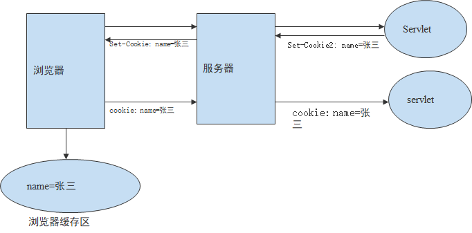

---
title: Servlet会话跟踪技术Cookie
date: 2021-02-16 12:03:57
summary: 本文分享Servlet会话跟踪技术Cookie的相关知识。
tags:
- Java
- Servlet
- Cookie
categories:
- Java
---

# Cookie

Cookie技术是一种在客户端保持会话跟踪的解决方案，会话数据保存在客户端浏览器。

Cookie在用户第一次访问服务器时，由服务器通过响应头的方式发送给客户端浏览器；当用户再次向服务器发送请求时会附带上这些文本信息。

在使用Cookie时，要保证客户端浏览器接受Cookie。



# 存储Cookie会话数据

**javax.servlet.http.Cookie**类，用于存储会话数据，存储过程如下：
1. 构造Cookie对象：`Cookie(java.lang.String name, java.lang.String value)`。
2. 设置Cookie：
    1. `void setPath(java.lang.String uri)`：设置Cookie的有效访问路径。
    2. `void setMaxAge(int expiry)`： 设置Cookie的有效时间。
        1. 正整数：时间若为正整数，表示Cookie存活的秒数。
        2. 负整数：表示其为临时Cookie，数据保存浏览器的内存中，浏览器关闭Cookie就丢失了。
        3. 零：表示通知浏览器删除相应的Cookie。
    3. `void setValue(java.lang.String newValue)`：设置Cookie的值。Cookie数据类型只能保存非中文字符串类型的。可以保存多个Cookie，但是浏览器一般只允许存放300个Cookie，每个站点最多存放20个Cookie，每个Cookie的大小限制为4KB。
3. 将Cookie对象响应给客户端浏览器，存储在客户端机器上。发送Cookie：`void response.addCookie(Cookie cookie)`

# 获取Cookie会话数据

存储在客户端的Cookie，通过HttpServletRequest对象的getCookies()方法获取，该方法返回所访问网站的所有Cookie的对象数组，遍历该数组可以获得各个Cookie对象。

```java
Cookie[] cookies = request.getCookies();
if(cookies != null) {
    for(Cookie c : cookies){
        out.println("属性名：" + c.getName());
        out.println("属性值" + c.getValue());
    }
}
```

# Cookie访问路径

在默认情况下，创建Cookie时没有设置路径，该Cookie只能被当前目录及子目录应用访问。Cookie的setPath()方法可以重新指定其访问路径，例如：将其设置为在某个应用下的某个路径共享，或者在同一服务器内的所有应用共享。

设置Cookie的有效访问路径：`void setPath(java.lang.String uri)`。

有效路径指的是Cookie的有效路径保存在哪里，那么浏览器在有效路径下访问服务器时就会带着Cookie信息，否则不带Cookie信息。

# Cookie存活时间

Cookie有一定的存活时间，不会在客户端一直保存，默认情况下，Cookie保存在浏览器内存中，在浏览器关闭时失效，这种Cookie也称为会话Cookie，若要使Cookie较长时间的保存在磁盘上，可以通过Cookie对象的setMaxAge()方法设置其存活时间。

Cookie对象可以通过setMaxAge()方法设置其存活时间，时间以秒为单位：`void setMaxAge(int expiry)`
- 时间若为正整数，表示其存活的秒数。
- 时间若为负数，表示其为临时Cookie。
- 时间若为0，表示通知浏览器删除相应的Cookie，删除Cookie时，path必须一致，否则不会删除。

例如：
- `name.setMaxAge(7*24*60*60);`
- `name.setMaxAge(0); //删除Cookie`

# Cookie局限性

Cookie的缺点主要集中在其安全性和隐私保护上，主要包括以下几种：
- Cookie可能被禁用，当用户非常注重个人隐私保护时，很可能会禁用浏览器的Cookie功能。
- Cookie可能被删除，因为每个Cookie都是硬盘上的一个文件，因此很有可能被用户删除。
- Cookie的大小和个数受限，不同浏览器有所区别，基本上单个Cookie保存的数据不能超过4095个字节，50个/每个域名。
- Cookie安全性不够高，所有的Cookie都是以纯文本的形式记录于文件中，因此如果要保存用户名密码等信息时，最好事先经过加密处理。
