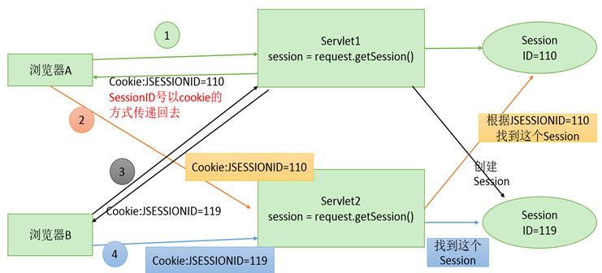
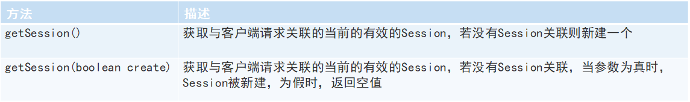
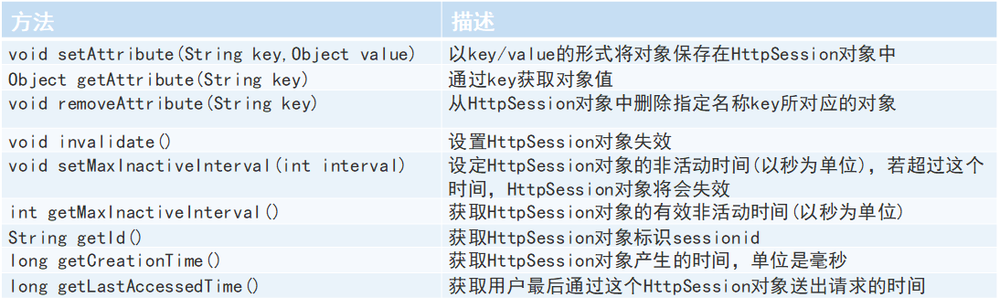
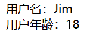

---
title: Servlet会话跟踪技术Session
date: 2021-02-16 13:17:34
summary: 本文分享Servlet会话跟踪技术Session的相关知识。
tags:
- Java
- Servlet
- Session
categories:
- Java
---

# Session

Session是指使用HttpSession对象实现会话跟踪的技术，是一种在服务器端保持会话跟踪的解决方案。

HttpSession对象是javax.servlet.http.HttpSession接口的实例，也称为会话对象。

HttpSession对象会在用户第一次访问服务器时由容器创建（注意只有访问JSP、Servlet等程序时才会创建，只访问HTML、IMAGE等静态资源并不会创建），当用户调用其失效方法（invalidate()方法）或超过其最大不活动时间时会失效。在此期间，用户与服务器之间的多次请求都属于同一个会话。

Session和Cookie的主要区别在于：
- Cookie是把用户的数据写给用户的浏览器。
- Session技术把用户的数据写到用户独占的Session中。

服务器在创建会话对象时，会为其分配一个唯一的会话标识——SessionId，以“JSESSIONID”的属性名保存在客户端Cookie中，在用户随后的请求中，服务器通过读取Cookie中的JSESSIONID属性值来识别不同的用户，从而实现对每个用户的会话跟踪。

# Session工作原理



# 获取HttpSession对象

HttpServletRequest接口提供了获取HttpSession对象的方法：


在程序中第一次执行request.getSession()时，服务器才会创建Session。

# HttpSession接口提供的方法

HttpSession接口提供了存取会话域属性和管理会话生命周期的方法：


# Session存取数据

- 存储会话域属性：`session.setAttribute("username"," haha");`
- 会话域中获取属性值：`String uname = (String)session.getAttribute("username");`
- 会话域中删除属性：`session.removeAttribute("username");`
- 用户登录示例： 当用户当用户登录成功后，将用户信息存储到Session中，并重定向到主页面显示用户信息。

# Session生命周期

- Session失效时间：Session具有一定声生命周期，如果Session超过会话的最大不活动时间，会话自动失效，会话的最大不活动时间指会话超过此时间段不进行任何操作。
- 设置Session的失效时间。
    - 方法1：在工程的**web.xml**中配置Session的生命周期，单位为分钟。
`<Session-config><Session-timeout>15</Session-timeout></Session-config>`
    - 方法2：在程序硬编码设置。
`Session.setMaxInactiveInterval(30 * 60); //设置单位为秒，设置为-1永不过期;`
    - 方法3：在Tomcat安装目录下**conf/web.xml**中配置（Web容器级别）。
`<Session-config><Session-timeout>15</Session-timeout></Session-config>`
- 手动销毁Session：可以通过调用invalidate()方法立即清除会话对象及其所有会话域属性，同时响应客户端浏览器清除Cookie中的JSessionID，在实际应用中，此方法多用来实现系统的“安全退出”功能。

# Session应用

Session的一个可以存储用户信息，可以用于登录和退出等情况：
- 登录：用户信息存入Session中
- 退出：`session.invalidate()`

# 设置Session失效时间的三种方式

1. Servlet类设置Session，单位为秒，仅在当前会话中有效，不常用：`session.setMaxInactiveInterval(20);`
2. web.xml中设置Session，单位为分钟，在整个项目中有效：
    ```xml
    <session-config>
        <session-timeout>20</session-timeout>
    </session-config>
    ```
3. Tomcat目录conf文件夹的web.xml设置Session，单位为分钟，在整个服务器中有效（默认的Session失效时间是30分钟）：
    ```xml
    <session-config>
        <session-timeout>20</session-timeout>
    </session-config>
    ```
4. 如果同时设置了以上三种，则第一种生效。

# 测试

```java
import javax.servlet.ServletException;
import javax.servlet.http.*;
import java.io.IOException;

public class SetSessionServlet extends HttpServlet {

    @Override
    public void doPost(HttpServletRequest request, HttpServletResponse response) throws ServletException, IOException {
        this.doGet(request, response);
    }

    @Override
    public void doGet(HttpServletRequest request, HttpServletResponse response) throws ServletException, IOException {
        HttpSession session = request.getSession();
        session.setAttribute("username", "Jim");
        session.setAttribute("userAge", 18);
        response.sendRedirect("GetSessionServlet");
    }

}
```

```java
import javax.servlet.ServletException;
import javax.servlet.http.*;
import java.io.IOException;
import java.io.PrintWriter;

public class GetSessionServlet extends HttpServlet {

    @Override
    public void doPost(HttpServletRequest request, HttpServletResponse response) throws ServletException, IOException {
        this.doGet(request, response);
    }

    @Override
    public void doGet(HttpServletRequest request, HttpServletResponse response) throws ServletException, IOException {
        HttpSession session = request.getSession();
        String username = (String)session.getAttribute("username");
        Integer userAge = (Integer)session.getAttribute("userAge");
        response.setContentType("text/html;charset=utf-8");
        PrintWriter out = response.getWriter();
        out.println("用户名：" + username + "<br/>用户年龄：" + userAge);
    }

}
```

访问：`localhost:8888/web/SetSessionServlet`



重新加载：


把浏览器关掉再开（因为我的Firefox暂时不能关，所以用的是Chrome代替）：

