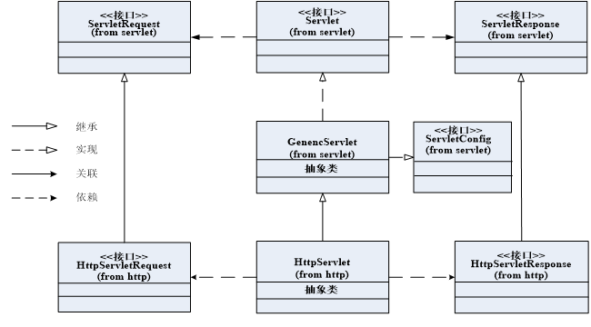

---
title: Servlet体系结构
date: 2021-02-14 17:25:52
summary: 本文分享Servlet体系结构的相关内容。
tags:
- Java
categories:
- Java
---

# Servlet

Servlet是基于Java语言的Web服务器端编程技术，按照Java EE规范定义，Servlet是运行在Servlet容器中的Java类，它能处理Web客户的HTTP请求，并产生HTTP响应。

Servlet运行在服务器端，由Servlet容器所管理，Servlet容器也叫Servlet引擎，是Web服务器或应用服务器的一部分，用于在发送的请求和响应之上提供网络服务、解码基于MIME的请求、格式化基于MIME的响应。

Servlet是使用Servlet API及相关类和方法的Java程序。

Servlet API包含两个软件包：
- **javax.servlet**：定义了所有Servlet类都必须实现或继承的通用接口和类。
- **javax.servlet.http**：定义了采用HTTP协议通信的HttpServlet类。

# Servlet API的主要接口和类之间的关系



# Servlet接口

定义如下：
```java
package javax.servlet;

import java.io.IOException;

public interface Servlet {
    public void init(ServletConfig config) throws ServletException;
    public ServletConfig getServletConfig();
    public void service(ServletRequest req, ServletResponse res) throws ServletException, IOException;
    public String getServletInfo();
    public void destroy();
}
```

- Servlet接口规定了必须由Servlet类实现并且由Servlet引擎识别和管理的方法集。
- Servlet接口的基本目标是提供与Servlet生命周期相关的方法，如：init()、service()和destroy()等。

主要方法说明：

| 方法名称 | 方法描述 |
|:---:|:---:|
| init(ServletConfig config) | Servlet初始化方法。在Servlet实例化后，容器调用该方法进行Servlet的初始化。<br>init()方法只能被调用一次，如果此方法没有正常结束，就会抛出一个ServletException异常。<br>一旦抛出该异常，Servlet将不再执行，随后对其进行再次调用，容器会重新载入并再次运行init()方法。|
| service(ServletRequest req,ServletResponse resp) | Servlet的服务方法。当用户对Servlet发出请求时容器会调用该方法处理用户的请求。 |
| destroy() | Servlet的销毁方法。容器在终止Servlet服务前调用此方法。<br>容器调用此方法前必须给service()线程足够时间来结束执行，<br>因此接口规定当service()正在执行时，destroy()不被执行。 |
| getServletConfig() | 此方法可以让Servlet在任何时候获得ServletConfig对象。 |
| getServletInfo() | 此方法返回一个String对象，该对象包含Servlet的信息，例如：开发者、创建日期、描述信息等。<br>该方法也可用于容器。 |

# GenericServlet抽象类

- GenericServlet是一个通用的协议无关的Servlet，它实现了Servlet和ServletConfig接口。
- GenericServlet继承自Servlet，应该重写service()方法。

主要方法说明：

| 方法名称 | 方法描述 |
|:---:|:---:|
| public void init(ServletConfig config) | 调用Servlet接口中的init()方法。<br>此方法还有一无参的重载方法，其功能与此方法相同。|
| public String getInitParameter(String name)| 返回名称为name的初始化参数的值。 |
| public ServletContext getServletContext() | 返回ServletContext对象的引用。 |

# HttpServlet类

HttpServlet指能够处理HTTP请求的Servlet，它在原有Servlet接口上添加了对HTTP协议的处理，它比Servlet接口的功能更为强大。

主要方法说明：

| 方法名称 | 方法描述 |
|:---:|:---:|
| service(HttpServletRequest  req, HttpServletResponse resp) | HttpServlet在实现Servlet接口时，重写了service()方法，该方法会自动判断用户的请求方式。<br>若为GET请求，则调用HttpServlet的doGet()方法；<br>若为POST请求，则调用doPost()方法。<br>因此，开发人员在编写Servlet时，通常只需要重写doGet()或doPost()方法，而不要去重写service方法。<br>如果Servlet收到一个HTTP请求而你没有重载相应的do方法，它就返回一个说明此方法对本资源不可用的标准HTTP错误。 |
| doGet(HttpServletRequest req, HttpServletResponse resp) | 此方法被本类的service()方法调用，用来处理一个HTTP GET 操作。 |
| doPost(HttpServletRequest req, HttpServletResponse resp) | 此方法被本类的service()方法调用，用来处理一个HTTP POST 操作。 |

HttpServlet作为HTTP请求的分发器，除了提供对GET和POST请求的处理外，对于其他请求类型也提供了相应的处理方法（如：doHead()、doOptions()、doDelete()、doPut()、doTrace()）
