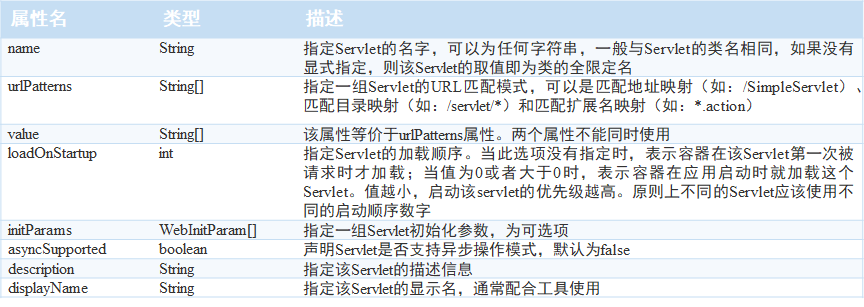
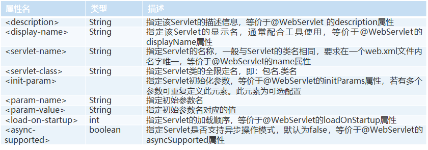
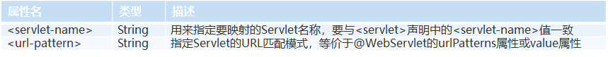

---
title: Servlet声明配置
date: 2021-02-14 19:30:57
summary: 本文分享Servlet两种声明配置方法，即注解和XML。
tags:
- Java
- Servlet
categories:
- Java
---

# 注解配置

注解配置需要使用注解 **@WebServlet** ：

# XML配置

XML配置需要在**web.xml**中通过`<servlet></servlet>`元素声明：

**web.xml**中的\<servlet-mapping>\</servlet-mapping>元素用于指定Serlvet的URL映射：

