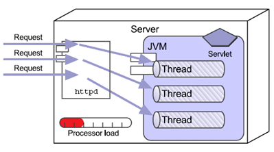

---
title: Servlet多线程并发
date: 2021-02-14 17:58:39
summary: 由于Servlet在Tomcat中是以单例模式存在的，所以当多个Servlet线程同时访问了Servlet的共享数据，如成员变量，可能会引发线程安全问题，本文分析Servlet的多线程并发情况。
tags:
- Java
- Servlet
categories:
- Java
---

由于Servlet在Tomcat中是以单例模式存在的，所以当多个Servlet线程同时访问了Servlet的共享数据，如成员变量，可能会引发线程安全问题。



下面是之前做的一个Demo：

```java
import javax.servlet.ServletException;
import javax.servlet.http.HttpServlet;
import javax.servlet.http.HttpServletRequest;
import javax.servlet.http.HttpServletResponse;
import java.io.IOException;

public class LoginServlet extends HttpServlet {

    private static String usernameRef;

    private static String passwordRef;

    public static void doPost(String username, String password) {
        try {
            usernameRef = username;
            if ("a".equals(username)) {
                Thread.sleep(5000);
            }
            passwordRef = password;
            System.out.println("username=" + usernameRef + " password=" + passwordRef);
        } catch (InterruptedException e) {
            e.printStackTrace();
        }
    }

    /**
     * 输出样例：
     * username=b password=bb
     * username=b password=aa
     * @param request
     * @param response
     * @throws ServletException
     * @throws IOException
     */
    @Override
    public void doPost(HttpServletRequest request, HttpServletResponse response) throws ServletException, IOException {
        LoginThreadA threadA = new LoginThreadA();
        LoginThreadB threadB = new LoginThreadB();
        threadA.start();
        threadB.start();
    }

    @Override
    public void doGet(HttpServletRequest request, HttpServletResponse response) throws ServletException, IOException {
        doPost(request, response);
    }

}
```

```java
public class LoginThreadA extends Thread {

    @Override
    public void run() {
        LoginServlet.doPost("a", "aa");
    }

}
```


```java
public class LoginThreadB  extends Thread {

    @Override
    public void run() {
        LoginServlet.doPost("b", "bb");
    }

}
```

运行的时候，有时的确会出现一些不符的username和password组合，的确会存在线程安全问题。
