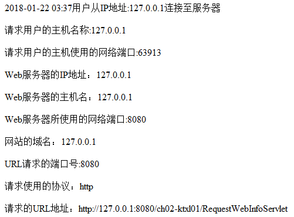

---
title: Servlet显示时间和IP等信息
date: 2020-05-03 21:29:00
summary: 本文分享Servlet显示时间和IP等信息的方法。
tags:
- Java
- Servlet
categories:
- Java
---

# 任务要求

**编写一个Servlet，当用户请求该Servlet时，显示用户于哪年哪月哪日几时几分几秒从哪个<abbr title="Internet Protocol">IP</abbr>地址连接至服务器。**



# Servlet程序

```java
import java.io.IOException;
import java.text.SimpleDateFormat;
import java.util.Date;
import javax.servlet.ServletException;
import javax.servlet.http.HttpServlet;
import javax.servlet.http.HttpServletRequest;
import javax.servlet.http.HttpServletResponse;

public class ServletDemo extends HttpServlet {

    private static final long serialVersionUID = 1L;

    @Override
    protected void doPost(HttpServletRequest request, HttpServletResponse response)
            throws ServletException, IOException {
        doGet(request, response);
    }

    @Override
    protected void doGet(HttpServletRequest request, HttpServletResponse response)
            throws ServletException, IOException {
        response.setContentType("text/html;charset=UTF-8");
        Date date = new Date();
        SimpleDateFormat sdf = new SimpleDateFormat("yyyy-MM-dd HH:mm:ss");
        String currentDate = sdf.format(date);
        response.getWriter().append(currentDate).append("用户从IP地址").append(request.getRemoteAddr()).append("连接至服务器");
        response.getWriter().write("<br>"+"请求用户的主机名称："+request.getRemoteHost());
        response.getWriter().write("<br>"+"请求用户的主机使用的网络端口："+request.getRemotePort());
        response.getWriter().write("<br>"+"Web服务器的IP地址："+request.getLocalAddr());
        response.getWriter().write("<br>"+"Web服务器的主机名:"+request.getServerName());
        response.getWriter().write("<br>"+"Web服务器所使用的的网络端口："+request.getServerPort());
        response.getWriter().write("<br>"+"网站的域名："+request.getServerName());
        response.getWriter().write("<br>"+"URL请求的端口号："+request.getServerPort());
        response.getWriter().write("<br>"+"请求使用的协议："+request.getProtocol());
        response.getWriter().write("<br>"+"请求的URL地址："+request.getRequestURL());
    }

}
```
