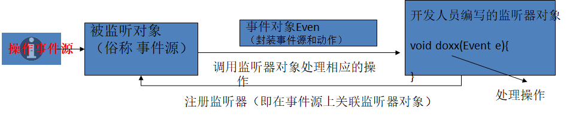
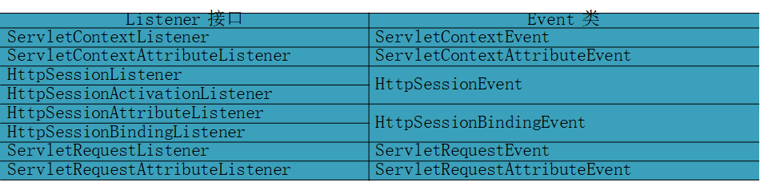

---
title: Servlet监听器技术
date: 2021-02-17 08:33:45
summary: 本文分享Servlet监听器(Listener)技术。
tags:
- Java
- Servlet
categories:
- Java
---

在Web容器运行过程中，有很多关键点事件，比如Web应用被启动、用户会话开始、用户会话结束、用户请求到达等，Servlet API提供了大量监听器接口来帮助开发者实现对Web应用内特定事件进行监听，从而当Web应用内这些特定事件发生时，回调监听器内的事件监听方法来实现一些特殊功能，监听器的作用是监听Web容器的有效期事件，因此它是由容器管理的。

监听器就是一个实现特定接口的普通Java程序，这个程序专门用于监听另一个Java对象的方法调用或属性改变，当被监听对象发生上述事件后，监听器某个方法将立即被执行。

在Servlet规范中定义了多种类型的监听器，它们用于监听的事件源分别为ServletContext、HttpSession和ServletRequest 这三个域对象。

Servlet规范针对这三个对象上的操作，又把这多种类型的监听器划分为三种类型：
- 监听三个域对象创建和销毁的事件监听器
- 监听域对象中属性的增加和删除的事件监听器
- 监听绑定到 HttpSession 域中的某个对象的状态的事件监听器。

下表列出了Servlet中的8个Listener接口和6个Event类：

