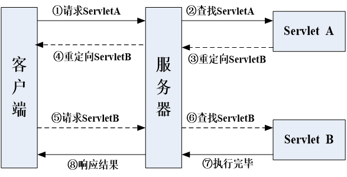
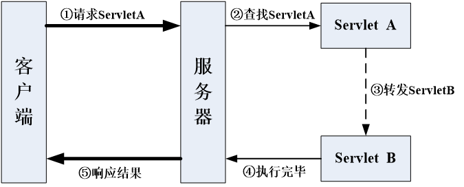

---
title: Servlet请求转发与重定向
date: 2021-02-16 13:53:07
summary: 本文分享Servlet请求转发与重定向的相关内容。
tags:
- Java
- Servlet
categories:
- Java
---

# 重定向

重定向是指由原请求地址重新定位到某个新地址，原有的request请求失效，客户端看到的是新的request请求返回的响应结果，客户端浏览器地址栏变为新请求地址。

一次重定向过程存在两次请求和两次响应。


重定向通过HttpServletResponse对象的sendRedirect()方法实现，该方法会通知客户端去重新访问新指定的URL地址，其语法格式如下：`public void sendRedirect(String location)throws java.io.IOException`，location参数用以指定重定向的URL，它可以是相对路径或绝对路径。

sendRedirect()方法不仅可以重定向到当前应用程序中的其他资源，还可以重定向到同一个站点上的其他应用程序中的资源，甚至是使用绝对URL重定向到其他站点的资源。

# 请求转发

请求转发是指将请求再转发到其他地址，转发过程中使用的是同一个request请求，转发后浏览器地址栏内容不变。



请求转发的过程发生在服务器内部，只能从当前应用内部查找相应的转发资源，而不能转发到其它应用的资源。

请求转发使用RequestDispatcher接口中的forward()方法来实现，该方法可以把请求转发给另外一个资源，并让该资源对此请求进行响应。

RequestDispatcher接口有以下两个方法：
- forward()方法：将请求转发给其他资源。
- include()方法：将其他资源并入到当前请求中。

请求转发语法：
```java
RequestDispatcher dispatcher = request.getRequestDispatcher(String path);
dispatcher.forward(ServletRequest request,ServletResponse response);
```

其中：
- path参数用以指定转发的URL，只能是相对路径。
- request和response参数取值为当前请求所对应的HttpServletRequest和HttpServletResponse对象。

# 数据传递

请求转发与重定向对HttpServletRequest对象属性的存取语法：
- `request.setAttribute("attrobj", “value"); // 将attrobj属性值存储到request对象中`
- `request.getAttribute("attrobj"); // 从request对象中取出attrobj属性值`

# 要点辨析

重定向和请求转发都可以让浏览器获得另外一个URL所指向的资源，但两者的内部运行机制有很大的区别：
- 请求转发只能将请求转发给同一个Web应用中的组件；而重定向不仅可以重定向到当前应用程序中的其他资源，还可以重定向到同一个站点上的其他应用程序中的资源，或者重定向到其他站点的资源。
- 重定向的访问过程结束后，浏览器地址栏中显示的URL会发生改变，由初始的URL地址变成重定向的目标URL；而请求转发过程结束后，浏览器地址栏保持初始的URL地址不变。
- 请求转发调用者与被调用者之间共享相同的request对象和response对象，它们属于同一个访问请求和响应过程；而重定向调用者与被调用者使用各自的request对象和response对象，它们属于两个独立的访问请求和响应过程。
