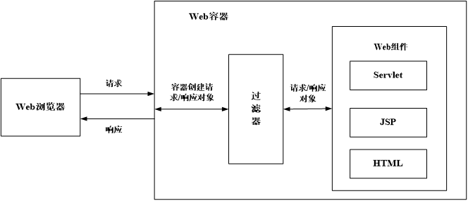
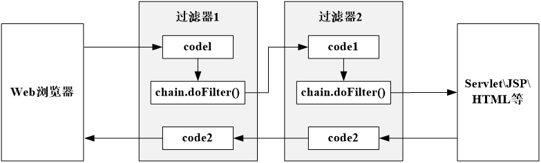
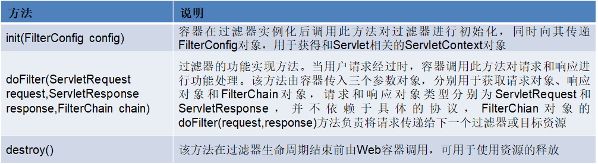
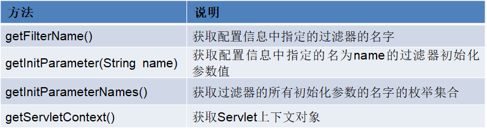
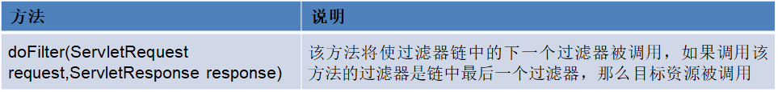

---
title: Servlet过滤器技术
date: 2021-02-17 08:33:53
summary: 本文分享Servlet过滤器(Filter)技术。
tags:
- Java
- Servlet
categories:
- Java
---

# 过滤器

过滤器（Filter）也称之为拦截器，是Servlet 2.3规范新增的功能，在Servlet 2.4规范中得到增强。

过滤器是Servlet技术中非常实用的技术，Web开发人员通过过滤器技术，可以在用户访问某个Web资源（如：JSP、Servlet、HTML、图片、CSS等）之前，对访问的请求和响应进行拦截，从而实现一些特殊功能。例如，验证用户访问权限、记录用户操作、对请求进行重新编码、压缩响应信息等。

过滤器所处的位置：

# 过滤器的运行原理

过滤器的运行原理：
- 当用户的请求到达指定的网页之前，可以借助过滤器来改变这些请求的内容，此过程也称为“预处理”。
- 当执行结果要响应到用户之前，可经过过滤器修改响应输出的内容，此过程称为“后处理”。

一个过滤器的运行过程可以分解为如下几个步骤：
- Web容器判断接收的请求资源是否有与之匹配的过滤器，如果有，容器将请求交给相应过滤器进行处理。
- 在过滤器预处理过程中，可以改变请求的内容，或者重新设置请求的报头信息，然后将请求发给目标资源。
- 目标资源对请求进行处理后作出响应。
- 容器将响应转发回过滤器。
- 在过滤器后处理过程中，可以根据需求对响应的内容进行修改。
- Web容器将响应发送回客户端。

# 过滤器链

在一个Web应用中，也可以部署多个过滤器，这些过滤器组成了一个过滤器链。

过滤器链中的每个过滤器负责特定的操作和任务，客户端的请求可以在这些过滤器之间进行传递，直到达到目标资源。

例如，一个由两个过滤器所组成的过滤器链的过滤过程：

在客户端的请求响应过程中，并不需要经过所有的过滤器链，而是根据过滤器链中每个过滤器的过滤条件来匹配需要过滤的资源。

# 过滤器的核心接口

过滤器的实现主要依靠以下核心接口：
- javax.servlet.Filter
- javax.servlet.FilterConfig
- javax.servlet.FilterChain

## Filter

与开发Servlet需要实现Servlet接口类似，开发过滤器要实现javax.servlet.Filter接口，并提供一个公共的不带参数的构造方法。

Filter接口的方法及说明：

## FilterConfig

javax.servlet.FilterConfig接口由容器实现，容器将其实例作为参数传入过滤器对象的初始化方法init()中，来获取过滤器的初始化参数和Servlet的相关信息。

FilterConfig接口的主要方法及作用：

## FilterChain

javax.servlet.FilterChain接口由容器实现，容器将其实例作为参数传入过滤器对象的doFilter()方法中。过滤器对象使用FilterChain对象调用过滤器链中的下一个过滤器，如果该过滤器是链中最后一个过滤器，那么将调用目标资源。

FilterChain接口主要方法及作用：

# 过滤器的生命周期

与Servlet类似，Filter接口定义的三个方法也与过滤器的生命周期有着直接的关系。

过滤器的生命周期分为四个阶段：
- 加载和实例化
Web容器启动时，会根据@WebFilter属性filterName所定义的类名的大小写拼写顺序，或者web.xml中声明的Filter顺序依次实例化Filter。
- 初始化
Web容器调用init(FilterConfig config)方法来初始化过滤器。容器在调用该方法时，向过滤器传递FilterConfig对象。实例化和初始化的操作只会在容器启动时执行，并且只会执行一次。
- doFilter()方法的执行
当客户端请求目标资源的时候，容器会筛选出符合过滤器映射条件的Filter，并按照@WebFilter属性filterName所定义的类名的大小写拼写顺序，或者web.xml中声明的filter-mapping的顺序依次调用这些过滤器的doFilter()方法。
在这个链式调用过程中，可以调用FilterChain对象的doFilter方法将请求传给下一个过滤器(或目标资源)，也可以直接向客户端返回响应信息，或者利用请求转发或重定向将请求转向到其它资源。需要注意的是，这个方法的请求和响应参数的类型是ServletRequest和ServletResponse，也就是说，过滤器的使用并不依赖于具体的协议。
- 销毁
Web容器调用destroy()方法指示过滤器的生命周期结束。在这个方法中，可以释放过滤器使用的资源。

# 过滤器的开发

基于过滤器的核心接口，一个过滤器的开发可以经过下述三个步骤：
- 创建Filter接口实现类。
- 编写过滤器的功能代码。
- 对过滤器进行声明配置。

# 过滤器的应用

在Web开发中，Filter是非常重要而且实用的技术，其应用非常广泛，如下为几种常见的使用情况：
- 做统一的认证处理。
- 对用户的请求进行检查和更精确的记录。
- 监视或对用户所传递的参数做前置处理，例如：防止数据注入攻击。
- 改变图像文件的格式。
- 对请求和响应进行编码。
- 对响应做压缩处理。
- 对XML的输出使用XSLT来转换。
