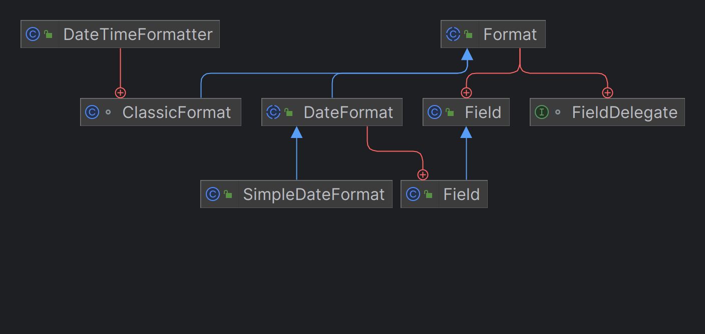

---
title: SimpleDateFormat与DateTimeFormatter
date: 2023-04-30 11:49:05
summary: 本文剖析java.text.SimpleDateFormat与java.time.format.DateTimeFormatter的关系，并对比二者。
tags:
- Java
categories:
- Java
---

# java.text.Format

java.text.Format是Java中的一个抽象类，用于格式化和解析数据。它是格式化和解析的基础类，提供了一种通用的方式来处理各种数据类型，如数字、日期、时间等。

java.text.Format类是一个抽象类，不能直接实例化，而是通过其派生类来实现具体的格式化和解析逻辑。其直接派生类包括：java.text.DateFormat、java.text.MessageFormat、java.text.NumberFormat、java.time.format.DateTimeFormatter.ClassicFormat。

java.text.Format类定义了以下两个核心方法：
- `format(Object obj)`：将给定的对象格式化为字符串。不同的子类实现此方法以提供特定类型的格式化逻辑。
- `parseObject(String source)`：将给定的字符串解析为对象。不同的子类实现此方法以提供特定类型的解析逻辑。

java.text.Format类及其子类在多线程环境下是不安全的，不建议将其作为共享的实例。通常情况下，每个线程应该创建自己的Format实例来进行格式化和解析操作。

推荐阅读：[数据格式化](https://blankspace.blog.csdn.net/article/details/104714306)



# ISO-8601

推荐阅读：[ISO-8601](https://www.iso.org/iso-8601-date-and-time-format.html)

ISO-8601是国际标准化组织（ISO）发布的日期和时间表示格式的标准规范。它定义了一种统一的日期和时间格式，旨在使日期和时间在不同的计算机系统、编程语言和文化背景之间具有一致性。

ISO-8601 规范提供了以下主要内容：
- 日期表示： 日期的表示采用`年-月-日`的格式，例如`2023-04-30`表示2023年4月30日。
- 时间表示： 时间的表示采用`时:分:秒`的格式，例如`13:45:30`表示下午1点45分30秒。
- 日期时间表示： 日期和时间的组合表示采用`年-月-日T时:分:秒`的格式，例如`2023-04-30T13:45:30`表示2023年4月30日下午1点45分30秒。
- 时区表示： 时区的表示采用以小时和分钟为单位的偏移量，例如`+08:00`表示相对于协调世界时（UTC）向东8小时的时区偏移。

ISO-8601规范还定义了一些扩展的日期和时间格式，例如带有毫秒、微秒和纳秒的精确时间表示，以及周和年的表示方式。

ISO-8601 =的使用广泛应用于各种领域，包括计算机系统、通信协议、数据交换、日志记录等。它提供了一种标准化的日期和时间表示方式，便于不同系统之间的交互和数据解析。在软件开发中，ISO-8601 的日期和时间格式也被广泛使用，包括在日期解析、日期格式化和日期比较等操作中。

# java.text.SimpleDateFormat

java.text.SimpleDateFormat是Java提供的一个日期格式化和解析的类，它用于将日期对象转换为指定格式的字符串，或将字符串解析为对应的日期对象。

java.text.SimpleDateFormat主要的功能包括：
- 日期格式化（Formatting）： 将日期对象按照指定的模式格式化为字符串。你可以定义自己的日期格式模式，包括年、月、日、时、分、秒等各种元素的组合。例如，将 Date 对象格式化为 "yyyy-MM-dd HH:mm:ss" 形式的字符串。
- 日期解析（Parsing）： 将符合特定格式的字符串解析为 Date 对象。你需要提供与字符串相匹配的日期格式模式，以便正确解析日期字符串为对应的日期对象。

java.text.SimpleDateFormat常用的方法主要有：
- `format(Date date)`：将指定的日期对象格式化为字符串。
- `parse(String source)`：将字符串解析为日期对象。

模式字符：
- y：年份
- M：月份
- d：日期（月中的天数）
- H：小时（24 小时制）
- h：小时（12 小时制）
- m：分钟
- s：秒钟
- S：毫秒
- E：星期几
- z：时区

需要注意的是，java.text.SimpleDateFormat存在线程不安全的问题。如果在多线程环境下使用同一个java.text.SimpleDateFormat实例，可能会导致结果不准确或抛出异常。为了避免这个问题，通常推荐在每个线程中创建独立的java.text.SimpleDateFormat实例，或使用线程安全的日期时间类库，例如Java8引入的 java.time.format.DateTimeFormatter。

# java.time.format.DateTimeFormatter

java.time.format.DateTimeFormatter是Java8引入的日期时间格式化和解析类，它用于将日期时间对象转换为指定格式的字符串，或将字符串解析为对应的日期时间对象。

java.time.format.DateTimeFormatter提供了丰富的方法和模式，可以满足各种日期时间格式化和解析的需求：
- 格式化（Formatting）：可以将日期时间对象按照指定的模式格式化为字符串。你可以使用预定义的模式，例如`ISO_DATE`、`ISO_TIME`、`ISO_DATE_TIME`，或自定义模式，包括年、月、日、时、分、秒等各种元素的组合。例如，将java.time.LocalDateTime对象格式化为 "yyyy-MM-dd HH:mm:ss" 形式的字符串。
- 解析（Parsing）： 可以将符合特定格式的字符串解析为日期时间对象。你需要提供与字符串相匹配的日期时间格式模式，以便正确解析字符串为对应的日期时间对象。
- 本地化（Localization）：java.time.format.DateTimeFormatter支持本地化的日期时间格式化和解析，可以根据不同地区的习惯和语言来进行格式化和解析。可以使用ofLocalizedDate、ofLocalizedTime、ofLocalizedDateTime等方法来创建本地化的格式化器。
- 线程安全性（Thread Safety）：java.time.format.DateTimeFormatter实例是不可变的，因此是线程安全的，可以在多个线程间共享和重用。

java.time.format.DateTimeFormatter常用的方法主要有：
- `ofPattern(String pattern)`：根据指定的模式字符串创建 DateTimeFormatter 实例。
- `format(TemporalAccessor temporal)`：将指定的日期时间对象格式化为字符串。
- `parse(CharSequence text)`：将字符串解析为日期时间对象。

需要注意的是，java.time.format.DateTimeFormatter是线程安全的，因此可以在多线程环境下共享和重用同一个实例。与 java.text.SimpleDateFormat 相比，java.time.format.DateTimeFormatter 提供了更多的功能和灵活性，并且在性能上也有一定的优势。它是Java8以后推荐使用的日期时间格式化和解析工具。

样例代码：

```java
DateTimeFormatter formatter = DateTimeFormatter.ofPattern("yyyy-MM-dd HH:mm:ss");
LocalDateTime dateTime = LocalDateTime.now();
String formattedDateTime = formatter.format(dateTime);
String dateTimeString = "2023-05-01 00:00:00";
LocalDateTime parsedDateTime = LocalDateTime.parse(dateTimeString, formatter);
```

# DateFormat与DateTimeFormatter的对比

java.text.SimpleDateFormat和java.time.format.DateTimeFormatter都是用于日期和时间格式化的类，但它们存在一些区别：
- API和线程安全性：SimpleDateFormat是旧版的日期格式化类，属于java.text包；而DateTimeFormatter是新版的日期格式化类，属于java.time.format包。SimpleDateFormat的API设计较为简单，但它不是线程安全的，因此在多线程环境中需要采取额外的同步措施。相比之下，DateTimeFormatter的API设计更加灵活，并且是线程安全的，可以在多线程环境下安全地共享使用。
- 日期模型：SimpleDateFormat使用的是传统的java.util.Date类型作为日期模型，该类存在一些设计上的缺陷，导致使用时可能会出现意外的行为。而DateTimeFormatter则使用了java.time的日期和时间API中的日期模型，如java.timeLocalDate、java.timeLocalTime、java.timeLocalDateTime等，这些新的类型更加清晰和易于使用。
- 支持的日期格式：SimpleDateFormat支持传统的日期格式，如"yyyy-MM-dd"、"HH:mm:ss"等，并且可以解析和格式化各种不同的日期和时间模式。DateTimeFormatter则支持ISO-8601规范定义的日期和时间格式，并且提供了更丰富的格式化和解析选项，可以自定义各种日期和时间模式，同时还支持本地化（Localization）和时区（Time Zone）的处理。

如果使用的是Java8及更高版本，推荐使用java.time.format.DateTimeFormatter用来进行日期和时间的格式化操作；如果使用的是低于Java8的版本，只能使用java.text.SimpleDateFormat，但要注意其线程安全性和一些设计上的限制。

## 线程安全性

java.text.SimpleDateFormat是线程不安全的，而java.time.format.DateTimeFormatter是线程安全的。因此，与java.text.SimpleDateFormat相比，java.time.format.DateTimeFormatter更适合在多线程环境下使用，可以安全地进行日期和时间的解析和格式化操作。

java.text.SimpleDateFormat是线程不安全的主要原因是它内部维护了一个可变的日期格式化模式（pattern），该模式用于解析和格式化日期。多个线程同时访问同一个java.time.format.SimpleDateFormat实例时，可能会出现线程间的竞争条件，导致日期格式化结果错误或抛出异常。

java.time.format.DateTimeFormatter是线程安全的，主要基于以下设计特点：
- 不可变性：DateTimeFormatter的实例是不可变的，即一旦创建就不可修改。这意味着多个线程可以同时共享同一个DateTimeFormatter实例而无需担心线程安全问题。
- 线程安全的解析和格式化操作：DateTimeFormatter提供了线程安全的解析（parse）和格式化（format）方法。它们是基于不可变的实例进行操作，保证了线程之间的数据隔离，因此多个线程可以同时调用这些方法而不会相互影响。
- 内部使用线程安全的日期时间库：DateTimeFormatter是Java8引入的日期时间API（java.time）的一部分，该API的设计考虑了线程安全性。它使用了线程安全的日期时间类，例如java.time.LocalDate、java.time.LocalTime、java.time.LocalDateTime，从而保证了在解析和格式化过程中的线程安全性。
