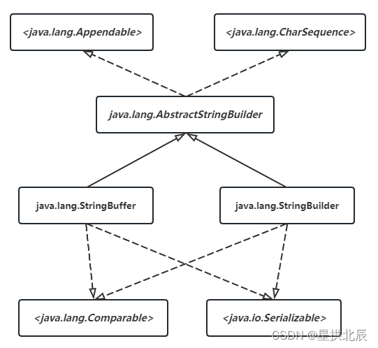

---
title: StringBuilder与StringBuffer
date: 2023-04-05 15:08:30
summary: 本文剖析java.lang.StringBuilder与java.lang.StringBuffer的关系，并对比二者，是一道常见的面试题。
tags:
- Java
categories:
- Java
---

# StringBuilder与StringBuffer的关系

java.lang.StringBuilder的声明是：

```java
public final class StringBuilder
    extends AbstractStringBuilder
    implements java.io.Serializable, Comparable<StringBuilder>, CharSequence
```

java.lang.StringBuffer的声明是：

```java
public final class StringBuffer
    extends AbstractStringBuilder
    implements Serializable, Comparable<StringBuffer>, CharSequence
```

可以看出，二者都继承自java.lang.AbstractStringBuilder，并且都实现了java.io.Serializable、java.lang.Comparable、java.lang.CharSequence这三个接口。

下面我们追溯java.lang.AbstractStringBuilder的声明：

```java
abstract sealed class AbstractStringBuilder implements Appendable, CharSequence
    permits StringBuilder, StringBuffer
```

被sealed修饰并permits了java.lang.StringBuilder和java.lang.StringBuffer，表示java.lang.AbstractStringBuilder只能被java.lang.StringBuilder和java.lang.StringBuffer继承。此外，java.lang.AbstractStringBuilder还实现了java.lang.Appendable、java.lang.CharSequence这两个接口。有趣的是，java.lang.AbstractStringBuilder作为限制继承的基类，与被限制继承的两个子类都实现了同一个接口java.lang.CharSequence，不过从语法上并不存在问题。

据此，我绘制了一个简单的类图，表明上述四个接口、一个抽象基类、两个普通派生类之间的关系。



# StringBuilder与StringBuffer的对比

以同样Override自java.lang.AbstractStringBuilder的方法`append(String str)`为例。

java.lang.AbstractStringBuilder对方法`append(String str)`的实现是：
```java
public AbstractStringBuilder append(String str) {
    if (str == null) {
        return appendNull();
    }
    int len = str.length();
    ensureCapacityInternal(count + len);
    putStringAt(count, str);
    count += len;
    return this;
}
```

java.lang.StringBuilder对方法`append(String str)`的实现是：
```java
@Override
@IntrinsicCandidate
public StringBuilder append(String str) {
    super.append(str);
    return this;
}
```

java.lang.StringBuffer对方法`append(String str)`的实现是：

```java
@Override
@IntrinsicCandidate
public synchronized StringBuffer append(String str) {
    toStringCache = null;
    super.append(str);
    return this;
}
```

通过查阅源码，我们知道：java.lang.StringBuilder与java.lang.StringBuffer的多数方法都是基于java.lang.AbstractStringBuilder已实现的模板扩展得到的。而java.lang.StringBuilder与java.lang.StringBuffer的主要区别也正体现在以上例为代表的多数方法中：
1. java.lang.StringBuilder是线程不安全的；java.lang.StringBuffer是线程安全的，其线程安全通过为多数方法添加`synchronized`关键词保证。
2. java.lang.StringBuilder由于不保证线程安全，故而性能较高；java.lang.StringBuffer额外提供了一个`private transient String toStringCache;`（老版本是`private transient char[] toStringCache;`）改善性能问题。
3. java.lang.StringBuilder适用于单线程访问的情况，能获得更好的性能；java.lang.StringBuffer适用于多线程并发的情况，能保证线程安全。
