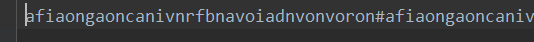
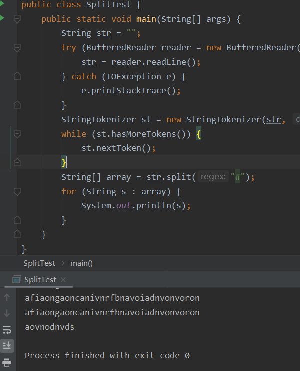
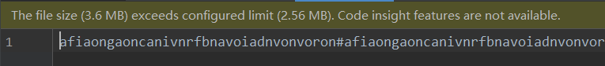
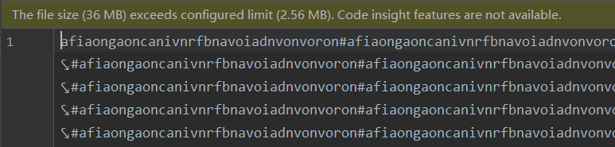
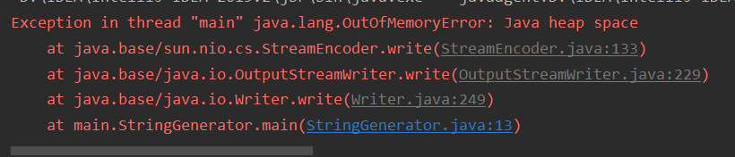
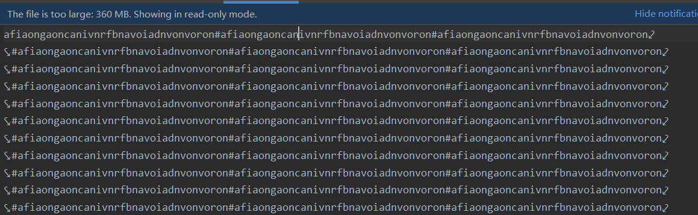
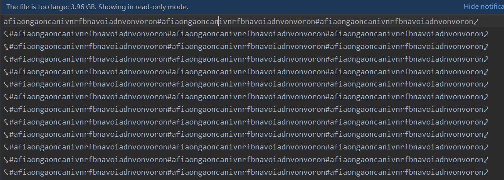

---
title: String的分割
date: 2020-03-05 21:48:21
summary: 本文分享三种java.lang.String的分割方法。
tags:
- Java
categories:
- 开发技术
---

# String

推荐阅读：[java.lang.String](https://blankspace.blog.csdn.net/article/details/130395138)

# String的分割方法

Java提供了多种字符串分割方法。

## 方法1：String.split()

split()方法是Java中最常用的字符串分割方法之一。它基于给定的正则表达式将字符串拆分为子字符串数组。

语法规则：

```java
String[] split(String regex)
```

用法示例：

```java
String str = "Hello, World!";
String[] parts = str.split(", ");
```

上面的代码段中，以逗号`,`作为分隔符将字符串拆分为两个子字符串。

split()方法的重载实现还提供了一个可选的参数，用于限制拆分的次数。

语法规则：

```java
String[] split(String regex, int limit)
```

用法示例：

```java
String str = "apple,banana,orange,mango";
String[] parts = str.split(",", 2);
```

上面的代码段中，通过指定limit参数为2，以逗号`,`作为分隔符将字符串拆分为两个子字符串。

## 方法2：StringTokenizer

StringTokenizer类以指定的分隔符将字符串拆分为多个标记，并提供了一些方法来迭代访问这些标记。

用法示例：

```java
String str = "apple,banana,orange,mango";
StringTokenizer tokenizer = new StringTokenizer(str, ",");
while (tokenizer.hasMoreTokens()) {
    String token = tokenizer.nextToken();
    // 处理每个标记
}
```

上面的代码段中，使用`,`作为分隔符创建了一个StringTokenizer对象，并通过hasMoreTokens()和nextToken()方法迭代访问每个标记。

## 方法3：Apache Commons Lang 库的 StringUtils

StringUtils类是 Apache Commons Lang 库提供的一个实用工具类，其中包含了许多字符串处理的便捷方法，包括字符串分割。

示例：

```java
String str = "apple,banana,orange,mango";
String[] parts = StringUtils.split(str, ",");
```

上面的代码段中，使用StringUtils.split()方法将字符串拆分为多个子字符串。

# String.split()和StringTokenizer的性能比较


```java
import java.io.FileOutputStream;
import java.io.IOException;
import java.io.OutputStreamWriter;

public class StringGenerator {
    public static void main(String[] args) {
        try (OutputStreamWriter writer = new OutputStreamWriter(new FileOutputStream("text.text"))) {
            StringBuilder str = new StringBuilder();
            str.append("afiaongaoncanivnrfbnavoiadnvonvoron#".repeat(1000));
            str.append("aovnodnvds");
            writer.write(str.toString());
        } catch (IOException e) {
            e.printStackTrace();
        }
    }
}
```

文件写入成功：


读取文件信息：


## 文本内容×1

```java
import java.io.BufferedReader;
import java.io.FileReader;
import java.io.IOException;
import java.util.StringTokenizer;

public class SplitTest {
    public static void main(String[] args) {
        String str = "";
        try (BufferedReader reader = new BufferedReader(new FileReader("text.text"))) {
            str = reader.readLine();
        } catch (IOException e) {
            e.printStackTrace();
        }
        long time0 = System.currentTimeMillis();
        StringTokenizer st = new StringTokenizer(str, "#");
        while (st.hasMoreTokens()) {
            st.nextToken();
        }
        long time1 = System.currentTimeMillis();
        String[] array = str.split("#");
        for (String s : array) {}
        long time2 = System.currentTimeMillis();
        System.out.println("StringTokenizer的运行时间是：" + (time1-time0));
        System.out.println("split()的运行时间是：" + (time2-time1));
    }
}
```

运行结果：

```java
StringTokenizer的运行时间是：9
split()的运行时间是：0
```

## 文本内容×10

```java
import java.io.FileOutputStream;
import java.io.IOException;
import java.io.OutputStreamWriter;

public class StringGenerator {
    public static void main(String[] args) {
        try (OutputStreamWriter writer = new OutputStreamWriter(new FileOutputStream("text.text"))) {
            StringBuilder str = new StringBuilder();
            str.append("afiaongaoncanivnrfbnavoiadnvonvoron#".repeat(10000));
            str.append("aovnodnvds");
            writer.write(str.toString());
        } catch (IOException e) {
            e.printStackTrace();
        }
    }
}
```

运行结果：

```java
StringTokenizer的运行时间是：10
split()的运行时间是：0
```

## 文本内容×100

```java
import java.io.FileOutputStream;
import java.io.IOException;
import java.io.OutputStreamWriter;

public class StringGenerator {
    public static void main(String[] args) {
        try (OutputStreamWriter writer = new OutputStreamWriter(new FileOutputStream("text.text"))) {
            StringBuilder str = new StringBuilder();
            str.append("afiaongaoncanivnrfbnavoiadnvonvoron#".repeat(100000));
            str.append("aovnodnvds");
            writer.write(str.toString());
        } catch (IOException e) {
            e.printStackTrace();
        }
    }
}
```



运行结果：

```java
StringTokenizer的运行时间是：20
split()的运行时间是：10
```

## 文本内容×1000

```java
import java.io.FileOutputStream;
import java.io.IOException;
import java.io.OutputStreamWriter;

public class StringGenerator {
    public static void main(String[] args) {
        try (OutputStreamWriter writer = new OutputStreamWriter(new FileOutputStream("text.text"))) {
            StringBuilder str = new StringBuilder();
            str.append("afiaongaoncanivnrfbnavoiadnvonvoron#".repeat(1000000));
            str.append("aovnodnvds");
            writer.write(str.toString());
        } catch (IOException e) {
            e.printStackTrace();
        }
    }
}
```



运行结果：

```java
StringTokenizer的运行时间是：90
split()的运行时间是：140
```

## 文本内容×10000

虚拟机内存空间不够，出现java.lang.OutOfMemoryError。



由一次写入改成分批次写入，每次都是追加模式。


```java
import java.io.FileWriter;
import java.io.IOException;

public class StringGenerator {
    public static void main(String[] args) {
        try (FileWriter writer = new FileWriter("text.text", true)) {
            StringBuilder str = new StringBuilder();
            str.append("afiaongaoncanivnrfbnavoiadnvonvoron#".repeat(1000000));
            for (int i = 0; i < 10; i++) {
                writer.write(str.append("\n").toString());
            }
            str.append("aovnodnvds");
        } catch (IOException e) {
            e.printStackTrace();
        }
    }
}
```



```java
import java.io.BufferedReader;
import java.io.FileReader;
import java.io.IOException;
import java.util.StringTokenizer;

public class SplitTest {
    public static void main(String[] args) {
        String[] strings = new String[10];
        try (BufferedReader reader = new BufferedReader(new FileReader("text.text"))) {
            for (int i = 0; i < 10; i++) {
                strings[i] = reader.readLine();
            }
        } catch (IOException e) {
            e.printStackTrace();
        }
        long time0 = System.currentTimeMillis();
        for (String s : strings) {
            StringTokenizer st = new StringTokenizer(s, "#");
            while (st.hasMoreTokens()) {
                st.nextToken();
            }
        }
        long time1 = System.currentTimeMillis();
        for (String s : strings) {
            String[] array = s.split("#");
            for (String str : array) {}
        }
        long time2 = System.currentTimeMillis();
        System.out.println("StringTokenizer的运行时间是：" + (time1-time0));
        System.out.println("split()的运行时间是：" + (time2-time1));
    }
}
```

测试结果：

```java
StringTokenizer的运行时间是：316
split()的运行时间是：609
```

## 文本内容×100000

```java
import java.io.FileWriter;
import java.io.IOException;

public class StringGenerator {
    public static void main(String[] args) {
        try (FileWriter writer = new FileWriter("text.text", true)) {
            StringBuilder str = new StringBuilder();
            str.append("afiaongaoncanivnrfbnavoiadnvonvoron#".repeat(1000000));
            for (int i = 0; i < 100; i++) {
                writer.write(str.append("\n").toString());
            }
            str.append("aovnodnvds");
        } catch (IOException e) {
            e.printStackTrace();
        }
    }
}
```



由一次写入改成分100批次写入，每次都是追加模式。

```java
import java.io.BufferedReader;
import java.io.FileReader;
import java.io.IOException;
import java.util.StringTokenizer;

public class SplitTest {
    public static void main(String[] args) {
        String[] strings = new String[100];
        try (BufferedReader reader = new BufferedReader(new FileReader("text.text"))) {
            for (int i = 0; i < 100; i++) {
                strings[i] = reader.readLine();
            }
        } catch (IOException e) {
            e.printStackTrace();
        }
        long time0 = System.currentTimeMillis();
        for (String s : strings) {
            StringTokenizer st = new StringTokenizer(s, "#");
            while (st.hasMoreTokens()) {
                st.nextToken();
            }
        }
        long time1 = System.currentTimeMillis();
        for (String s : strings) {
            String[] array = s.split("#");
            for (String str : array) {}
        }
        long time2 = System.currentTimeMillis();
        System.out.println("StringTokenizer的运行时间是：" + (time1-time0));
        System.out.println("split()的运行时间是：" + (time2-time1));
    }
}
```

测试结果：

```java
StringTokenizer的运行时间是：650
split()的运行时间是：1805
```

## 对比总结

Java中的java.util.StringTokenizer是一个早期的API，从Java 1.0版本开始就存在。在处理小规模数据时，它相比于split()方法显得不够简洁和快速。

然而，当处理大规模数据时，由于split()方法生成的数据存储在数组中，这个数组会变得非常大，难以处理。幸运的是，String是引用类型，否则仅仅为了分配这么大的空间就已经是一项挑战。

因此，当处理数据量较大且需要读取文件时，可以使用java.util.StringTokenizer来避免再次分配一个大数组的情况。
