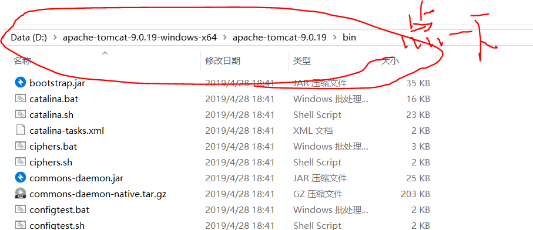

# Tomcat简介

[Tomcat简介](https://blog.csdn.net/u014231646/article/details/79482195)

# Tomcat下载

[Tomcat官网Link](https://tomcat.apache.org/download-90.cgi)

# Tomcat启动

列举两种：
- 命令行输入startup
- 双击startup.bat

# Tomcat关闭

可以双击shutdown.bat

# Error:'startup' 不是内部或外部命令，也不是可运行的程序或批处理文件

这是因为没有把bin路径添加到环境变量中。

Windows10系统可以在左下角输入“高级系统设置”，打开后找到“环境变量”，找到path，向其中添加一个路径，这个路径应该到bin路径下。

考虑到可能有新手不知道，我简单说明一下：

- 首先找到存放Tomcat的位置：

- 找到bin路径

- 点击上面，复制bin路径：
（比如说，我的就是：`D:\apache-tomcat-9.0.19-windows-x64\apache-tomcat-9.0.19\bin`）

把这个路径加入环境变量中，即可运行`startup`

# Error:The CATALINA_HOME environment variable is not defined correctly

报错：
`The CATALINA_HOME environment variable is not defined correctly.`
`This environment variable is needed to run this program`

这是因为我们只配置了path环境变量，其实还应该配置其他四个环境变量：
CATALINA_BASE、CATALINA_HOME、TOMCAT_HOME、JAVA_HOME。
`JAVA_HOME`的话想必大家都配过了，其他的可能没配过，这里统一说一下。

## Tomcat错误配置

`CATALINA_BASE`、`CATALINA_HOME`、`TOMCAT_HOME`、`JAVA_HOME`结尾的路径可能包含多余的符号，或者没弄清楚`bin`的问题。

首先说明，path要指向bin路径，但这四个以及同类的环境变量不要加bin路径，应该在bin路径的上一路径。

以CATALINA_BASE为例，说一下典型的**错误类型**：
- D:\apache-tomcat-9.0.19-windows-x64\apache-tomcat-9.0.19\
- D:\apache-tomcat-9.0.19-windows-x64\apache-tomcat-9.0.19;
- D:\apache-tomcat-9.0.19-windows-x64\apache-tomcat-9.0.19\bin
- D:\apache-tomcat-9.0.19-windows-x64\apache-tomcat-9.0.19\bin\

## Tomcat正确配置

- CATALINA_BASE：D:\apache-tomcat-9.0.19-windows-x64\apache-tomcat-9.0.19
- CATALINA_HOME：D:\apache-tomcat-9.0.19-windows-x64\apache-tomcat-9.0.19
- TOMCAT_HOME：D:\apache-tomcat-9.0.19-windows-x64\apache-tomcat-9.0.19
- JAVA_HOME：D:\Java\jdk-11

# Tomcat无法连接到localhost:8080

前提是我已经调了防火墙，那怎么还登不上去呢？

找到："启用或关闭Windows功能"，把圈里的打开，确定保存：

打开Web浏览器，输入localhost，能显示出类似下面的界面：

接下来就重新启动Tomcat吧！

# Tomcat仍然无法连接localhost:8080

这时我希望大家换一种思维，即：想想你的Tomcat端口号真的是8080吗？

以我的为例，我命令行输入`startup`，找到了8888而非8080：

所以啊，未必是8080，换成8888，我们再试试：

问题解决！
