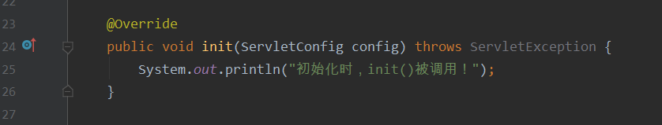

# org.apache.tomcat.util.modeler.BaseModelMBean.invoke Exception invoking method [manageApp]

**遇到Tomcat服务器启动报错信息如下所示：**

```java
org.apache.tomcat.util.modeler.BaseModelMBean.invoke Exception invoking method [manageApp]
java.lang.IllegalStateException: Error starting child
	at org.apache.catalina.core.ContainerBase.addChildInternal(ContainerBase.java:716)
	at org.apache.catalina.core.ContainerBase.addChild(ContainerBase.java:690)
	at org.apache.catalina.core.StandardHost.addChild(StandardHost.java:695)
	at org.apache.catalina.startup.HostConfig.manageApp(HostConfig.java:1728)
	at java.base/jdk.internal.reflect.NativeMethodAccessorImpl.invoke0(Native Method)
	at java.base/jdk.internal.reflect.NativeMethodAccessorImpl.invoke(NativeMethodAccessorImpl.java:62)
	at java.base/jdk.internal.reflect.DelegatingMethodAccessorImpl.invoke(DelegatingMethodAccessorImpl.java:43)
	at java.base/java.lang.reflect.Method.invoke(Method.java:566)
	at org.apache.tomcat.util.modeler.BaseModelMBean.invoke(BaseModelMBean.java:289)
	at java.management/com.sun.jmx.interceptor.DefaultMBeanServerInterceptor.invoke(DefaultMBeanServerInterceptor.java:809)
	at java.management/com.sun.jmx.mbeanserver.JmxMBeanServer.invoke(JmxMBeanServer.java:801)
	at org.apache.catalina.mbeans.MBeanFactory.createStandardContext(MBeanFactory.java:457)
	at org.apache.catalina.mbeans.MBeanFactory.createStandardContext(MBeanFactory.java:406)
	at java.base/jdk.internal.reflect.NativeMethodAccessorImpl.invoke0(Native Method)
	at java.base/jdk.internal.reflect.NativeMethodAccessorImpl.invoke(NativeMethodAccessorImpl.java:62)
	at java.base/jdk.internal.reflect.DelegatingMethodAccessorImpl.invoke(DelegatingMethodAccessorImpl.java:43)
	at java.base/java.lang.reflect.Method.invoke(Method.java:566)
	at org.apache.tomcat.util.modeler.BaseModelMBean.invoke(BaseModelMBean.java:289)
	at java.management/com.sun.jmx.interceptor.DefaultMBeanServerInterceptor.invoke(DefaultMBeanServerInterceptor.java:809)
	at java.management/com.sun.jmx.mbeanserver.JmxMBeanServer.invoke(JmxMBeanServer.java:801)
	at java.management/com.sun.jmx.remote.security.MBeanServerAccessController.invoke(MBeanServerAccessController.java:468)
	at java.management.rmi/javax.management.remote.rmi.RMIConnectionImpl.doOperation(RMIConnectionImpl.java:1466)
	at java.management.rmi/javax.management.remote.rmi.RMIConnectionImpl\$PrivilegedOperation.run(RMIConnectionImpl.java:1307)
	at java.base/java.security.AccessController.doPrivileged(Native Method)
	at java.management.rmi/javax.management.remote.rmi.RMIConnectionImpl.doPrivilegedOperation(RMIConnectionImpl.java:1406)
	at java.management.rmi/javax.management.remote.rmi.RMIConnectionImpl.invoke(RMIConnectionImpl.java:827)
	at java.base/jdk.internal.reflect.NativeMethodAccessorImpl.invoke0(Native Method)
	at java.base/jdk.internal.reflect.NativeMethodAccessorImpl.invoke(NativeMethodAccessorImpl.java:62)
	at java.base/jdk.internal.reflect.DelegatingMethodAccessorImpl.invoke(DelegatingMethodAccessorImpl.java:43)
	at java.base/java.lang.reflect.Method.invoke(Method.java:566)
	at java.rmi/sun.rmi.server.UnicastServerRef.dispatch(UnicastServerRef.java:359)
	at java.rmi/sun.rmi.transport.Transport\$1.run(Transport.java:200)
	at java.rmi/sun.rmi.transport.Transport\$1.run(Transport.java:197)
	at java.base/java.security.AccessController.doPrivileged(Native Method)
	at java.rmi/sun.rmi.transport.Transport.serviceCall(Transport.java:196)
	at java.rmi/sun.rmi.transport.tcp.TCPTransport.handleMessages(TCPTransport.java:562)
	at java.rmi/sun.rmi.transport.tcp.TCPTransport\$ConnectionHandler.run0(TCPTransport.java:796)
	at java.rmi/sun.rmi.transport.tcp.TCPTransport\$ConnectionHandler.lambda\$run\$0(TCPTransport.java:677)
	at java.base/java.security.AccessController.doPrivileged(Native Method)
	at java.rmi/sun.rmi.transport.tcp.TCPTransport\$ConnectionHandler.run(TCPTransport.java:676)
	at java.base/java.util.concurrent.ThreadPoolExecutor.runWorker(ThreadPoolExecutor.java:1128)
	at java.base/java.util.concurrent.ThreadPoolExecutor$Worker.run(ThreadPoolExecutor.java:628)
	at java.base/java.lang.Thread.run(Thread.java:834)
Caused by: org.apache.catalina.LifecycleException: Failed to start component [StandardEngine[Catalina].StandardHost[localhost].StandardContext[/web]]
	at org.apache.catalina.util.LifecycleBase.handleSubClassException(LifecycleBase.java:440)
	at org.apache.catalina.util.LifecycleBase.start(LifecycleBase.java:198)
	at org.apache.catalina.core.ContainerBase.addChildInternal(ContainerBase.java:713)
	... 42 more
Caused by: java.lang.IllegalArgumentException: Invalid <url-pattern> [SetCookieServlet] in servlet mapping
	at org.apache.catalina.core.StandardContext.addServletMappingDecoded(StandardContext.java:3175)
	at org.apache.catalina.Context.addServletMappingDecoded(Context.java:881)
	at org.apache.catalina.startup.ContextConfig.configureContext(ContextConfig.java:1385)
	at org.apache.catalina.startup.ContextConfig.webConfig(ContextConfig.java:1162)
	at org.apache.catalina.startup.ContextConfig.configureStart(ContextConfig.java:768)
	at org.apache.catalina.startup.ContextConfig.lifecycleEvent(ContextConfig.java:301)
	at org.apache.catalina.util.LifecycleBase.fireLifecycleEvent(LifecycleBase.java:123)
	at org.apache.catalina.core.StandardContext.startInternal(StandardContext.java:5048)
	at org.apache.catalina.util.LifecycleBase.start(LifecycleBase.java:183)
	... 43 more

17-May-2020 15:59:11.577 严重 [RMI TCP Connection(3)-127.0.0.1] 
org.apache.tomcat.util.modeler.BaseModelMBean.invoke Exception invoking method [createStandardContext]
javax.management.RuntimeOperationsException: Exception invoking method [manageApp]
	at org.apache.tomcat.util.modeler.BaseModelMBean.invoke(BaseModelMBean.java:298)
	at java.management/com.sun.jmx.interceptor.DefaultMBeanServerInterceptor.invoke(DefaultMBeanServerInterceptor.java:809)
	at java.management/com.sun.jmx.mbeanserver.JmxMBeanServer.invoke(JmxMBeanServer.java:801)
	at org.apache.catalina.mbeans.MBeanFactory.createStandardContext(MBeanFactory.java:457)
	at org.apache.catalina.mbeans.MBeanFactory.createStandardContext(MBeanFactory.java:406)
	at java.base/jdk.internal.reflect.NativeMethodAccessorImpl.invoke0(Native Method)
	at java.base/jdk.internal.reflect.NativeMethodAccessorImpl.invoke(NativeMethodAccessorImpl.java:62)
	at java.base/jdk.internal.reflect.DelegatingMethodAccessorImpl.invoke(DelegatingMethodAccessorImpl.java:43)
	at java.base/java.lang.reflect.Method.invoke(Method.java:566)
	at org.apache.tomcat.util.modeler.BaseModelMBean.invoke(BaseModelMBean.java:289)
	at java.management/com.sun.jmx.interceptor.DefaultMBeanServerInterceptor.invoke(DefaultMBeanServerInterceptor.java:809)
	at java.management/com.sun.jmx.mbeanserver.JmxMBeanServer.invoke(JmxMBeanServer.java:801)
	at java.management/com.sun.jmx.remote.security.MBeanServerAccessController.invoke(MBeanServerAccessController.java:468)
	at java.management.rmi/javax.management.remote.rmi.RMIConnectionImpl.doOperation(RMIConnectionImpl.java:1466)
	at java.management.rmi/javax.management.remote.rmi.RMIConnectionImpl$PrivilegedOperation.run(RMIConnectionImpl.java:1307)
	at java.base/java.security.AccessController.doPrivileged(Native Method)
	at java.management.rmi/javax.management.remote.rmi.RMIConnectionImpl.doPrivilegedOperation(RMIConnectionImpl.java:1406)
	at java.management.rmi/javax.management.remote.rmi.RMIConnectionImpl.invoke(RMIConnectionImpl.java:827)
	at java.base/jdk.internal.reflect.NativeMethodAccessorImpl.invoke0(Native Method)
	at java.base/jdk.internal.reflect.NativeMethodAccessorImpl.invoke(NativeMethodAccessorImpl.java:62)
	at java.base/jdk.internal.reflect.DelegatingMethodAccessorImpl.invoke(DelegatingMethodAccessorImpl.java:43)
	at java.base/java.lang.reflect.Method.invoke(Method.java:566)
	at java.rmi/sun.rmi.server.UnicastServerRef.dispatch(UnicastServerRef.java:359)
	at java.rmi/sun.rmi.transport.Transport\$1.run(Transport.java:200)
	at java.rmi/sun.rmi.transport.Transport\$1.run(Transport.java:197)
	at java.base/java.security.AccessController.doPrivileged(Native Method)
	at java.rmi/sun.rmi.transport.Transport.serviceCall(Transport.java:196)
	at java.rmi/sun.rmi.transport.tcp.TCPTransport.handleMessages(TCPTransport.java:562)
	at java.rmi/sun.rmi.transport.tcp.TCPTransport\$ConnectionHandler.run0(TCPTransport.java:796)
	at java.rmi/sun.rmi.transport.tcp.TCPTransport\$ConnectionHandler.lambda\$run\$0(TCPTransport.java:677)
[2020-05-17 03:59:11,609] Artifact java_web_normal_training:war exploded: Error during artifact deployment. See server log for details.
	at java.base/java.security.AccessController.doPrivileged(Native Method)
	at java.rmi/sun.rmi.transport.tcp.TCPTransport\$ConnectionHandler.run(TCPTransport.java:676)
	at java.base/java.util.concurrent.ThreadPoolExecutor.runWorker(ThreadPoolExecutor.java:1128)
	at java.base/java.util.concurrent.ThreadPoolExecutor$Worker.run(ThreadPoolExecutor.java:628)
	at java.base/java.lang.Thread.run(Thread.java:834)
Caused by: java.lang.IllegalStateException: Error starting child
	at org.apache.catalina.core.ContainerBase.addChildInternal(ContainerBase.java:716)
	at org.apache.catalina.core.ContainerBase.addChild(ContainerBase.java:690)
	at org.apache.catalina.core.StandardHost.addChild(StandardHost.java:695)
	at org.apache.catalina.startup.HostConfig.manageApp(HostConfig.java:1728)
	at java.base/jdk.internal.reflect.NativeMethodAccessorImpl.invoke0(Native Method)
	at java.base/jdk.internal.reflect.NativeMethodAccessorImpl.invoke(NativeMethodAccessorImpl.java:62)
	at java.base/jdk.internal.reflect.DelegatingMethodAccessorImpl.invoke(DelegatingMethodAccessorImpl.java:43)
	at java.base/java.lang.reflect.Method.invoke(Method.java:566)
	at org.apache.tomcat.util.modeler.BaseModelMBean.invoke(BaseModelMBean.java:289)
	... 34 more
Caused by: org.apache.catalina.LifecycleException: Failed to start component [StandardEngine[Catalina].StandardHost[localhost].StandardContext[/web]]
	at org.apache.catalina.util.LifecycleBase.handleSubClassException(LifecycleBase.java:440)
	at org.apache.catalina.util.LifecycleBase.start(LifecycleBase.java:198)
	at org.apache.catalina.core.ContainerBase.addChildInternal(ContainerBase.java:713)
	... 42 more
Caused by: java.lang.IllegalArgumentException: Invalid \<url-pattern> [SetCookieServlet] in servlet mapping
	at org.apache.catalina.core.StandardContext.addServletMappingDecoded(StandardContext.java:3175)
	at org.apache.catalina.Context.addServletMappingDecoded(Context.java:881)
	at org.apache.catalina.startup.ContextConfig.configureContext(ContextConfig.java:1385)
	at org.apache.catalina.startup.ContextConfig.webConfig(ContextConfig.java:1162)
	at org.apache.catalina.startup.ContextConfig.configureStart(ContextConfig.java:768)
	at org.apache.catalina.startup.ContextConfig.lifecycleEvent(ContextConfig.java:301)
	at org.apache.catalina.util.LifecycleBase.fireLifecycleEvent(LifecycleBase.java:123)
	at org.apache.catalina.core.StandardContext.startInternal(StandardContext.java:5048)
	at org.apache.catalina.util.LifecycleBase.start(LifecycleBase.java:183)
	... 43 more
```

发现问题出在`<servlet-mapping>`下的`<url-pattern>`，那就去看看：

错因是没加`/`，失误了。

## 完整代码

```java
import javax.servlet.ServletException;
import javax.servlet.http.Cookie;
import javax.servlet.http.HttpServlet;
import javax.servlet.http.HttpServletRequest;
import javax.servlet.http.HttpServletResponse;
import java.io.IOException;

public class SetCookieServlet extends HttpServlet {

    @Override
    public void doPost(HttpServletRequest request, HttpServletResponse response) throws ServletException, IOException {
        this.doGet(request, response);
    }

    @Override
    public void doGet(HttpServletRequest request, HttpServletResponse response) throws ServletException, IOException {
        // 创建Cookie
        Cookie cookie1 = new Cookie("info1", "hello1");
        Cookie cookie2 = new Cookie("info2", "hello2");
        Cookie cookie3 = new Cookie("info3", "hello3");
        // 设置cookie有效时间
        cookie1.setMaxAge(10);
        cookie2.setMaxAge(20);
        // 存cookie
        response.addCookie(cookie1);
        response.addCookie(cookie2);
        response.addCookie(cookie3);
        // 重定向
        response.sendRedirect("GetCookieServlet");
    }

}
```

```java
import javax.servlet.ServletException;
import javax.servlet.http.Cookie;
import javax.servlet.http.HttpServlet;
import javax.servlet.http.HttpServletRequest;
import javax.servlet.http.HttpServletResponse;
import java.io.IOException;
import java.io.PrintWriter;

public class GetCookieServlet extends HttpServlet {

    @Override
    public void doPost(HttpServletRequest request, HttpServletResponse response) throws ServletException, IOException {
        this.doGet(request, response);
    }

    @Override
    public void doGet(HttpServletRequest request, HttpServletResponse response) throws ServletException, IOException {
        response.setContentType("text/html;charset=utf-8");
        PrintWriter writer = response.getWriter();
        //获取Cookie
        Cookie[] cookies = request.getCookies();
        if (cookies != null) {
            for (Cookie c : cookies) {
                String name = c.getName();
                String value = c.getValue();
                writer.println(name + " " + value + "<br/>");
            }
        }
    }

}
```

## 运行结果

浏览器地址栏输入：`localhost:888/web/SetCookieServlet`，可见：


过10秒刷新：


过10秒刷新：


# getInitParameter()发生空指针导致HTTP状态码为500

启动Tomcat服务器，打开网页遇到空指针导致的500：


原来是空指针异常。

## 排查代码

错误被定格在41行，查看代码：


再看看web.xml中的Param设定：


似乎没什么问题，那问题在哪呢？

## 问题解决

查看之前重写的init()：



没有写`super.init(config);`，加上这行代码，重启Tomcat：


查看控制台，问题解决：

