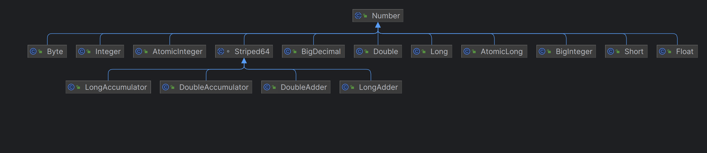
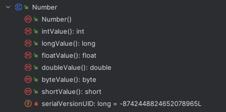
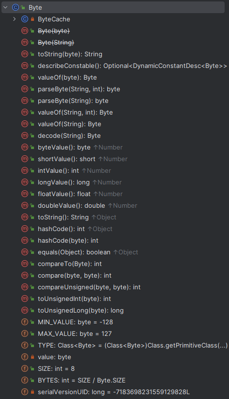
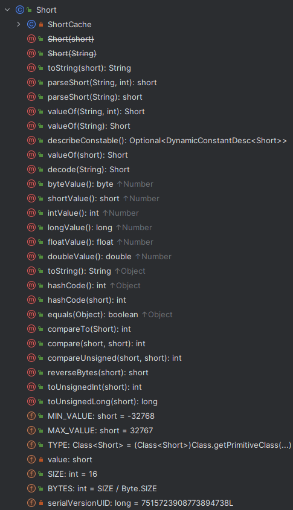
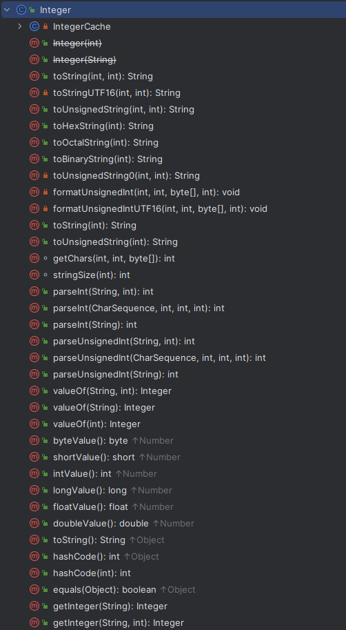
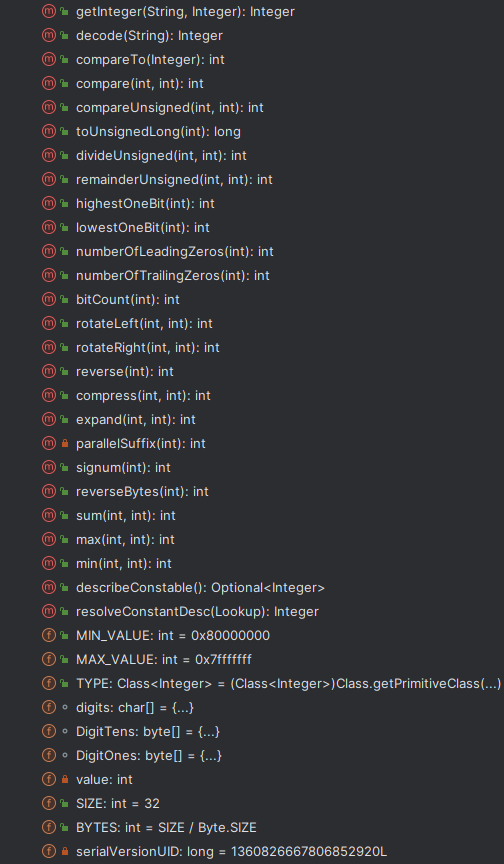
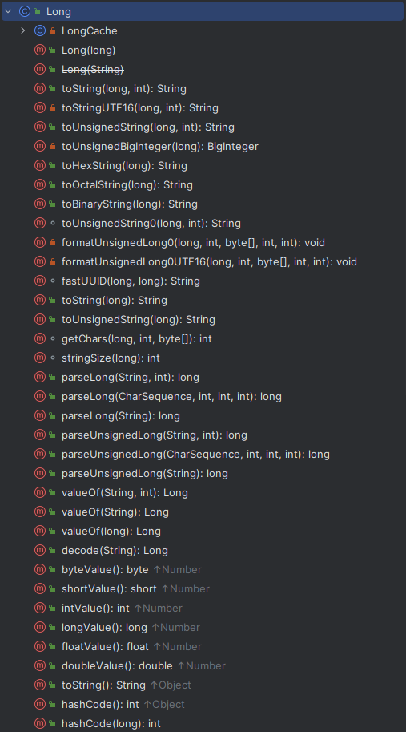
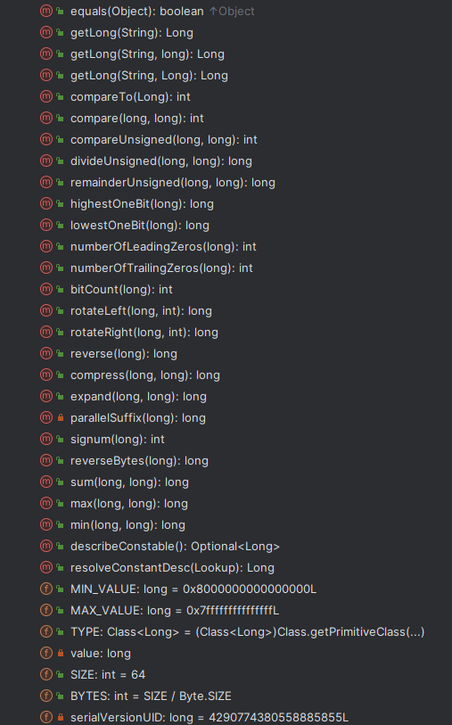
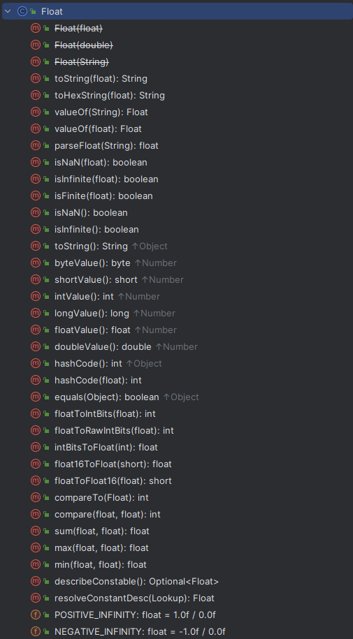
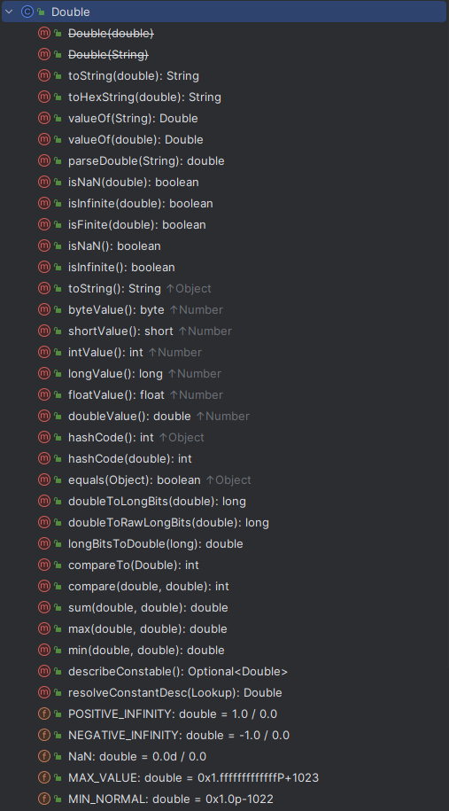

---
title: java.lang.Number
date: 2019-05-23 09:43:36
summary: 本文分享Java数值类型体系，以java.lang.Number为核心，扩展到包装类型、大数类型、原子类型。
tags:
- Java
categories:
- 开发技术
---

# java.lang.Number



java.lang.Number是一个抽象类，是Java中表示数值的类的基类。这些数值可以转换为不同的基本类型，例如byte、double、float、int、long 和 short。这些转换的执行方式取决于Number子类的具体实现。

推荐阅读：[Java基本类型](https://blankspace.blog.csdn.net/article/details/104545979)



将数字值从java.lang.Number的子类转换为基本类型时，转换遵循Java语言规范中定义的规则。这意味着转换可能会导致值的位数变窄或变宽，进而导致有关值的总体大小的信息丢失、精度损失，甚至是值符号的变化。

java.lang.Number的子类分为三类：
- 包装类型
    - java.lang.Byte
    - java.lang.Short
    - java.lang.Integer
    - java.lang.Long
    - java.lang.Float
    - java.lang.Double
- 大数类型
    - java.math.BigDecimal
    - java.math.BigInteger
- 原子类型
    - java.util.concurrent.atomic.AtomicInteger
    - java.util.concurrent.atomic.AtomicLong
    - java.util.concurrent.atomic.Striped64
    - java.util.concurrent.atomic.DoubleAccumulator
    - java.util.concurrent.atomic.DoubleAdder
    - java.util.concurrent.atomic.LongAccumulator
    - java.util.concurrent.atomic.LongAdder

推荐阅读：[Java数值计算的常见错误](https://blankspace.blog.csdn.net/article/details/104707882)

# 包装类型

推荐阅读：[Java包装类型](https://blankspace.blog.csdn.net/article/details/104715326)

## java.lang.Byte



java.lang.Byte对java.lang.Number的实现如下所示：
```java
private final byte value;

@IntrinsicCandidate
public byte byteValue() {
    return value;
}

public short shortValue() {
    return (short)value;
}

public int intValue() {
    return (int)value;
}

public long longValue() {
    return (long)value;
}

public float floatValue() {
    return (float)value;
}

public double doubleValue() {
    return (double)value;
}
```

java.lang.Short、java.lang.Integer、java.lang.Long、java.lang.Float、java.lang.Double与此类似。

## java.lang.Short



## java.lang.Integer




## java.lang.Long




## java.lang.Float



## java.lang.Double



# 大数类型

## BigInteger与BigDecimal

推荐阅读：[BigInteger与BigDecimal](https://blankspace.blog.csdn.net/article/details/130354777)

# 原子类型

## AtomicInteger与AtomicLong

java.util.concurrent.atomic.AtomicInteger和java.util.concurrent.atomic.AtomicLong是Java中的原子类型，用于在多线程环境下进行原子性操作。它们提供了一种线程安全的方式来对整数（AtomicInteger）和长整数（AtomicLong）进行操作，避免了多线程并发访问时可能出现的竞争条件和数据不一致性问题。

这两个类的操作方法都是原子性的，意味着每个操作都是独立的且不会被其他线程干扰。它们内部使用了底层的CAS（Compare and Swap）操作，确保在并发情况下对变量的操作是原子的。

AtomicInteger和AtomicLong提供了一系列方法，例如增加值、减少值、获取当前值等。这些方法可以在多线程环境下安全地使用，而不需要额外的同步措施，保证了数据的一致性和线程安全性。

使用AtomicInteger和AtomicLong可以避免使用锁和同步机制，提高多线程程序的性能和可伸缩性。它们特别适用于高并发的场景，例如计数器、ID生成器等。

需要注意的是，虽然AtomicInteger和AtomicLong提供了原子性的操作，但并不能解决所有的并发问题。在某些复杂的场景下，仍然需要使用更高级的并发工具和技术来确保线程安全和数据一致性。

## Striped64、DoubleAccumulator、DoubleAdder、LongAccumulator、LongAdder

Striped64、DoubleAccumulator、DoubleAdder、LongAccumulator、LongAdder是Java中用于高并发场景下的原子累加器（accumulator）类。

Striped64是一个抽象类，它提供了一种基于分段锁（striped locking）的方式来实现高并发下的累加操作。它将累加操作分解为多个小的段（stripes），每个段维护一个独立的累加值，从而减小了竞争和锁的粒度，提高了并发性能。

DoubleAccumulator和LongAccumulator是基于Striped64的具体实现。它们提供了对double类型和long类型的数值进行原子累加操作的功能。它们支持自定义的二元操作（BinaryOperator），可以对累加器的值进行自定义的累加逻辑。通过使用分段锁，它们在高并发环境下能够提供较好的性能。

DoubleAdder和LongAdder是对累加器的另一种实现，它们同样提供了对double类型和long类型的数值进行原子累加操作的功能。与前面提到的累加器不同的是，DoubleAdder和LongAdder使用了更细粒度的无锁算法，减少了竞争和锁的开销，进一步提高了并发性能。它们适用于高度并发的场景，特别是在累加操作频繁且线程数较多的情况下，可以获得更好的性能。

这些累加器类的使用方式类似，可以通过调用相应的累加方法（如add()、accumulate()等）来进行累加操作。它们在多线程环境下能够提供原子性的累加操作，并且具有较好的性能和并发能力，适用于各种计数、统计、求和等场景。
