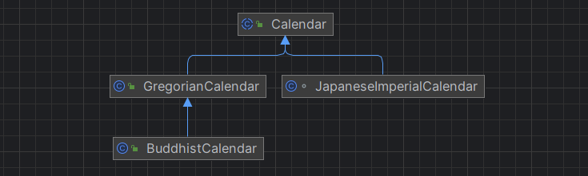

---
title: java.util.Calendar
date: 2020-03-07 15:04:23
summary: 本文介绍用于描述日期时间的java.util.Calendar。
tags:
- Java
categories:
- 开发技术
---

# java.util.Calendar

java.util.Calendar是Java中用于处理日期和时间的抽象类。它提供了对日期字段（例如年、月、日）和时间字段（例如小时、分钟、秒）进行操作的方法，并支持各种日期计算和格式化操作。

java.util.Calendar类是一个抽象类，不能直接实例化，但可以通过调用其静态方法getInstance()来获取java.util.Calendar对象的实例。getInstance()方法返回一个java.util.Calendar对象，该对象的默认时区和当前日期时间设置为系统默认值。

java.util.Calendar类提供了一系列用于操作日期和时间的方法，包括以下重要的方法：
- `get(field)`：获取指定字段的值，例如java.util.Calendar.YEAR获取年份，java.util.Calendar.MONTH获取月份，java.util.Calendar.DAY_OF_MONTH获取日期。
- `set(field, value)`：设置指定字段的值，例如`set(Calendar.YEAR, 2023)`将年份设置为2023。
- `add(field, amount)`：对指定字段进行增加或减少，例如`add(Calendar.MONTH, 1)`将月份增加1。
- `getTime()`：将java.util.Calendar对象转换为java.util.Date对象。
- `getTimeInMillis()`：获取java.util.Calendar对象表示的时间戳（以毫秒为单位）。
- `setTime(Date date)`：使用给定的java.util.Date对象设置java.util.Calendar对象的时间。

java.util.Calendar类还支持时区的设置和处理。可以使用java.util.Calendar的getTimeZone()方法获取当前时区，使用setTimeZone(TimeZone timezone)方法设置指定时区。还可以使用getAvailableIDs()方法获取所有可用的时区ID，使用java.util.TimeZone.getTimeZone(String id)方法根据时区ID获取TimeZone对象。

java.util.Calendar类的月份字段从0开始，即0表示一月，1表示二月，依此类推，11表示十二月。日期字段的范围通常从1到最大值，例如，月份的日期范围是1到31。

java.util.Calendar提供了国际化支持。通过设置java.util.Locale对象，可以根据不同的地区和语言设置java.util.Calendar的显示格式。可以使用java.util.Calendar.getInstance(Locale locale)方法来获取特定地区的java.util.Calendar实例。

# java.util.Calendar的派生类

Java还提供了java.util.GregorianCalendar、java.util.JapaneseImperialCalendar、sun.util.BuddhistCalendar这三个日历类，它们
都是java.util.Calendar类的子类，提供了日期和时间的操作和计算功能。根据具体的需求和文化背景，选择合适的日历类可以确保正确处理和显示日期和时间。

java.util.GregorianCalendar、java.util.JapaneseImperialCalendar、sun.util.BuddhistCalendar是Java中的不同日历类，用于处理不同的历法和文化背景下的日期和时间。
- java.util.GregorianCalendar：这个类是Java标准库中提供的日历类，实现了格里高利历（阳历）。GregorianCalendar是最常用的日历类，用于处理大多数国家和地区使用的日期和时间。它支持公历的日期和时间计算，提供了各种方法和功能，如日期比较、日期格式化、日期计算等。
- java.util.JapaneseImperialCalendar：这个类实现了日本的天皇纪年历法，根据日本天皇的纪年计算日期。它是阳历（格里高利历）的一个变种，使用天皇的纪年作为年份计数。使用java.util.JapaneseImperialCalendar可以在程序中处理日本历史和文化相关的日期和时间。
- sun.util.BuddhistCalendar：这个类实现了泰国佛教历法，它是阳历（格里高利历）的一个变种，使用佛教纪元作为年份计数。使用sun.util.BuddhistCalendar可以在程序中处理泰国佛教历史和文化相关的日期和时间。
