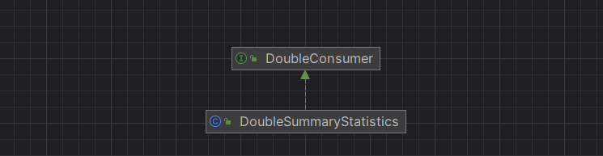

---
title: java.util.DoubleSummaryStatistics
date: 2023-04-28 22:06:24
summary: 本文分享java.util.DoubleSummaryStatistics的用法。
tags:
- Java
categories:
- Java
---

# java.util.function.DoubleConsumer



java.util.function.DoubleConsumer是一个函数式接口，它接受一个double类型的输入参数，并且不返回任何结果。它通常用于需要对double类型的值进行操作或处理的场景。

java.util.function.DoubleConsumer接口只包含一个抽象方法accept(double value)，该方法接受一个double类型的值作为参数，表示要执行的操作。可以将具体的操作逻辑以lambda表达式或方法引用的形式传递给java.util.function.DoubleConsumer对象的accept方法。

以下是java.util.function.DoubleConsumer接口的样例代码：

```java
import java.util.function.DoubleConsumer;

public class DoubleConsumerDemo {
    public static void main(String[] args) {
        // 使用lambda表达式创建一个DoubleConsumer对象
        DoubleConsumer printSquare = (double value) -> System.out.println(value * value);
        // 使用DoubleConsumer对象执行操作
        printSquare.accept(5.0); // 输出：25.0
        printSquare.accept(2.5); // 输出：6.25
    }
}
```

需要注意的是，java.util.function.DoubleConsumer接口是一个函数式接口，因此可以在Lambda表达式、方法引用或方法中使用。它可以与其他函数式接口一起使用，例如在Stream操作中的forEach方法中对double值进行处理，或者作为参数传递给其他函数式接口的方法。

# java.util.DoubleSummaryStatistics

java.util.DoubleSummaryStatistics用于在Stream编程的环境中收集计数、最小值、最大值、总和和平均值等统计信息的状态对象。

要使用java.util.DoubleSummaryStatistics计算一组double数据的统计信息，开发者可以按以下步骤进行操作：
1. 创建一个DoubleSummaryStatistics对象：使用DoubleSummaryStatistics的无参构造函数创建一个新的实例。
2. 向DoubleSummaryStatistics对象添加数据：使用accept(double value)方法将每个double值添加到DoubleSummaryStatistics对象中。可以迭代遍历数据集合，并将每个元素传递给accept方法。
3. 获取统计信息：使用DoubleSummaryStatistics对象的各种方法获取所需的统计信息，例如总和、平均值、最大值、最小值和计数等。

下面是使用DoubleSummaryStatistics计算一组double数据的统计信息的样例代码：

```java
import java.util.DoubleSummaryStatistics;

public class DoubleStatisticsDemo {
    public static void main(String[] args) {
        double[] data = { 2.5, 4.7, 6.3, 8.1, 3.9 };
        // 创建一个DoubleSummaryStatistics对象
        DoubleSummaryStatistics statistics = new DoubleSummaryStatistics();
        // 向DoubleSummaryStatistics对象添加数据
        for (double value : data) {
            statistics.accept(value);
        }
        // 获取统计信息
        double sum = statistics.getSum();
        double average = statistics.getAverage();
        double max = statistics.getMax();
        double min = statistics.getMin();
        long count = statistics.getCount();
        // 打印统计信息
        System.out.println("Sum: " + sum);
        System.out.println("Average: " + average);
        System.out.println("Max: " + max);
        System.out.println("Min: " + min);
        System.out.println("Count: " + count);
    }
}
```

执行上述代码将输出以下结果：

<font color="blue">
Sum: 25.5<br>
Average: 5.1<br>
Max: 8.1<br>
Min: 2.5<br>
Count: 5
</font>

这些统计信息反映了给定数据集的总和、平均值、最大值、最小值和元素数量。
